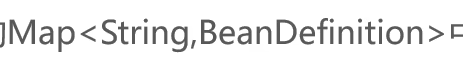
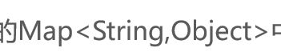

# 实例化基本流程

## 流程

-   **当然,这里是用ApplicationContext实例化且不用lazy-init**

### Step1-封装信息

#### 注意

>   封装的是Bean的**信息**而不是对象(例如UserService)本身

### Step2-信息存入Map

### Step3-遍历

### Step4-反射

### Step5-对象存入Map

>   单例池 

### Step6-调用getBean("id")

 

## 线程

