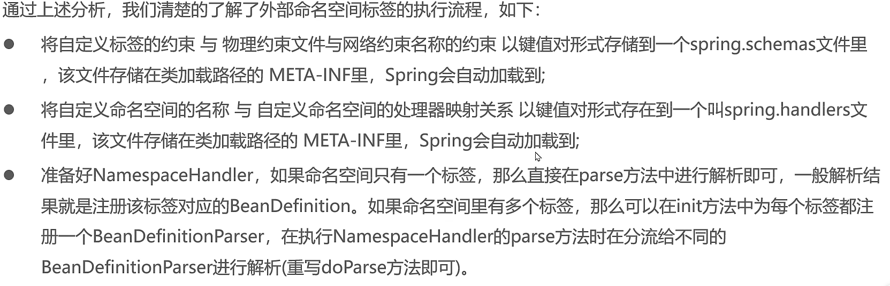
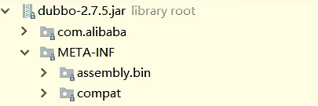
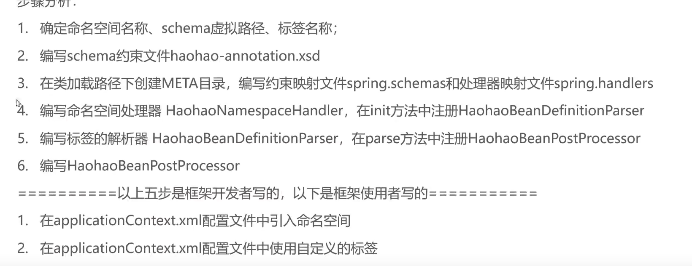
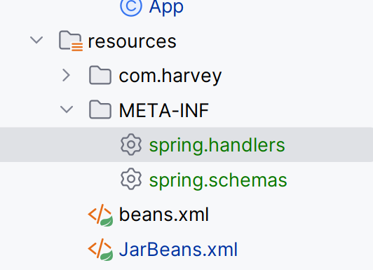

# Spring整合自定义标签


```xml
<beans xmlns="http://www.springframework.org/schema/beans"
       xmlns:xsi="http://www.w3.org/2001/XMLSchema-instance"
       xsi:schemaLocation="http://www.springframework.org/schema/beans 
       http://www.springframework.org/schema/beans/spring-beans.xsd">
```



## Namespace有什么用

[引入自定义命名空间](..\xml与Spring基础应用\Day03😊-命名空间.md)

```properties
xmlns:xsi="http://www.w3.org/2001/XMLSchema-instance"
```

​	


-   自己的项目包装到Spring

1.  在META-INF文件夹下创建spring.handlers(键值对) 

    -   META-INF要放在项目的根目录下

    -   这是由于Spring的源码里对指定(有namespace的解析器的位置的)文件的位置的要求

2.  里面写虚拟网址=自己的项目名NamespaceHander

    -   自己的项目名NameSpaceHander是一个自己写的类的全类名

3.  在(自己的项目名NameSpaceHander的)解析器类

    -   -   继承NamespaceHandlerSupport
        -   或实现对应的接口NamespaceHandler

    -   覆载方法
        -   init()一个命名空间有多个标签,每个标签有自己的解析器
        -   parse()解析方法

## 实践

>    通过一个指示标签,向Spring容器中自动注入一个BeanPostProcessor

### 步骤简述



### 1.确定各色名称

-   我不到啊

### 2.编写schema约束文件

```xml
<?xml version="1.0" encoding="UTF-8" ?>

<xsd:schema xmlns="http://www.harvey.com/spring/handler"
            xmlns:xsd="http://www.w3.org/2001/XMLSchema"
            targetNamespace="http://www.harvey.com/spring/handler">

    <xsd:element name="annotation-driven"/>
</xsd:schema>
```

-   不需要懂,大概看看就行,也不太会变
-   xmlns 是XML NameSpace的缩写

### 3.编写前期准备的文件

-   在MATE-INF目录创建:

    

#### 编写约束映射文件spring.schemas

>   schemas的映射地址(字符串)跟当前文件的真实地址的映射关系

```properties
http\://www.harvey.com/spring/harveyAnnotation.xsd=com/harvey/spring/config/harvey-annotation.xsd
```

-   \\:是转义字符

#### 编写处理器映射文件spring.handler

>    命名空间处理器跟当前命名空间(字符串)的映射关系

```properties
http\://www.harvey.com/spring/handler=com.harvey.handlers.HarveyNamespaceHandler
```


### 4.编写命名空间解析器

```java
public class HarveyNamespaceHandler extends NamespaceHandlerSupport {
    /**
     * 初始化
     * 一般情况下,一个命名空间会有多个标签
     * 会在init方法中为每一个标签注册一个标签解析器
     * */
    @Override
    public void init() {
        // 我们的标签: <xsd:element name="annotation-driven"/>
        // 怎么注册?这么注册:
        this.registerBeanDefinitionParser(
                "annotation-driven",
                new HarveyBeanDefinitionParser());
    }
}
```


### 5.编写标签解析器

```java
/**
 * 需求:注册一个BeanPostProcessor
 * */
class HarveyBeanDefinitionParser implements BeanDefinitionParser {
    /**
    * 在parse中注册HarveyBeanPostProcessor
    */
    @Override
    public BeanDefinition parse(Element element, ParserContext parserContext) {
        BeanDefinition beanDefinition = new RootBeanDefinition();
        beanDefinition.setBeanClassName("com.harvey.processor.HarveyBeanPostProcessor");
        parserContext.getRegistry().registerBeanDefinition("harveyBeanPostProcessor",beanDefinition);
        return beanDefinition;
    }
}
```

### 6.编写Processor

```java
public class HarveyBeanPostProcessor implements BeanPostProcessor {
    @Override
    public Object postProcessAfterInitialization(Object bean, String beanName) throws BeansException {
        System.out.println("HarveyBeanPostProcessor执行");
        return BeanPostProcessor.super.postProcessAfterInitialization(bean, beanName);
    }
}
```

### 测试

-   上面几步是框架开发者写点

```xml
<beans xmlns="http://www.springframework.org/schema/beans"
    xmlns:xsi="http://www.w3.org/2001/XMLSchema-instance"
    xmlns:harvey="http://www.harvey.com/spring/handler"
    xsi:schemaLocation="
    http://www.springframework.org/schema/beans
    http://www.springframework.org/schema/beans/spring-beans-4.2.xsd
    http://www.harvey.com/spring/handler
    http://www.harvey.com/spring/harveyAnnotation.xsd">

    <!--使用之定义命名空间的标签-->
    <harvey:annotation-driven/>

    <bean id="user" class="com.harvey.pojo.User"/>
</beans>
```

