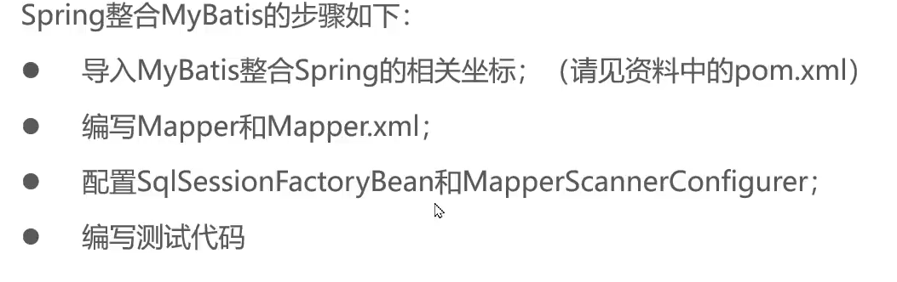
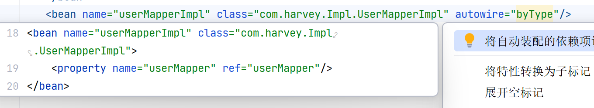
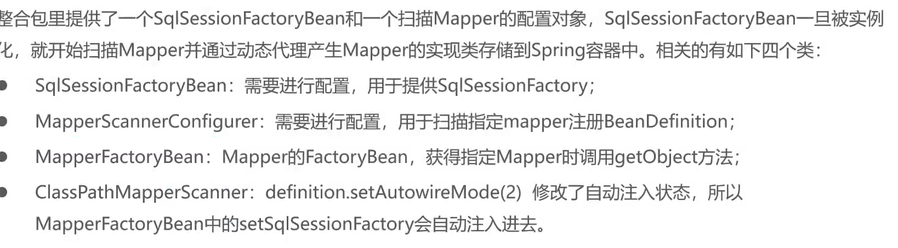

# 整合MyBatis

-   之前整合的哪个也很麻烦,而且不规范,这个才是正宗的

-   最终目标:

    -   不要java代码:

        ```java
        @Test
        public void testMybatis() throws IOException {
            //静态工厂方式
            InputStream resource = Resources.getResourceAsStream("mybatis-config.xml");
        
            //无参构造实例化
            SqlSessionFactoryBuilder builder = new SqlSessionFactoryBuilder();
        
            //实例工厂方法
            SqlSessionFactory factory = builder.build(resource);
            //实例工厂方法
            SqlSession session = factory.openSession();
            //实例工厂方法
            UserMapper userMapper = session.getMapper(
                    //resource
                    UserMapper.class);
        
            TestLogger.info(userMapper.selectAll());
        }
        ```

    -   不要xml核心配置文件(放到Spring的配置文件中)

        ```xml
        <?xml version="1.0" encoding="UTF-8" ?>
        
        <!DOCTYPE configuration
                PUBLIC "-//mybatis.org//DTD Config 3.0//EN"
                "https://mybatis.org/dtd/mybatis-3-config.dtd">
        
        <configuration>
            <typeAliases>
                <package name="com.harvey.pojo"/
            </typeAliases>
            <environments default="development">
                <!--development 开发化境-->
                <environment id="development">
                    <transactionManager type="JDBC"/>
                    <!-- 默认的数据库连接池  POOLED -->
                    <dataSource type="POOLED">
                        <!-- JDBC文件连接 -->
                        <property name="driver" value="com.mysql.cj.jdbc.Driver"/>
                        <!--数据库连接-->
                        <property name="url" value="jdbc:mysql:///company?useSSL=false"/>
                        <!--用户名-->
                        <property name="username" value="root"/>
                        <!--密码-->
                        <property name="password" value="123456"/>
                    </dataSource>
                </environment>
                </environment>
            </environments>
            <mappers>
                <package name= "com/harvey/mapper"/>
            </mappers>
        
        </configuration>
        ```

        

## 操作



### 导入第三方jar包

spring-jdbc.jar

mybatis-spring.jar

```xml
<dependency>
  <groupId>org.springframework</groupId>
  <artifactId>spring-jdbc</artifactId>
  <version>6.0.3</version>
</dependency>
<!--本来需要spring-tx的包(有关事务)的,但是spring-jdbc会自动帮我们导入,也是挺六的-->
<dependency>
  <groupId>org.mybatis</groupId>
  <artifactId>mybatis-spring</artifactId>
  <version>3.0.2</version>
</dependency>
```

### 编写Mapper接口和Mapper.xml

-   逃不掉的是吧
-   说实话,这两步才是最累人,最无语的

### 配置Mybatis-Spring的xml文件

#### SqlSessionFactoryBean和MapperScannerConfigurer;简介

-   SqlSessionFactoryBean;

    向Spring容器中提供SqlSessionFactory

    

    ```java
    public class SqlSessionFactoryBean implements 
        FactoryBean<SqlSessionFactory>, 
    	InitializingBean, 
    	ApplicationListener<ContextRefreshedEvent>  {
        ...
    }
    ```

-   MapperScannerConfigurer;

    扫描指定的包,产生Mapper对象存储到Spring容器

    ```java
    public class MapperScannerConfigurer implements 
        BeanDefinitionRegistryPostProcessor, 
    	InitializingBean, 
    	ApplicationContextAware, 
    	BeanNameAware {
            ...
    }
    ```

    回家了属于是

#### 配置

```xml
<?xml version="1.0" encoding="UTF-8"?>
<beans xmlns="http://www.springframework.org/schema/beans"
       xmlns:xsi="http://www.w3.org/2001/XMLSchema-instance"
       xmlns:context="http://www.springframework.org/schema/context"
       xmlns:util="http://www.springframework.org/schema/util"
       xsi:schemaLocation="http://www.springframework.org/schema/beans http://www.springframework.org/schema/beans/spring-beans.xsd http://www.springframework.org/schema/context https://www.springframework.org/schema/context/spring-context.xsd http://www.springframework.org/schema/util https://www.springframework.org/schema/util/spring-util.xsd">

    <bean id="dataSource"
          class="com.alibaba.druid.pool.DruidDataSource">
        <property name="driverClassName" value="com.mysql.cj.jdbc.Driver"/>
        <property name="url" value="jdbc:mysql://localhost:3306/company"/>
        <property name="username" value="root"/>
        <property name="password" value="123456"/>
    </bean>


    <bean class="org.mybatis.spring.SqlSessionFactoryBean">
        <property name="dataSource" ref="dataSource"/>
        <!--↓这一步!就是它!二十四小时!-->
        <property name="typeAliasesPackage" value="com.harvey.pojo"/>
    </bean>

    <bean class="org.mybatis.spring.mapper.MapperScannerConfigurer">
        <property name="basePackage" value="com.harvey.mapper"/>
    </bean>
    <bean name="userMapperImpl" class="com.harvey.Impl.UserShow">
        <property name="userMapper" ref="userMapper"/>
    </bean>
</beans>

```

-   然后加上Mapper的Bean;



***问 :***

-   明明没有配置userMapper的Bean,它会推荐我去这样注入一个不存在的Bean

***答 :***

-   因为我的配置文件不是明明配的,是我自己配的👀(滑稽)
-   是因为MapperScannerConfigurer帮我们扫描包之后,把所有的Bean全部实例化到了Spring的容器里,而且还叫userMapper,它在注入userMapperImpl的时候,一看自己的resource在,就注入了

### MhyBatis和Spring整合的原理是什么

-   实现Mybatis搭建的几个主要有关类



## 加载Propertis文件到Spring容器

### properties文件准备
- JDBC.properties
	```properties
jdbc.driverClassName = com.mysql.cj.jdbc.Driver
jdbc.url             = jdbc:mysql://localhost:3306/company
jdbc.username        = root
jdbc.password        = 123456
	```

### 配置property(属性)-place(位置)holder(解析器)

```xml
<context:property-placeholder location="classpath:JDBC.properties"/>
```

### 引入property文件

>   使用SpEL表达式

```xml
<bean id="dataSource"
      class="com.alibaba.druid.pool.DruidDataSource">
    <!--要习惯把property配成键值对.property文件-->
    <property name="driverClassName" value="${jdbc.driverClassName}"/>
    <property name="url" value="${jdbc.url}"/>
    <property name="username" value="${jdbc.username}"/>
    <property name="password" value="${jdbc.password}"/>
</bean>
```
