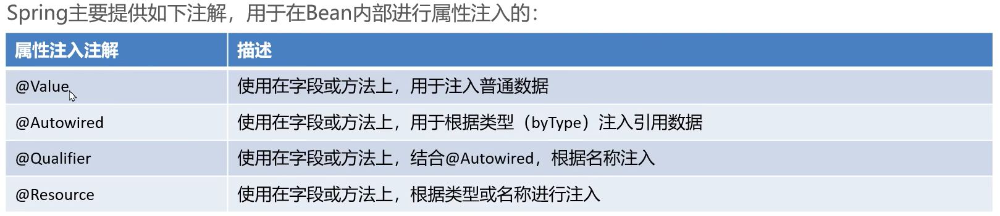

# 注入

-   注解集合先别着急,我觉着Json比较合适,但时候未到



```java
package com.harvey.impl;

import com.harvey.dao.UserDao;
import com.harvey.service.UserService;
import org.springframework.beans.factory.annotation.Autowired;
import org.springframework.beans.factory.annotation.Qualifier;
import org.springframework.beans.factory.annotation.Value;
import org.springframework.stereotype.Component;

import javax.annotation.Resource;

/**
 * @author : HarveyBlocks
 * @version : 1.0
 * @className : UserServiceImpl
 * @date : 2023/11/06 02:04
 **/
@Component
public class UserServiceImpl implements UserService {

    //    @Value("张三")//为啥不赋值呢?鸟用没有
    @Value("${jdbc.username}")
    private String userName;

    @Autowired //根据类型进行注入
    private UserDao userDao;
    /*
    有两个UserDaoImpl继承UserDao,为啥不报错呢?
    如果Type有一个,byType
    否则,byName
    找不到Name?报错
    */

    @Autowired
    private UserDao userDao2;

    @Autowired
    @Qualifier("userDao3")//依据byName
    private UserDao userDao3;

    /**
     * @Resource 不指定参数时, 按照类注入(重复会报错), 指定参数时, 用Name注入
     */
    @Resource(name = "userDao")
    private UserDao userDaoByResource;

}
```

## @Autowired注解方法

### 注解字段

```java
@Autowired("你好")
private String name;//没啥用

//依据配置文件注入
@Autowired("${jdbc.username}")
private String name;

//自动注入Mapper
@Autowired
private UserMapper userMapper;
```

[详见整合Mybatis](..\..\基于注解的Spring应用\整合第三方\整合MyBatis.md)

### 注解方法

```java
/*
* 依据形参作为id
* */
@Autowired
public void xxx(UserDao userDao3){
    System.out.println("xxx:"+userDao3);
}
```

输出:`xxx:UserDaoImpl3{}`

-   说起来,不用调用原来也可以输出啊


```java
/*
*  要求容器找UserDao的Bean,有几个找几个
* */
@Autowired void yyy(List<UserDao> userDaoList222){
    System.out.println("yyy:"+userDaoList222);
}
```

输出:`yyy:[UserDaoImpl{}, UserDaoImpl2{}, UserDaoImpl3{}]`

## 注解参数

```java
public void aaa(@Autowired List<UserDao> userDaoList222){
    System.out.println("aaa:"+userDaoList222);
}
public void bbb(@Autowired @Qualifier("userDao2") List<UserDao> userDaoList222){
    System.out.println("bbb:"+userDaoList222);
}
List<UserDao> userDaoList;
public void ccc(@Qualifier("userDao2") List<UserDao> userDaoList222){
    userDaoList = userDaoList222;
    System.out.println("ccc:"+userDaoList222);
}
```

