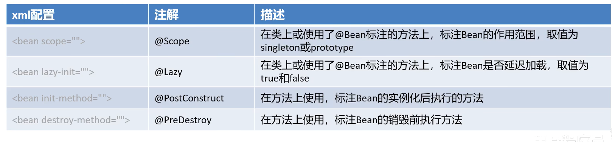

# 注解配置Bean

## 实质

1.  用Spring提供的注解替代XML的标签
2.  [用Spring的核心配置类替代XML文件](Day07-配置类.md)

## @Component配置一个自定义Bean

```xml
<?xml version="1.0" encoding="UTF-8"?>
<beans xmlns="http://www.springframework.org/schema/beans"
       xmlns:xsi="http://www.w3.org/2001/XMLSchema-instance"
       xmlns:context="http://www.springframework.org/schema/context"
       xsi:schemaLocation="http://www.springframework.org/schema/beans 
       http://www.springframework.org/schema/beans/spring-beans.xsd 
       http://www.springframework.org/schema/context 
       http://www.springframework.org/schema/context/spring-context.xsd">
    <bean id="user" class="com.harvey.ApplicationContextTest"/>
    <!--注解组件扫描:扫描基本包及其子包,看它有没有配@Component-->
    <context:component-scan base-package="com.harvey"/>
</beans>
```

```java
@Component("userDao")
public class UserDaoImpl implements UserDao {

}
@Component 
public class UserDaoImpl implements UserDao {
	//不取名字的类BeanName是Simple类名,首字母小写
}
```

### 属性注解



#### @Scope

##### 康康源码

```java
@Target({ElementType.TYPE, ElementType.METHOD})
@Retention(RetentionPolicy.RUNTIME)
@Documented
public @interface Scope {
    @AliasFor("scopeName")
    String value() default "";

    @AliasFor("value")
    String scopeName() default "";

    ScopedProxyMode proxyMode() default ScopedProxyMode.DEFAULT;
}
```

-   scopeName和value是完全等价的,是一致的(@AliasFor()取别名)
-   填入参数singleton,prototype等,全小写

##### 使用

```java
@Scope("singleton")
@Scope(value = "singleton")
@Scope(scopeName = "singleton")
```

都是等价的

#### @Lazy()

### 实践使用

```java
package com.harvey.impl;

import ...

/**
 * 注解本身就在类上了,不需要配置class,不需要配置id
 **/
@Component("userDao")
@Scope(scopeName = "singleton")
@Lazy(false)
public class UserDaoImpl implements UserDao {
    @PostConstruct()
    public void init(){
        System.out.println("init");
    }
    @PreDestroy
    public void Destroy(){
        System.out.println("Destroy");
    }
    @PreDestroy
    public void Destroy2(){
        System.out.println("Destroy2");
    }
}
```


## @Bean配置一个非自定义Bean

-   第三方Jar包里的类怎么把他给Bean了呢?

### 步骤

1.  在一个不管有没有注解@Component的类下
    -   这里经测试,好似在getBean的那个类下也是可以@Bean并被取得的
2.  写一个方法,返回值是要实例化的Bean
3.  注解@Bean
4.  在@Bean里取一个名字(爱取不取)

-   疑惑:既然要作为返回值了 , 这不是要new了吗?悲

### 实践

```java
@Bean
public DataSource dataSource(){
    DruidDataSource dataSource = new DruidDataSource();
    System.out.println("看看"+dataSource);
    return dataSource;
}
```

### 设置参数


```java
@Bean("dataSource")
public DataSource dataSource(@Value("${jdbc.driverClassName}")
                                 String driverClassName,
                             @Value("${jdbc.url}")
                                String url,
                             @Value("${jdbc.username}")
                                String username,
                             @Value("${jdbc.password}")
                                String password){
    System.out.println(userDaoList);
    DruidDataSource dataSource = new DruidDataSource();
    dataSource.setDriverClassName(driverClassName);
    dataSource.setUrl(url);
    dataSource.setUsername(username);
    dataSource.setPassword(password);
    return dataSource;
}
```

-   不取名字,以方法名为名


