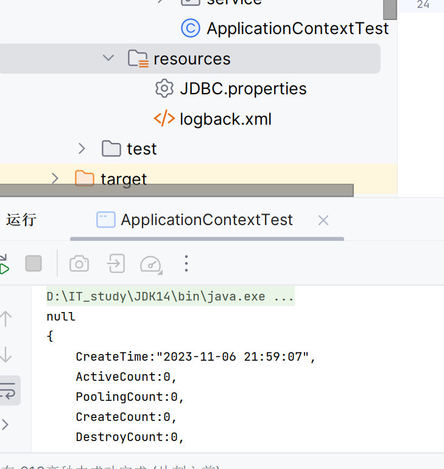

# 配置类的注解开发

>   彻底替代配置文件

### 看看现在的配置文件里还有些啥

```java
<?xml version="1.0" encoding="UTF-8"?>
<beans xmlns="http://www.springframework.org/schema/beans"
       xmlns:xsi="http://www.w3.org/2001/XMLSchema-instance"
       xmlns:context="http://www.springframework.org/schema/context"
       xsi:schemaLocation="http://www.springframework.org/schema/beans 
       http://www.springframework.org/schema/beans/spring-beans.xsd 
       http://www.springframework.org/schema/context 
       http://www.springframework.org/schema/context/spring-context.xsd">
    <bean id="user" class="com.harvey.ApplicationContextTest"/>
    <!--注解组件扫描:扫描基本包及其子包,看它有没有配@Component-->
    <context:component-scan base-package="com.harvey"/>

    <context:property-placeholder location="classpath:JDBC.properties"/>
</beans>
```

## 核心配置类

```java
@Configuration //标注当前类是一个配置类(代替配置文件) + @Component
/*
组件扫描
<context:component-scan base-package="com.harvey"/>
可能有多个包,故是数组
当然,只有一个包的时候@ComponentScan("com.harvey")
 */
@ComponentScan(basePackages = {"com.harvey"})
/*
<context:property-placeholder location="classpath:JDBC.properties"/>
多个这么些@PropertySource({"classpath:JDBC.properties","你好?"})
*/
@PropertySource("classpath:JDBC.properties")
public class SpringConfig {

}
```

### \<import/\>的平替@Import

```java
@Configuration
@ComponentScan(basePackages = {"com.harvey"})
@PropertySource("classpath:JDBC.properties")
@Import(UserServiceImpl.class)
public class SpringConfig {

}
```

-   这样,UserServiceImpl.class的@Component可以爱写不写了
-   UserServiceImpl的name是其全类名
-   这个UserServiceImpl.class也变成了配置类(分配置类)


[详见@Import再解](../..\基于注解的Spring应用\整合第三方\Day09-@Import再解.md)

## 测试类:时代变了

```java
public class ApplicationContextTest {
    public static void main( String[] args ){
        try (
//                ClassPathXmlApplicationContext applicationContext =
//                     new ClassPathXmlApplicationContext(
//                             "application.xml"
//                     )
                AnnotationConfigApplicationContext applicationContext =
                        new AnnotationConfigApplicationContext(
                                SpringConfig.class
                        )
        ) {
            //System.out.println(applicationContext.getBean(UserDaoImpl.class));
            System.out.println(applicationContext.getBean(DataSource.class));
        }
    }

}
```

## 成果



### 删了,但是岁月静好

