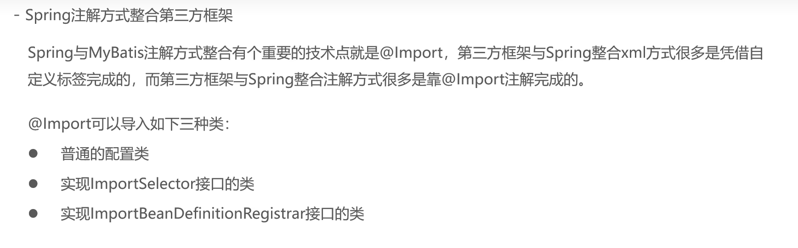

# @Import

## 可导入的类

-   [普通配置类(自定义类)](../../基于注解的Spring应用\Bean基本注解开发\Day07-配置类.md)
-   实现ImportSelector的类
-   实现ImportBeanDefinitionRegister接口的类

## 导入实现ImportSelector的类

>   好处:动态地确定要Import的对象

```java
public class MyImportSelect implements ImportSelector {
    /**
     * @param  annotationMetadata 注解媒体数组->
     *							  该对象内部封装是
     *							  *当前使用了@Import注解的类*上的
     *							  *其他注解*的元信息
     * @return  返回的数组封装是需要被注册到Spring容器中的Bean的全限定名
     */
    @Override
    public String[] selectImports(AnnotationMetadata annotationMetadata){
        Map<String,Object> annotationAttributes =
                annotationMetadata.getAnnotationAttributes(ComponentScan.class.getName());
        //例如@Import注解了SpringConfig类,SpringConfig类同时也被@ComponentScan注解
        //返回值的Map是属性名(String)和属性值(Object)的映射
        System.out.println(annotationAttributes.get("basePackageClasses").getClass());

        return new String[]{MyBean.class.getName()};//手动告诉它,要注册MyBean
        //作用上和beanPostProcessor差不多,用代码去注册啥的
    }
}
```


-   在SpringConfig注解@Import

    ```java
    @Configurable
    @ComponentScan("com.harvey")
    @Import(MyImportSelect.class)
    public class SpringConfig {
    }
    
    ```

-   测试

    ```java
    public class App {
        public static void main( String[] args ){
            ApplicationContext applicationContext =
                    new AnnotationConfigApplicationContext(SpringConfig.class);
            applicationContext.getBean(MyBean.class);
        }
    }
    ```

#### 用处

有些第三方框架没有做Spring,可以在这里面帮助它注册,或者说包一层,导入一层注解啥的

## 导入实现ImportBeanDefinitionRegister接口的类

>   这里不仅能动态地决定import的Bean,还能确定其name

-   向容器里注册BeanDefinition

    ```java
    public class MyRegister implements ImportBeanDefinitionRegistrar {
        @Override
        public void registerBeanDefinitions(
                AnnotationMetadata importingClassMetadata,
                BeanDefinitionRegistry registry,
                BeanNameGenerator importBeanNameGenerator) {
            System.out.println("HI 二货");
            //注册BeanDefinition
            BeanDefinition beanDefinition = new RootBeanDefinition();
            beanDefinition.setBeanClassName(MyBean.class.getName());
            registry.registerBeanDefinition("myBean",beanDefinition);
    //        ImportBeanDefinitionRegistrar.super.registerBeanDefinitions(
    //                importingClassMetadata,
    //                registry,
    //                importBeanNameGenerator
    //        );
        }
    }
    ```

然后有两种Import的用法

1.  把@Import(MyRegiter.class)注解给SpringConfig注解类,使其帮我们做 MyRegister的事情

    ```java
    @Configurable
    @ComponentScan("com.harvey")
    @Import(MyRegister.class)
    public class SpringConfig {
    }
    ```

    

2.  把@Import(MyRegiter.class)注解给自己的注解(此处以MapperScan注解的自定义注解为例)

    ```java
    @Retention(RetentionPolicy.RUNTIME)
    @Target({ElementType.TYPE})
    @Documented
    //这些是抄MapperScan的
    //@Import({MapperScannerRegistrar.class})我们需要替换的是这个注解,将这个注解的类里面的内容替换成我们自己的
    @Import(MyRegister.class)
    //@Repeatable(MapperScans.class)这个注解抄不来
    public @interface    MyMapperScan {
    }
    ```

