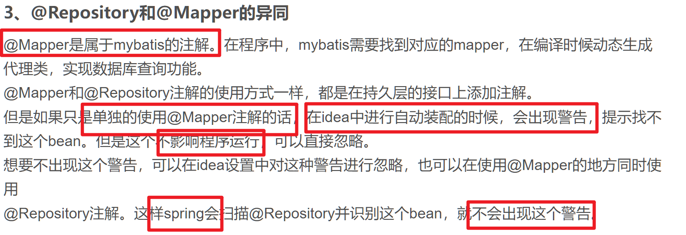

[用XML整合MyBatis](../..\基于XML文件的Spring应用\整合第三方框架\Day06-整合MyBatis.md)

# MyBatis--启动!

## 前期准备

### org/test/JDBC.properties

```properties
jdbc.driverClassName = com.mysql.cj.jdbc.Driver
jdbc.url             = jdbc:mysql://localhost:3306/company
jdbc.username        = root
jdbc.password        = 123456
```

### pom.xml

-   spring-context
-   druid
-   mysql-connector-java
-   mybatis
-   spring-jdbc
-   mybatis-spring

```xml
<project xmlns="http://maven.apache.org/POM/4.0.0" xmlns:xsi="http://www.w3.org/2001/XMLSchema-instance"
  xsi:schemaLocation="http://maven.apache.org/POM/4.0.0 http://maven.apache.org/xsd/maven-4.0.0.xsd">
  <modelVersion>4.0.0</modelVersion>

  <groupId>org.test</groupId>
  <artifactId>untitled1</artifactId>
  <version>1.0-SNAPSHOT</version>
  <packaging>jar</packaging>

  <name>untitled1</name>
  <url>http://maven.apache.org</url>

  <properties>
    <project.build.sourceEncoding>UTF-8</project.build.sourceEncoding>
  </properties>

  <dependencies>
    <dependency>
      <groupId>org.springframework</groupId>
      <artifactId>spring-context</artifactId>
      <version>5.3.19</version>
    </dependency>

    <dependency>
      <groupId>com.alibaba</groupId>
      <artifactId>druid</artifactId>
      <version>1.2.13</version>
    </dependency>

    <dependency>
      <groupId>mysql</groupId>
      <artifactId>mysql-connector-java</artifactId>
      <version>8.0.28</version>
    </dependency>

    <dependency>
      <groupId>org.mybatis</groupId>
      <artifactId>mybatis</artifactId>
      <version>3.5.13</version>
    </dependency>

    <dependency>
      <groupId>org.springframework</groupId>
      <artifactId>spring-jdbc</artifactId>
      <version>5.2.13.RELEASE</version>
    </dependency>
    <dependency>
      <groupId>org.mybatis</groupId>
      <artifactId>mybatis-spring</artifactId>
      <version>2.0.5</version>
    </dependency>
  </dependencies>
</project>
```

-   日志和junit测试爱加不加

### org.test.pojo.User

```java
package org.test.pojo;

/**
 * @author : HarveyBlocks
 * @version : 1.0
 * @className : User
 * @date : 2023/11/09 10:41
 **/
public class User {
    private String name;
    private int id;
    private int age;
    private String gender;

    public User() {
    }

    @Override
    public String toString() {
        return "User{" +
                "name=" + name +
                ", id=" + id +
                ", age=" + age +
                ", gender='" + gender + '\'' +
                '}';
    }
}
```

### Mapper

#### org.test.mapper.UserMapper

```java
package org.test.mapper;

import org.test.pojo.User;
import java.util.List;

@Mapper
public interface UserMapper {
    List<User> findAll();
}
```



#### org/test/mapper/UserMapper.xml

```xml
<?xml version="1.0" encoding="UTF-8" ?>


<!DOCTYPE mapper
        PUBLIC "-//mybatis.org//DTD Mapper 3.0//EN"
        "https://mybatis.org/dtd/mybatis-3-mapper.dtd">

<mapper namespace="org.test.mapper.UserMapper"><!--名字写代理接口-->

    <resultMap id="UserMap" type="org.test.pojo.User">
        <result column="name" property="name"/>
        <result column="id" property="id"/>
        <result column="age" property="age"/>
        <result column="gender" property="gender"/>
    </resultMap>

    <select id="findAll" resultMap="UserMap">
        select * from user ;
    </select>

</mapper>
```

## Spring

### org.test.config.SpringConfig

```java
package org.test.config;

import com.alibaba.druid.pool.DruidDataSource;
import org.mybatis.spring.SqlSessionFactoryBean;
import org.mybatis.spring.annotation.MapperScan;
import org.springframework.beans.factory.annotation.Configurable;
import org.springframework.beans.factory.annotation.Value;
import org.springframework.context.annotation.Bean;
import org.springframework.context.annotation.ComponentScan;
import org.springframework.context.annotation.PropertySource;
import javax.sql.DataSource;
@Configurable
@ComponentScan("org.test")
@PropertySource("classpath:org/test/JDBC.properties")
@MapperScan("org.test.mapper")
public class SpringConfig {

    @Bean
    public DataSource dataSource(
            @Value("${jdbc.driverClassName}") String driverClassName,
            @Value("${jdbc.url}") String url,
            @Value("${jdbc.username}") String username,
            @Value("${jdbc.password}") String password
    ) {
        DruidDataSource dataSource = new DruidDataSource();
        dataSource.setDriverClassName(driverClassName);
        dataSource.setUrl(url);
        dataSource.setUsername(username);
        dataSource.setPassword(password);
        return dataSource;
    }

    @Bean
    public SqlSessionFactoryBean sqlSessionFactoryBean(DataSource dataSource) {
        SqlSessionFactoryBean sqlSessionFactoryBean = new SqlSessionFactoryBean();
        sqlSessionFactoryBean.setDataSource(dataSource);
        return sqlSessionFactoryBean;

    } 
}
```

### org.test.service.UserService

-   不规范,没准备一个接口,直接上了

```java
package org.test.service;

import org.springframework.beans.factory.annotation.Autowired;
import org.springframework.stereotype.Component;
import org.test.mapper.UserMapper;
import org.test.pojo.User;
import java.util.List;

@Component
public class UserService {
    @Autowired
    private UserMapper userMapper;

    public void show() {
        List<User> users = userMapper.findAll();
        for (User user : users) {
            System.out.println(user);
        }
    }
}
```

### @MapperScan自动注入Mapper

-   这个是MyBatis-spring里的注解

-   依靠两步

    1.  在org.test.config.SpringConfig配置类上注解

        ```java
        @MapperScan("org.test.mapper")
        ```

    2.  在org.test.service.UserService字段上注解

        ```java
        @Autowired
        private UserMapper userMapper;
        ```

        

## 测试

```java
package org.test;

import org.springframework.context.ApplicationContext;
import org.springframework.context.annotation.AnnotationConfigApplicationContext;
import org.test.config.SpringConfig;
import org.test.service.UserService;
import sun.misc.ObjectInputFilter;

public class App {
    public static void main(String[] args) {
        ApplicationContext applicationContext =
            new AnnotationConfigApplicationContext(SpringConfig.class);
        applicationContext.getBean(UserService.class).show();
    }
}
```
