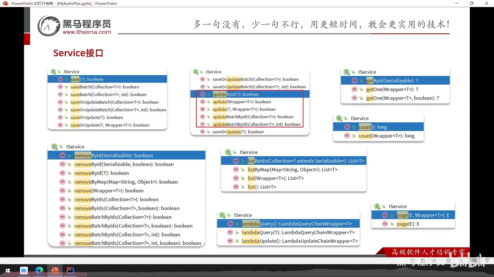
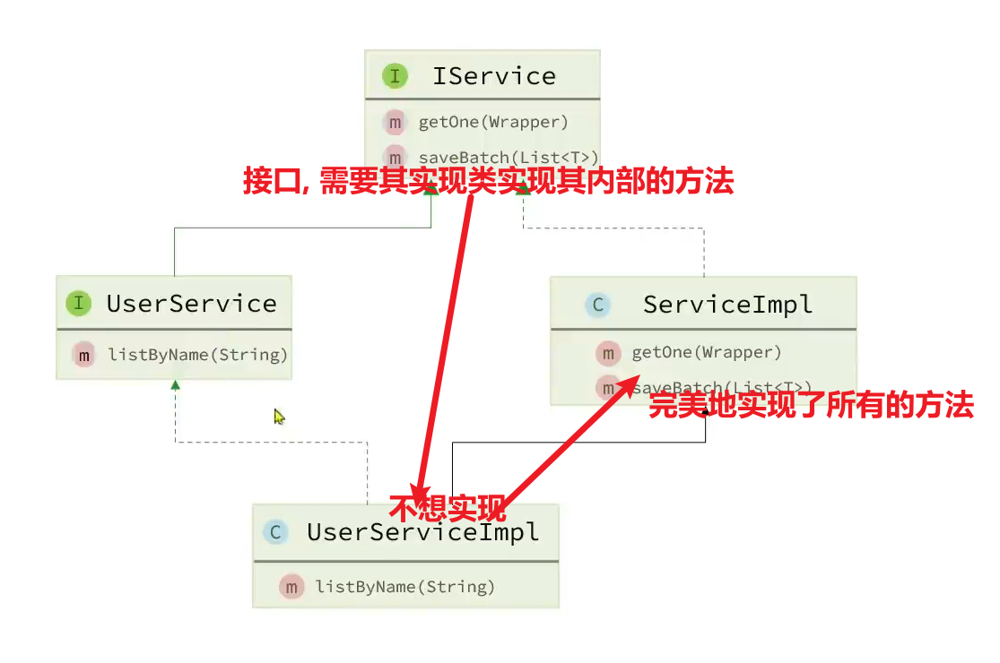
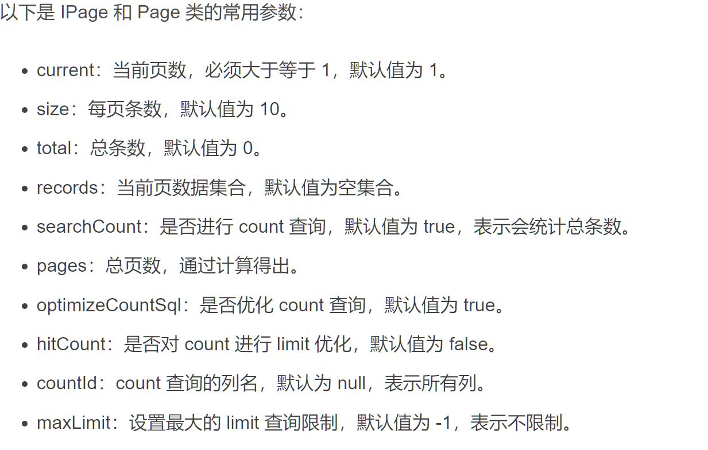
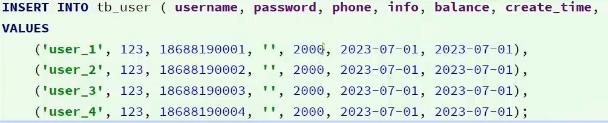

# IService接口



-   截一张api

-   批量删除

    -   removeByIds()

        通过**in的方式**来组装sql

    -   removeBatchByIds()

        通过普通的where方式, 但是会采用jdbc**批处理的方案**来提交实现**批量删除**

        性能好一点,因为**in没法用索引**

## 继承IService



```java
public interface UserService extends IService<User> {
    void showMapper();
}
```

```java
@Service
public class UserServiceImpl extends ServiceImpl<UserMapper,User>
        implements UserService {
    @Override
    public void showMapper() {
        if (baseMapper==null){
            throw new NoSuchBeanDefinitionException("No bean named 'baseMapper' available");
        }
        System.out.println(baseMapper);
    }
}
```

-   lambdaQuery()

    ```java
    @Override
    public List<User> query(String name, int ageLow, int ageHigh) {
        return lambdaQuery()
                .like(!name.isEmpty(), User::getName, name)
                .ge(ageLow>0,User::getAge,ageLow)
                .le(ageHigh<65&&ageHigh>=ageLow,User::getAge,ageHigh)
                .list();//还有.one(),.page等
    }
    ```

    -   page()

        

        ```java
        @Override
        public List<User> queryByPage(
                long current, long size, long total, boolean searchCount
        ) {
            Page<User> userPage = new Page<>(current, size,total,searchCount);
            IPage<User> userIPage = lambdaQuery().page(userPage);
            System.out.println("总页数： "+userIPage.getPages());
            System.out.println("总记录数： "+userIPage.getTotal());
            return userIPage.getRecords();
        }
        ```

        未完待续

-   lambdaUpdate()

    ```java
    @Override
    @Transactional//事务
    public void update(int id, String newName) {
        User user = getById(id);
        if (user == null) {
            throw new RuntimeException("user == null");
        }
        lambdaUpdate()
                .set(!newName.isEmpty(),User::getName, newName)
                .eq(User::getId, id)
                //使用了"改",应该考虑线程安全,使用什么锁?乐观锁
                .eq(User::getName,user.getName())
                //刚才获取的user的name依旧还是name没有被改,可以执行update,否则不更新
                .update();

    }
    ```

## 批量插入

### 法一: save一十万次

```java
for(int i = 0;i<100000;i++)
	userService.save(buidUser(i));//i是唯一值,防止重复
```

-   需要多次请求十万次数据库,所以很慢

### 法二:批量插入

批量插入1000条SQL语句次,插100次(因为从java传到MySQL不能传太多次)

```java
for(int i = 0;i<100;i++){
    for(int j = 0;j<1000;j++)
		list.add(buidUser(i*1000+j));//i是唯一值,防止重复
	userService.saveBatch(list);
	list.clear();
}
```

-   快了很多,但是,SQL语句依旧有十万条,还是有进步空间

### 法三:批量插入values



把原来的一千条分开了的SQL语句拼成一条

#### 方案一: 自定义SQL语句

```java
public void adds(@Param("users")List<User> users);
```

```xml
    <insert id="adds">
        insert into tb_user(name,age, gender)
        values
        <foreach collection="emps" item="emp" separator=",">
            (#{user,Name}, #{user.age}, #{user.gender})
        </foreach>
    </insert>
```

-   不可忘本啊qwq

#### 方案二:改变MySQL的配置,转变批处理语句

MySQL有一个配置,`rewriteBatchedStatements`,默认是false,改为true之后,就可以将传入的SQL语句**转换为一整条(如果能转的话)**,这一步是MySQL做的

```yml
spring:
  datasource:
    url: "jdbc:mysql://localhost:3306/company?rewriteBatchedStatements=true"
```

即可

## 异步执行长时间的数据库操作

```java
@Override
@Async("asyncThreadPoolTaskExecutorBean")
public void update(int id, String newName) {
    // 消耗时间很长的逻辑
}
```

线程池的Bean

```java
@Bean("asyncThreadPoolTaskExecutorBean")
public ThreadPoolTaskExecutor asyncThreadPoolTaskExecutorBean(){
    ThreadPoolTaskExector exector = new ThreadPoolTaskExector();
    exector.set // ...
	exector.initialize();
    return exector;
}
```

