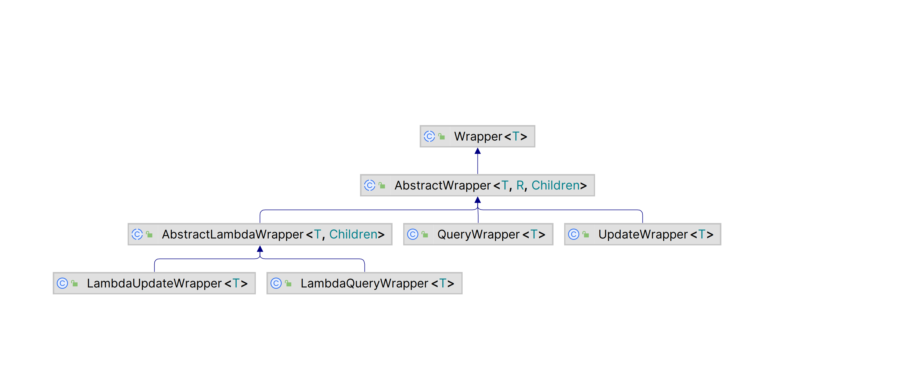
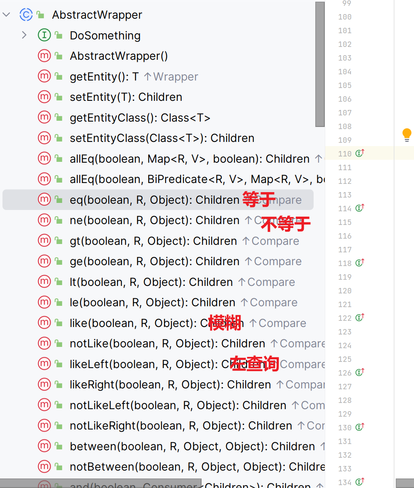

# 条件构造器

>   本来只能依据id操作,条件构造器可以用来制定复杂的条件


## Wrapper继承体系

>   条件构造器



-   AbstractWrapper

    

-   UpdateWrapper

    **支持特殊的更新(见下)**

    ```java
    @Override
    public UpdateWrapper<T> setSql(boolean condition, String setSql, Object... params) {
        if (condition && StringUtils.isNotBlank(setSql)) {
            sqlSet.add(formatSqlMaybeWithParam(setSql, params));
        }
        return typedThis;
    }
    ```

    -   写set的部分,然后拼字符串

-   QueryWrapper

    查询特别加强版

    **允许多字段查询**

    ```java
    @Override
    public QueryWrapper<T> select(boolean condition, List<String> columns) {
        if (condition && CollectionUtils.isNotEmpty(columns)) {
            this.sqlSelect.setStringValue(String.join(",", columns));
        }
    
        return (QueryWrapper)this.typedThis;
    }
    ```

-   AbstractLambdaWrapper

    支持Lambda

###QueryWrapper

####案例一

##### 需求

>查询tb_user表中,名字中含'o'或'O'的,且年龄大于等于64岁的男性


#####MySQL模拟


```mysql
select from tb_user
    where name like '%o%'
    and age>65 and  gender='男';
```


#####select方法查询

```java
/*List<T> selectList(@Param("ew") Wrapper<T> queryWrapper);*/
QueryWrapper<User> queryWrapper = new QueryWrapper<>();
queryWrapper.select("id","name","age","gender")
        .like("name","o")//前后自动加%,用不着你家
        .ge("age",64)//gt大于,ge大于等于;
        .eq("gender","男");//等于;

userMapper.selectList(queryWrapper).forEach(System.out::println);
```

#####DEBUG的拼字符串

==>  Preparing: SELECT id,name,age,gender FROM tb_user WHERE (name LIKE ? AND age >= ? AND gender = ?) 
==> Parameters: %o%(String), 64(Integer), 男(String) 

####案例二

##### 需求与初步分析

>更新名为'JbquXjYjb9'的用户,其年龄改为36,性别改为女

-   虽然是更新,但是还是要用**查询条件构造器**

#####MySQL模拟


```mysql
update tb_user set age = 36,gender='女' where name='JbquXjYjb9'
```

#####update方法更新

```java
// 创建更新后的User对象
User user = new User();
user.setAge(36);
user.setGender("女");
// 查询部分的逻辑
QueryWrapper<User> queryWrapper = new QueryWrapper<>();
queryWrapper.eq("name","JbquXjYjb9");
// 执行更新
int update = userMapper.update(user, queryWrapper);
System.out.println(update);
```

#####DEBUG的拼字符串

==> Preparing: UPDATE tb_user SET age=?, gender=? WHERE (name = ?) 
==> Parameters: 36(Integer), 女(String), JbquXjYjb9(String) 

###UpdateWrapper

#### 需求

>更新id为1, 2, 4 的用户的年龄**加5**


####MySQL模拟


```mysql
update user set age = age + 5
	where id in (1,2,4);
```


####select方法查询

```java
/*List<T> selectList(@Param("ew") Wrapper<T> queryWrapper);*/
QueryWrapper<User> queryWrapper = new QueryWrapper<>();
queryWrapper.select("id","name","age","gender")
        .like("name","o")//前后自动加%,用不着你家
        .ge("age",64)//gt大于,ge大于等于;
        .eq("gender","男");//等于;

userMapper.selectList(queryWrapper).forEach(System.out::println);
```

####DEBUG的拼字符串

==>  Preparing: UPDATE tb_user SET age = age +5 WHERE (id IN (?,?,?)) 
==> Parameters: 1(Integer), 2(Integer), 4(Integer) 

### LambdaWrapper

#### 优势

**避免把字符串写死的硬编码**

#### 示例

更新名为'JbquXjYjb9'的用户,其年龄改为63,性别改为男

```java
User user = new User();
user.setAge(63);
user.setGender("男");

LambdaQueryWrapper<User> lambdaQueryWrapper = new LambdaQueryWrapper<>();
lambdaQueryWrapper.select(User::getName).eq(User::getName,"JbquXjYjb9");//使用了反射解析方法

int update = userMapper.update(user, lambdaQueryWrapper);
System.out.println(update);//3
```

####DEBUG的拼字符串

==>  Preparing: UPDATE tb_user SET age=?, gender=? WHERE (name = ?) 

 ==> Parameters: 63(Integer), 男(String), JbquXjYjb9(String) 

\<\=\=    Updates: 1 

