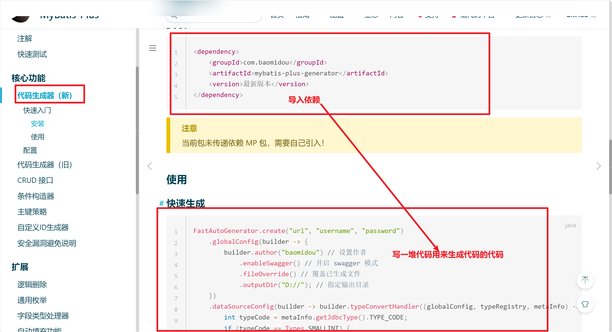
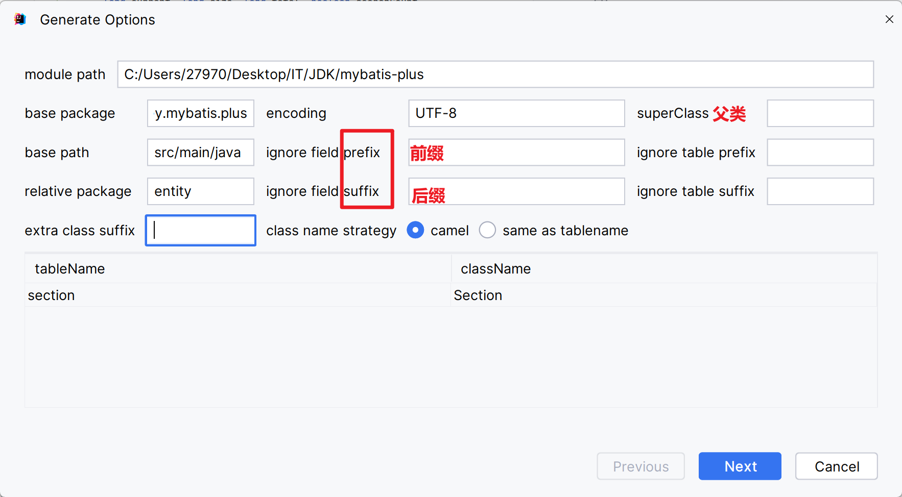

# 代码生成器

1.  创建实体类
2.  创建Mapper接口
    -   继承BaseMapper\<实体类\>接口
3.  创建Service层接口
    -   继承IService<实体类>接口
4.  创建Service层接口的实现类
    -   继承ServiceImpl<实体类Mapper,实体类>
    -   实现Service层接口

-   以上代码总是固定

[代码生成器（新）官方文档](https://baomidou.com/pages/779a6e/#安装)

-   这就很抽象啊

## MyBatisX

 [MybatisX快速开发插件](https://baomidou.com/pages/ba5b24/)

## MyBatisPlus(下架了好像)

封面是初音未来耶

