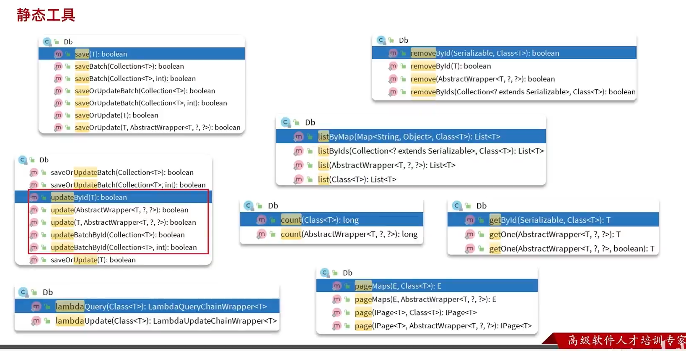
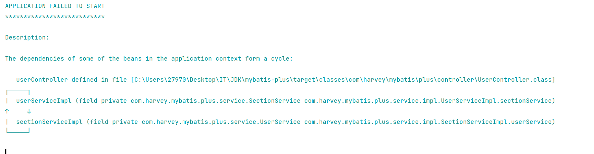
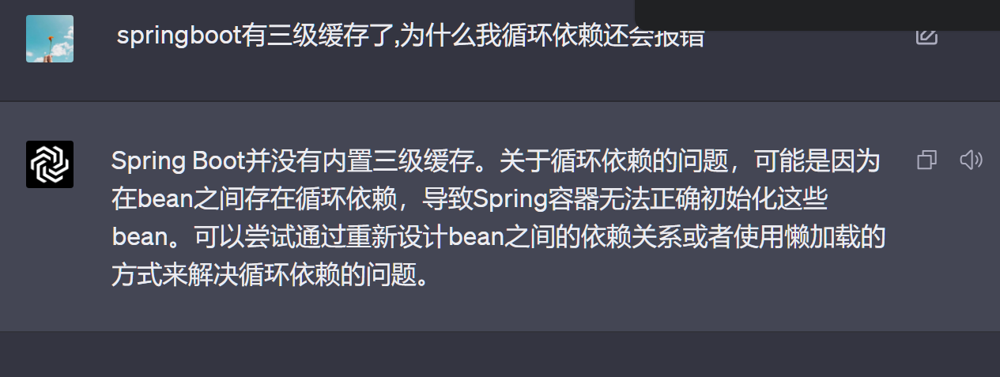

# 静态工具Db



## 和IService的区别

静态的方法是没有办法读到类上的泛型

所以Class作为参数传递

## 应用场景

-   有两张表和对应实体类:
    -   用户
    -   地址

-   需求:

    1.  根据id查询用户的接口,查询用户的同时,查询出用户对应的所有地址
        -   **注入addressService**
    2.  根据id查询地址的接口,查询地址的同时,查询出地址对应的所有用户,如果用户年龄小于18岁,抛出异常
        -   需要校验用户年龄
        -   **注入userService**

    -   **循环注入**

        

    -   **Db静态工具解决这个问题**

可是,这很奇怪,不是有三级缓存吗?



纳尼,SpringBoot没有三级缓存?!

### 练习

>   批量根据id查询用户,同时需要查询他们各自的地址

#### 法一

1.  批量根据id查询用户
2.  **遍历**用户List,得到user的地址IdList
3.  批量根据地址Id查询地址

#### 法二

1.  批量根据id查询用户

2.  把这些用户的所有涉及的Address查询出来

    ```java
    List<Address> addressList = Db
        .lambdaQuery(Address.class).in(Address::getUserId,userIds).list();
    ```

    

3.  依据用户映射地址

    ```java
    Map<User, List<Address>> collect = users.stream().collect(Collectors.groupingBy(Address::getUserId));
    //依据用户的性别分组
    ```


-   由于法一有遍历这一步,导致向数据库请求次数过多,所以**法二优于法一**
