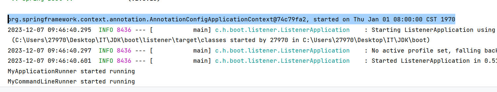
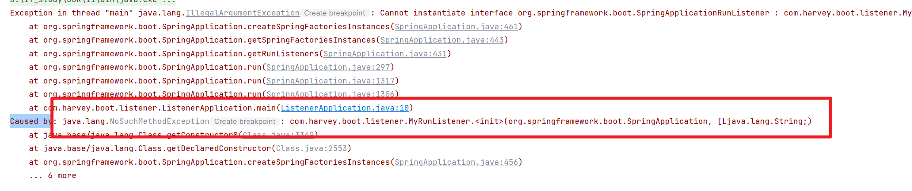
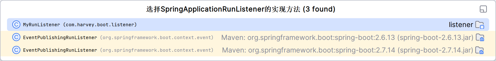
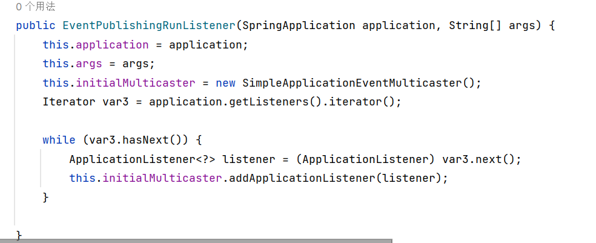
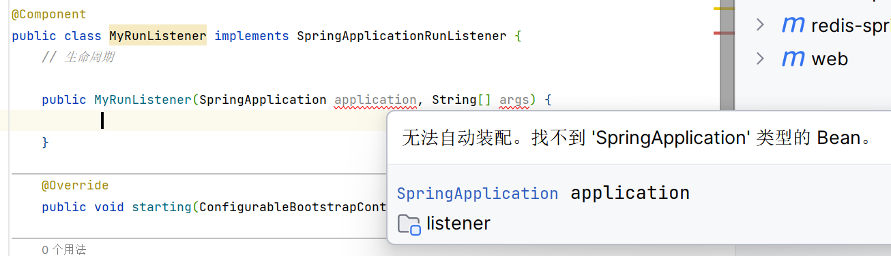
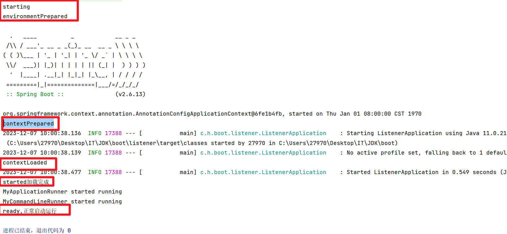
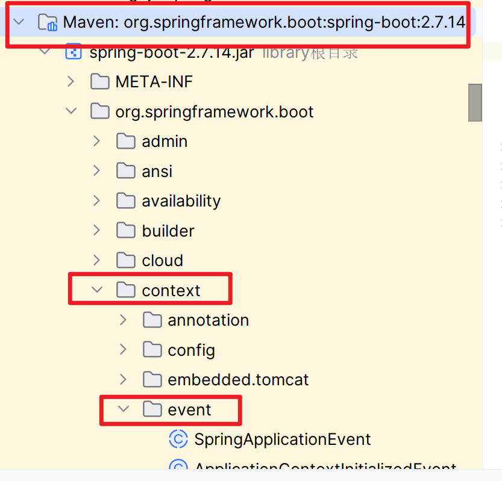

# 监听机制

监听监听对象的创建和变化

spirng的监听机制实际上是对Java事件监听机制的封装

## Java监听机制

Java中的事件监听机制定义了以下几个类:

-   Event事件

    继承java.util.EventObject类的对象

-   Source事件源

    任意对象Object

-   Listener监听器

    实现java.util.EventListener接口的对象

## Spring监听机制

>   Spring项目启动时, 会对几个监听器进行回调, 我们可以实现这些监听器接口, 在项目启动时完成一些操作

-   ApplicationContextInitializer

    ```java
    @Component
    public class MyInitializer implements ApplicationContextInitializer {
        @Override
        public void initialize(ConfigurableApplicationContext applicationContext) {
            System.out.println(applicationContext);
        }
    }
    ```

-   SpringApplicationRunListener

    ```java
    @Component
    public class MyRunListener implements SpringApplicationRunListener {
        // 生命周期

        @Override
        public void starting(ConfigurableBootstrapContext bootstrapContext) {
            System.out.println("starting");
        }

        @Override
        public void environmentPrepared(ConfigurableBootstrapContext bootstrapContext, ConfigurableEnvironment environment) {
            System.out.println("environmentPrepared");
        }

        @Override
        public void contextPrepared(ConfigurableApplicationContext context) {
            System.out.println("contextPrepared");
        }

        @Override
        public void contextLoaded(ConfigurableApplicationContext context) {
            System.out.println("contextLoaded");
        }

        @Override
        public void started(ConfigurableApplicationContext context, Duration timeTaken) {
            System.out.println("started加载完成");
        }

        @Override
        public void ready(ConfigurableApplicationContext context, Duration timeTaken) {
            System.out.println("ready,正常启动运行");
        }

        @Override
        public void failed(ConfigurableApplicationContext context, Throwable exception) {
            System.out.println("failed,启动失败");
        }
    }
    ```

-   CommandLineRunner

    ```java
    @Component
    public class MyCommandLineRunner implements CommandLineRunner {
        @Override
        public void run(String... args) throws Exception {
            System.out.println("MyCommandLineRunner started running");
        }
    }
    ```

    -   **项目启动后自动执行**

-   ApplicationRunner

    ```java
    @Component
    public class MyApplicationRunner implements ApplicationRunner {
        @Override
        public void run(ApplicationArguments args) throws Exception {
            // 对参数进行了封装
            System.out.println("MyApplicationRunner started running");
        }
    }
    ```

    -   **项目启动后自动执行**

### ApplicationRunner和CommandLineRunner

同样是在项目启动后执行, 可以用来做数据库的预热工作(把数据库的数据放入内存)

**其参数是命令行参数**

### ApplicationContextInitializer

-   需要在spirng.factories配置

    ```properties
    org.springframework.context.ApplicationContextInitializer=\
      com.harvey.boot.listener.MyInitializer
    ```



```java
//@Component,应为是靠配置自动装配的,所以@Componet没啥用
public class MyInitializer implements ApplicationContextInitializer {
    @Override
    public void initialize(ConfigurableApplicationContext applicationContext) {
        System.out.println(applicationContext);
    }
}
```

### SpringApplicationRunListener

-   需要在spirng.factories配置

    ```properties
    org.springframework.boot.SpringApplicationRunListener=\
      com.harvey.boot.listener.MyRunListener
    ```

-   报错

    

    缺少构造方法(\<init\>的意思是构造),其参数是(SpringApplication,String)

    看看人家怎么写的:

    

有的吧~~

仿照写一个:



这是因为@Componet需要创建Bean,就要的检测参数能否注入,删掉@Component就行(应为@Compont没啥用)

因为ApplicationContextInitializer和SpringApplicationRunListener是靠配置执行的,也就是说, 上面SpringApplicationRunListener的@Compnet删掉也没事



成功

## Spring的事件



这个包里有好多Event,最终继承自java.util.EventObject

