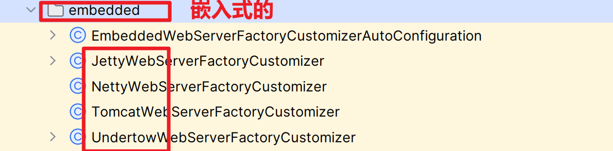
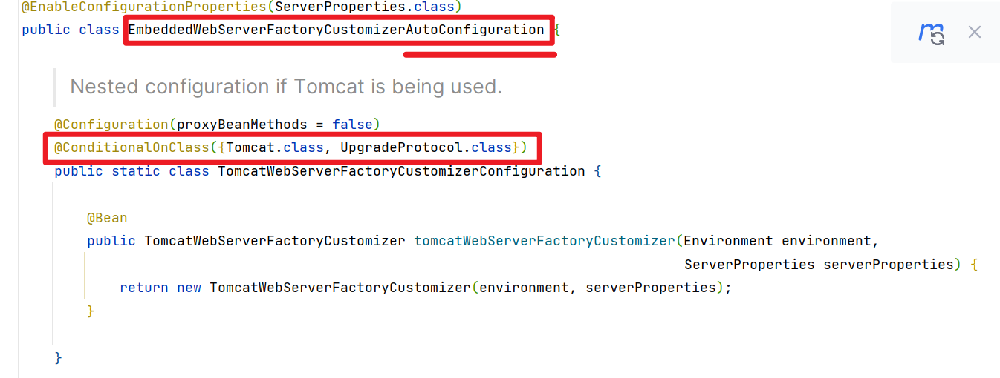
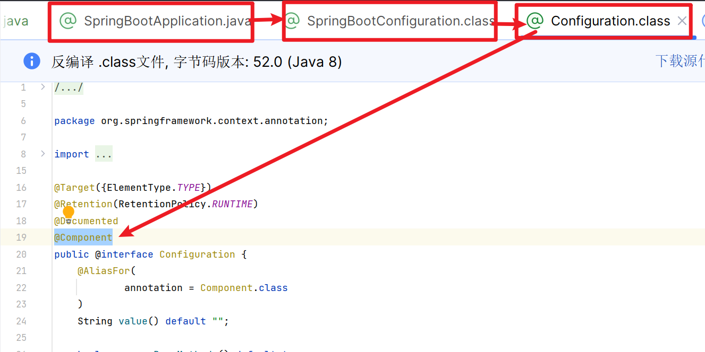
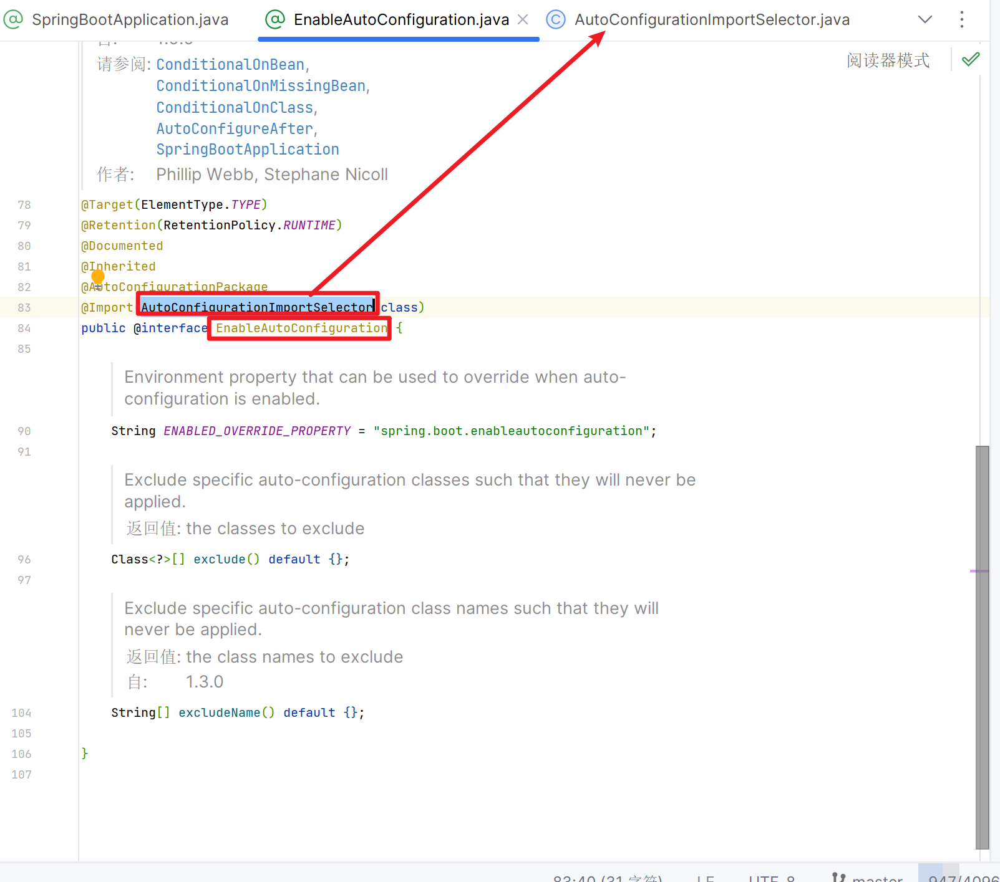
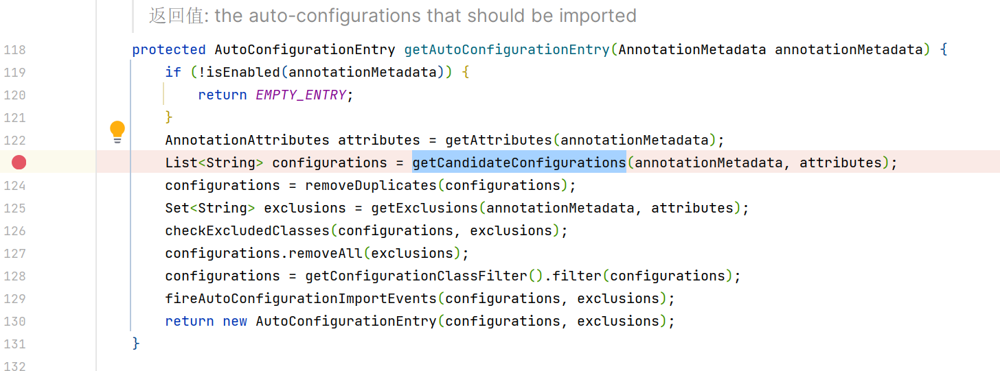
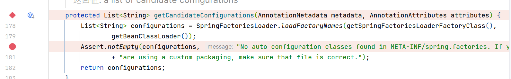
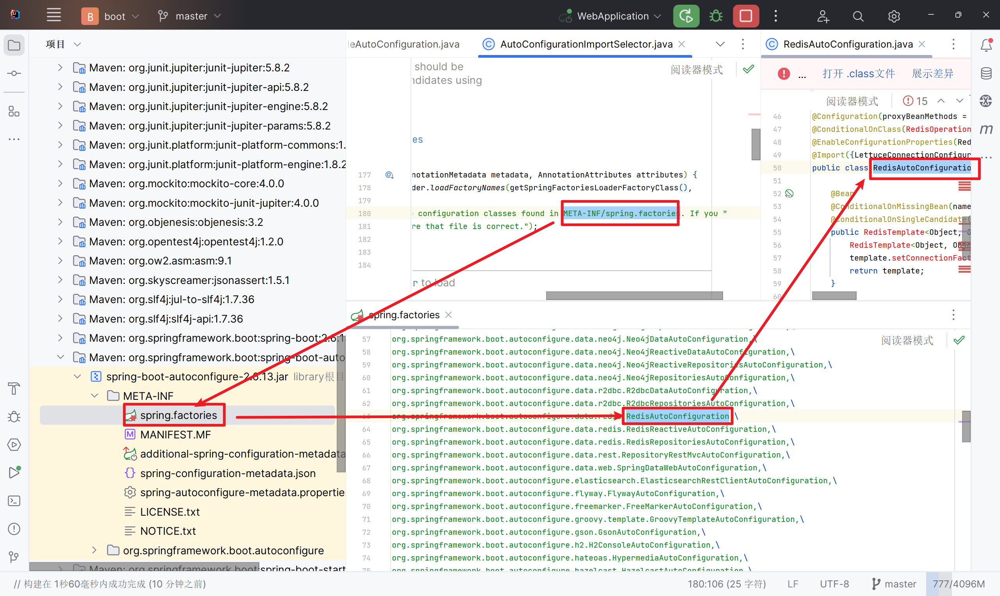
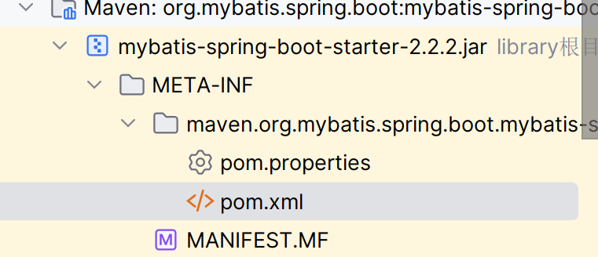
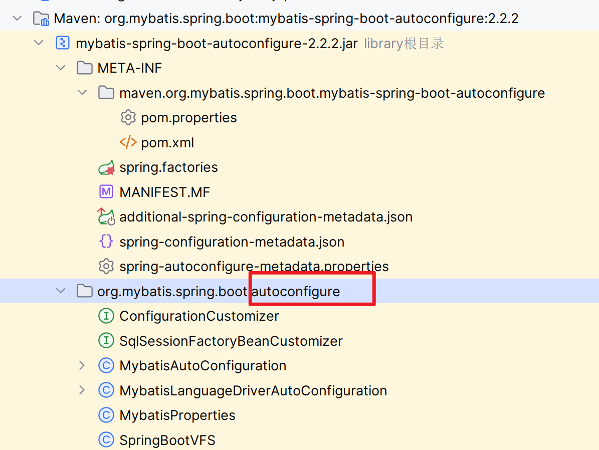
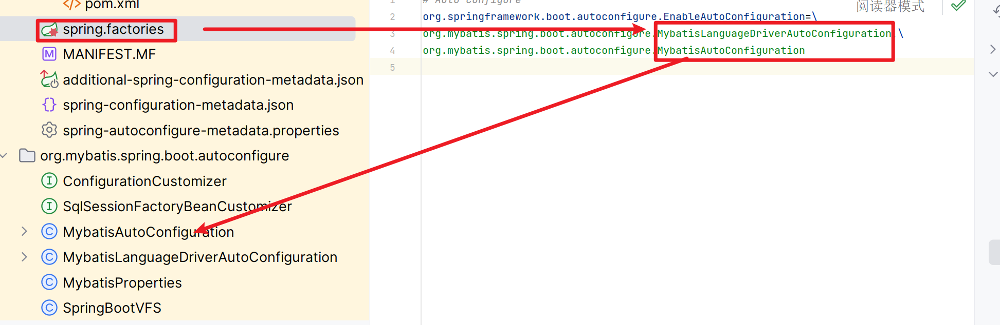

# 自动配置

## Condition

>   实现选择性创建Bean

-   问:

    SpringBoot咱知道要把RedisTemplate放入容器的?我又没让他放

    它咱知道我有没有导入Redis的起步依赖捏?

-   答:

    Condition立大功

### 使用Condition

>   需求:
>
>   ​	如果导入Jedis坐标,就加载User的Bean,
>
>   ​	否则不加载

~~这算不算耦合?~~

```xml
<dependency>
    <groupId>redis.clients</groupId>
    <artifactId>jedis</artifactId>
</dependency>
```

1.  创建一个配置类, 用于把User放进IOC容器

    ```java
    package com.harvey.bootredis.config;

    import ...

    @Configuration
    public class UserConfig {

        @Bean
        public User user() throws ReflectiveOperationException{
            return (User) Class.forName("com.harvey.bootredis.domain.User")
                    .getDeclaredConstructor().newInstance();
        }
    }
    ```

2.  为了判断User应不应该被放入容器,我们在方法上注解`@Conditional`

    -   看看`@Conditional`的源码

        ```java
        package org.springframework.context.annotation;

        import ...

        @Target({ElementType.TYPE, ElementType.METHOD})
        @Retention(RetentionPolicy.RUNTIME)
        @Documented
        public @interface Conditional {
            Class<? extends Condition>[] value();
        }
        ```

        参数需要一个**实现Condition接口**的类

    -   看看`Condition.class`

        ```java
        package org.springframework.context.annotation;

        import org.springframework.core.type.AnnotatedTypeMetadata;

        @FunctionalInterface
        public interface Condition {
            boolean matches(ConditionContext context, AnnotatedTypeMetadata metadata);
        }
        ```

        可以用Lambda表达式?(关注点奇怪)

        只要自己的类实现这个接口就可以了

    1.  编写自己的Condition,实现`Condition.class`

        ```java
        package com.harvey.bootredis.condition;

        // 有很多Condition, 不要导错啦
        import org.springframework.context.annotation.Condition;
        import org.springframework.context.annotation.ConditionContext;
        import org.springframework.core.type.AnnotatedTypeMetadata;

        public class UserCondition implements Condition {
            @Override
            public boolean matches(ConditionContext context, AnnotatedTypeMetadata metadata) {
                return /*Jedis的包被导入了*/false;
            }
        }
        ```

    2.  实现对Jedis坐标是否导入的判断

        ```java
        @Override
        public boolean matches(ConditionContext context, AnnotatedTypeMetadata metadata) {
            // 方法: 找Jedis自解码文件, 看它是不是存在
            // redis.clients.jedis.Jedis
            boolean jedisExist;
            try {
                Class.forName("redis.clients.jedis.Jedis");
                jedisExist = true;
            } catch (ClassNotFoundException ignored) {
                jedisExist = false;
            }
            return jedisExist;
        }
        ```

    3.  现在可以填入注解的参数了

        ```java
        package com.harvey.bootredis.config;

        import com.harvey.bootredis.condition.UserCondition;
        import com.harvey.bootredis.domain.User;
        import org.springframework.context.annotation.Bean;
        import org.springframework.context.annotation.Conditional;
        import org.springframework.context.annotation.Configuration;
        import java.lang.reflect.InvocationTargetException;

        @Configuration
        public class UserConfig {

            @Bean
            @Conditional(UserCondition.class)// 指定COndition
            public User user() throws ReflectiveOperationException{
                return (User) Class.forName("com.harvey.bootredis.domain.User")
                        .getDeclaredConstructor().newInstance();
            }
        }
        ```

3.  测试

    ```java
    public static void main(String[] args) {
        // 它居然有返回值?!真是太周到啦
        ConfigurableApplicationContext applicationContext
                = SpringApplication.run(BootRedisApplication.class, args);
        try{
            User user = (User) applicationContext.getBean("user");
            System.out.println(user);
        }catch (Exception e){
            System.out.println("不能获取");
            return;
        }
        System.out.println("能获取");
    }
    ```

### 动态的Condition

```java
@Override
public boolean matches(ConditionContext context, AnnotatedTypeMetadata metadata) {
    // 方法: 找Jedis自解码文件, 看它是不是存在
    // redis.clients.jedis.Jedis
    boolean jedisExist;
    try {
        Class.forName("redis.clients.jedis.Jedis");
        jedisExist = true;
    } catch (ClassNotFoundException ignored) {
        jedisExist = false;
    }
    return jedisExist;
}
```

`"redis.clients.jedis.Jedis"`写死了

-   使用注解

    ```java
    @Configuration
    public class UserConfig {

        @Bean
        @ConditionalOnProperty(name="XXX",havingValue = "xxx")
        // 如果有配置XXX就加载这个Bean. 
        // 如果加上了havingValue的参数(当然也可以不加,只判断有没有这个配置,不关心值),就表示有配置XXX且值为xxx时加载这个Bean
        @ConditionalOnClass(name="redis.clients.jedis.Jedis")
        // 和上面的差不多
        @ConditionalOnMissingBean(User.class)
        // 没有对应的Bean,才创建这个Bean.
        // 常用于SpringBoot的底层, 判断我们有没有自定义Bean,有的话就不再创建默认Bean,使用我们的Bean
        public User user() throws ReflectiveOperationException{
            return (User) Class.forName("com.harvey.bootredis.domain.User")
                    .getDeclaredConstructor().newInstance();
        }
    }
    ```

## 切换内置服务器

>   SpringBoot默认内置了Tomcat服务器

-   要使用web工程哟





可以看出, 它时凭借查看是否存在Tomcat类来判断依赖是否存在, 要启用哪个服务器的

### 排除内置服务器(Tomcat)

```xml
<dependency>
    <groupId>org.springframework.boot</groupId>
    <artifactId>spring-boot-starter-web</artifactId>

    <!--排除-->
    <exclusions>
        <exclusion>
            <groupId>org.springframework.boot</groupId>
            <artifactId>spring-boot-starter-tomcat</artifactId>
        </exclusion>
    </exclusions>

</dependency>
```

### 导入其他服务器的依赖

```xml
<dependency>
    <groupId>org.springframework.boot</groupId>
    <artifactId>spring-boot-starter-jetty</artifactId>
    <version>2.6.13</version>
</dependency>
```

## @Enable*

>   以Enable开头的注解, 用于动态启动某些功能, 底层原理是使用@Import注解导入一些配置类,实现Bean的动态加载

### 获取其他工程中的Bean

-   SpringBoot工程是否可以直接获取jar包中定义的Bean?

-   不行qwq

-   哪SpringBoot是怎么做的呢?

    **你其实早就知道了**-----使用@Import(另一个包的配置类)



-   其实@SpringBootApplication注解的类也会被加载到Spring容器里去(离谱),所以马,扫描另一个Jar包实例化Bean的那配置类所在的包也是可以获取那个配置类的,以此简洁地获取这个配置类实例化的Bean(离谱)

    我姑且还是说一下: **@SpringBootApplication包扫描的范围是** ***自己所在包及其子包***

    所以你包命名的是一样的话, 还是可以扫到的(当然要用pom.xml导入这个工程)

-   Import导入的类也会被放入Spring容器中去(无论是不是被@Component注解)

-   现在介绍一种新方法: 对@Import进行封装-----没错就是使用@Enable*

    怎么封装**看别的@Enable的源码**

    ```java
    @Target(ElementType.TYPE)
    @Retention(RetentionPolicy.RUNTIME)
    @Documented
    @Inherited
    @AutoConfigurationPackage
    @Import(AutoConfigurationImportSelector.class)
    public @interface EnableAutoConfiguration {

        String ENABLED_OVERRIDE_PROPERTY = "spring.boot.enableautoconfiguration";

        Class<?>[] exclude() default {};

        String[] excludeName() default {};

    }
    ```

    我们怎么封装?

    ```java
    @Target(ElementType.TYPE)
    @Retention(RetentionPolicy.RUNTIME)
    @Documented
    @Import(User.class)
    public @interface EnableUser {
    }
    ```

    就好了

### 核心注解@EnableAutoConfiguration

-   源码









## 案例

>   自定义redis-stater依赖

### 要求

当导入redis坐标,SpringBoot自动创建Jedis的Bean

### 参考

先去看看人家mybatis-spring-boot-starter是咋写的







### 步骤

1.  创建redis-spring-boot-autoconfigure模块

2.  创建redis-spring-boot-stater模块,依赖redis-spring-boot-autoconfigration的模块

3.  在redis-spring-boot-autoconfigure模块中

    1.  创建解析redis配置的类

        ```java
        package com.harvey.redis.configure;

        import org.springframework.boot.context.properties.ConfigurationProperties;

        @ConfigurationProperties(prefix = "redis")
        // 在属性文件(application{-profiles}.properties等)以"redis"开头的属性将封装成这个类
        public class RedisProperties {
            private String host = "127.0.0.1";
            private int port = 6379;
        	Getter And Setter;
        }
        ```

    2.  初始化Jedis的Bean

    3.  定义META-INF/spring.factories文件

        ```java
        package com.harvey.redis.configure;

        import ...

        @Configuration
        @EnableConfigurationProperties(RedisProperties.class)//启用这个连接配置文件的类
        @ConditionalOnClass(Jedis.class)
        public class RedisSpringBootAutoconfiguration {

            @Bean
            @ConditionalOnMissingBean(name = "jedis")
            public Jedis jedis(RedisProperties redisProperties) throws ReflectiveOperationException {
                return Jedis.class
                        .getDeclaredConstructor(String.class,int.class)
                        .newInstance(redisProperties.getHost(), redisProperties.getPort());

            }

        }
        ```

4.  仿照MyBatis编写META-INF/spring.factories

    ```properties
    # MyBatis' Auto Configure ,I'll copy his;
    # org.springframework.boot.autoconfigure.EnableAutoConfiguration=\
    # org.mybatis.spring.boots.autoconfigure.MybatisLanguageDriverAutoConfiguration,\
    # org.mybatis.spring.boot.autoconfigure.MybatisAutoConfiguration
    org.springframework.boot.autoconfigure.EnableAutoConfiguration=\
    com.harvey.redis.configure.RedisSpringBootAutoconfiguration
    ```

    让spring找到你的Autofiguration

    好像所有被导入的依赖的包下的factories都会被扫到

