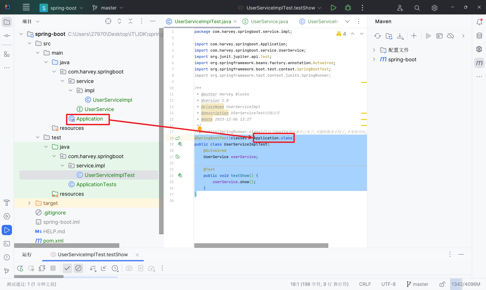
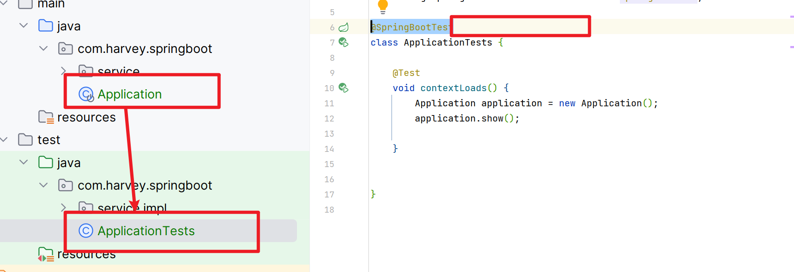

# 整合Junit

>   版本变化,有点不同了

1.  创建SpringBoot工程

2.  引入starter-test起步依赖

    ```xml
    <dependency>
        <groupId>org.springframework.boot</groupId>
        <artifactId>spring-boot-starter-test</artifactId>
        <scope>test</scope>
    </dependency>
    ```

3.  编写测试类

4.  添加测试类相关注解

    -   @RunWith(SpringRunner.class)

        类注解

    -   @SpringBootTest(classes=启动类.class)

        类注解

    ```java
    //@RunWith(SpringRunner.class)//这个Junit4的包要自己导了,可能时版本不同了,不导也可以,这样写就可以了
    @SpringBootTest(classes = Application.class)
    public class UserServiceImplTest{}
    ```

5.  编写测试方法

    ```java
    @SpringBootTest(classes = Application.class)
    public class UserServiceImplTest{
        @Autowired
        UserService userService;
    
        @Test
        public void testShow() {
            userService.show();
        }
    }
    ```

    

    这个Application.就是程序的入口

    

    测试类和入口在同一目录下,就不用写这个参数了

