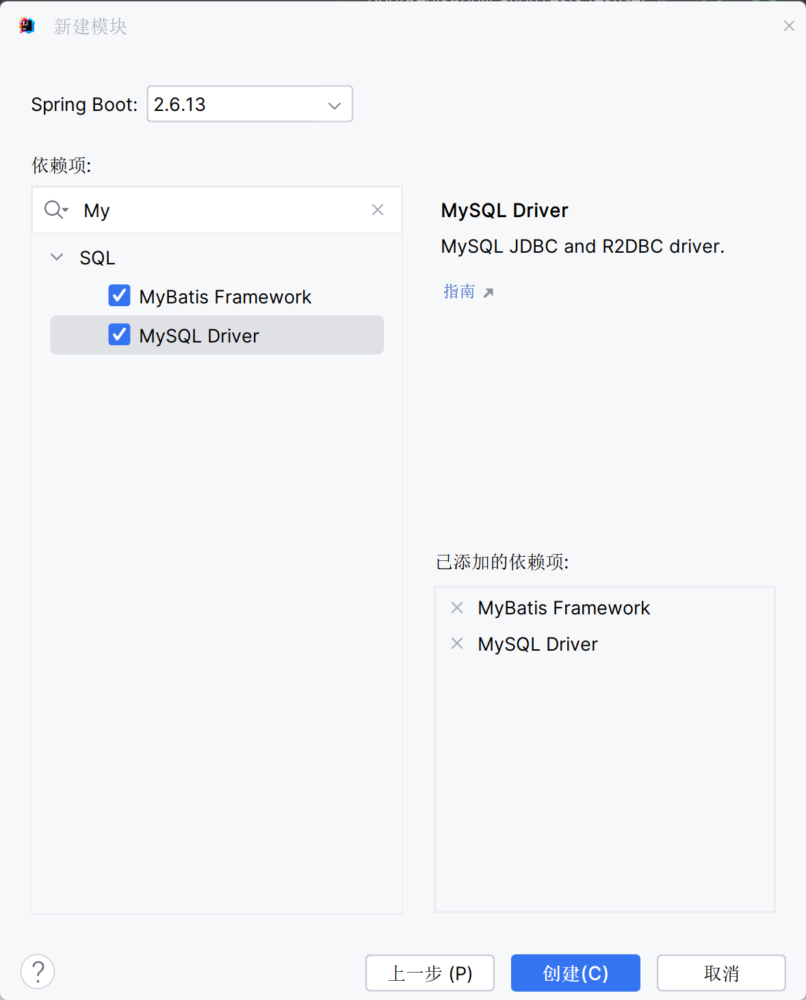
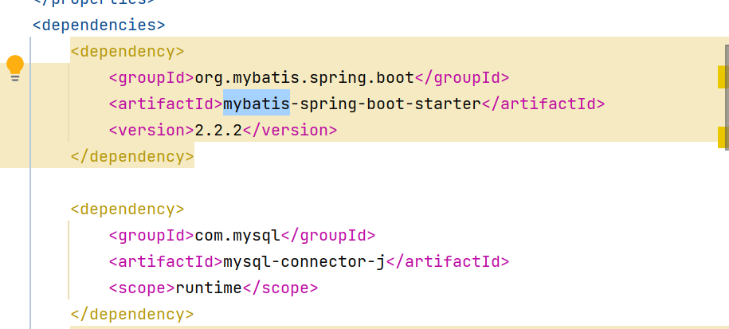

# SpringBoot整合MyBatis

[整合MyBatis](..\..\blog\JDBC与MyBits\Day33-MyBatis简述与配置.md)

[SpringXML整合MyBatis](..\..\spring-blog\基于XML文件的Spring应用\整合第三方框架\Day06-整合MyBatis.md)

[Spring注解整合MyBatis](..\..\spring-blog\基于注解的Spring应用\整合第三方\Day09-整合MyBatis.md)

## 步骤

1.  搭建SpringBoot工程

    

2.  引入mybatis起步依赖, 添加mysql驱动

    

    -   runtime-编译不生效, 运行生效

        可以注释掉

3.  编写DataSource和MyBatis相关配置

    ```properties
    # mysql配置
    spring:
      datasource:
        driver-class-name: com.mysql.cj.jdbc.Driver
        url: jdbc:mysql://localhost:3306/company
        username: root
        password: 123456
    ```

4.  定义表和实体类

    不再赘述

5.  编写dao和mapper文件/注解开发

6.  测试

## 注解开发

-   不需要配置MyBatis的信息

### 编写Mapper类

```java
package com.harvey.bootmybatis.dao;

import com.harvey.bootmybatis.domain.User;
import org.apache.ibatis.annotations.Mapper;
import org.apache.ibatis.annotations.Select;
import java.util.List;

@Mapper
public interface UserMapper {
    @Select("select * from user")
    List<User> findAll();
}
```

### 测试

```java
package com.harvey.bootmybatis;

import ...;

@SpringBootTest
class BootMybatisApplicationTests {

    @Autowired
    private UserMapper userMapper;

    @Test
    void testFindAll() {
        List<User> users = userMapper.findAll();
        System.out.println(users);
    }

}
```

-   可能会出现时区的错误, 但由于我用的时alibaba的魔改spring,所以没有这个问题

    这里也给出解决方案(未测试)

    ```yaml
    # mysql配置
    spring.datasource.url: jdbc:mysql://localhost:3306/company
    ```

    更改->

    ```yaml
    spring.datasource.url: jdbc:mysql://localhost:3306/company?serverIimezone-UTC
    ```

## XML文件开发

-   去掉注解的Mapper, 其余一样

    ```java
    package com.harvey.bootmybatis.dao;

    import com.harvey.bootmybatis.domain.User;
    import org.apache.ibatis.annotations.Mapper;
    import java.util.List;

    @Mapper
    public interface UserMapper {
        List<User> findAll();
    }
    ```

-   映射文件

    ```xml
    <?xml version="1.0" encoding="UTF-8" ?>
    <!DOCTYPE mapper
            PUBLIC "-//mybatis.org//DTD Mapper 3.0//EN"
            "http://mybatis.org/dtd/mybatis-3-mapper.dtd">

    <mapper namespace="com.harvey.bootmybatis.dao.UserMapper">
        <select id="findAll" resultType="com.harvey.bootmybatis.domain.User">
            select * from user;
        </select>
    </mapper>
    ```

-   application.yaml

    ```yaml
    # mysql配置
    spring:
      datasource:
        driver-class-name: com.mysql.cj.jdbc.Driver
        url: jdbc:mysql://localhost:3306/company
        username: root
        password: 123456

    #mybatis配置
    mybatis:
      # config-location: 指定MyBatis的核心配置文件,但是这里没有这个文件

      # mapper映射文件路径,但是我把Mapper接口和XML映射文件放在同一个包下,这个不用写
      # mapper-locations: classpath:com/harvey/bootmybatis/dao/*.xml

      # 包扫描实体类
      type-aliases-package: com.harvey.bootmybatis.domain
    ```

