# 监控

-   监控与监听

>   SpringBoot自带监控功能Actuator,可以帮助实现对程序内部运行情况监控, Bean加载配置,配置属性, 日志信息等

## 导入依赖

```xml
<dependency>
    <groupId>org.springframework.boot</groupId>
    <artifactId>spring-boot-starter-actuator</artifactId>
</dependency>
```

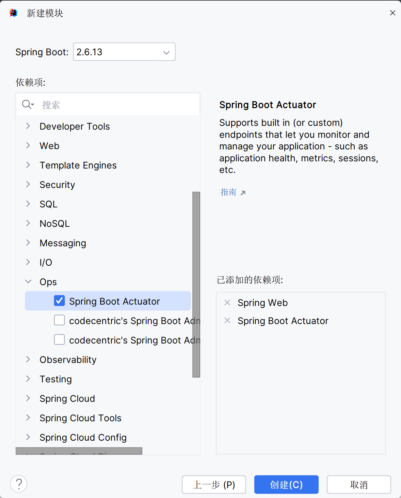

## 启动项目, 测试监控

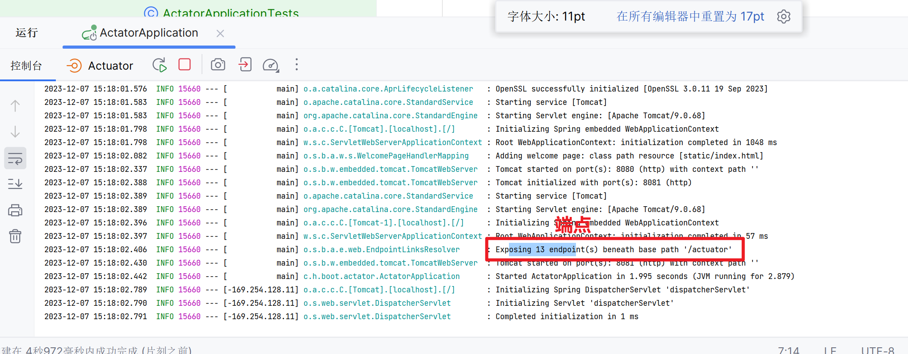

-   这个断点有十三个之多是由于alibaba写了几个配置

    没有这些配置, **只有healthy和info是默认打开监控的**

接下来访问`http://localhost:8081/actuator`

得到一个全是Json字符串的页面

### info

```yaml
management:
  # 启用配置里的info开头的变量
  info:
    env:
      enabled: true
info:
  name: "aaa"
  age: 12
```

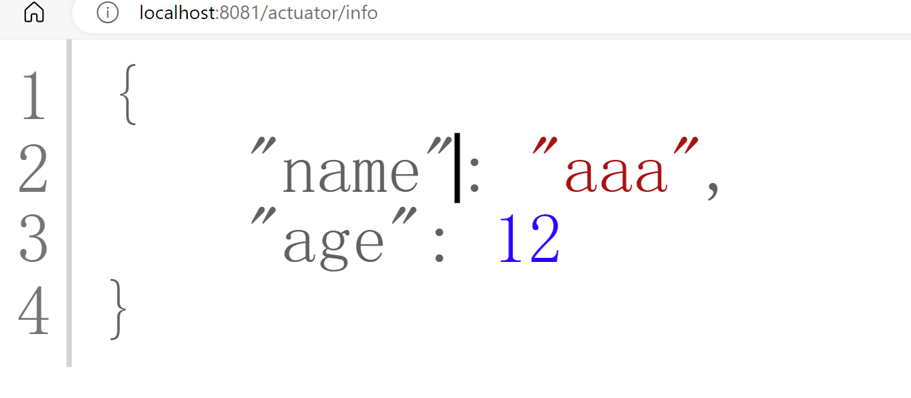

### 健康检查

```yaml
management:
    # 开启健康检查的完整信息
    health:
      show-details: always
```

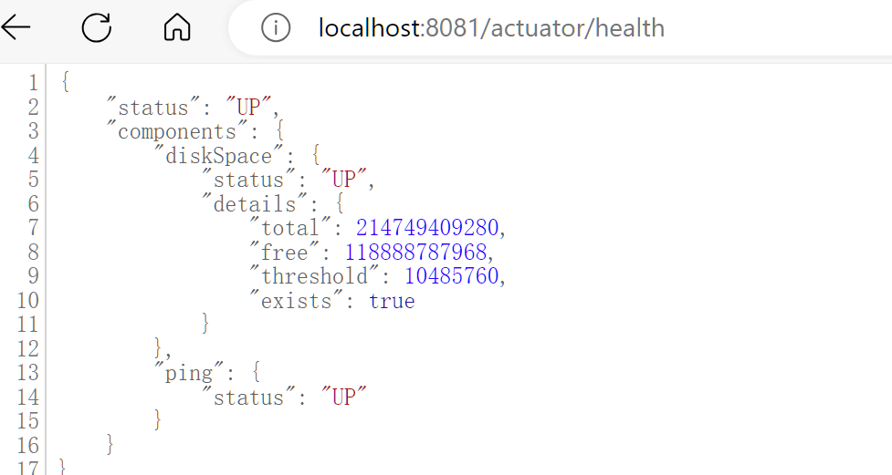

-   "UP"表示程序服务器正常运行
-   diskSpace:磁盘


#### 检查数据库

-   以Redis为例


-   引入Redis之后,不打开redis服务器

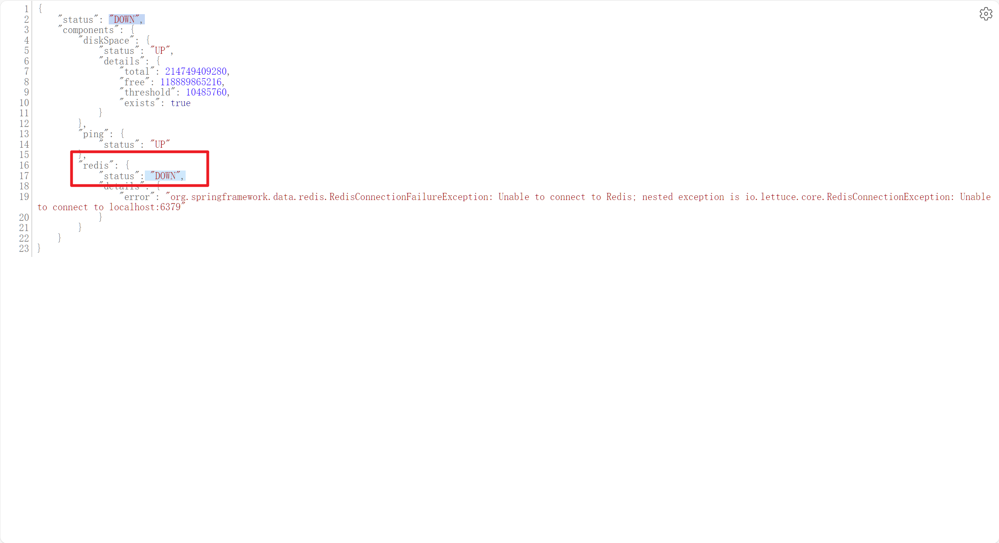

-   开启Redis服务器之后就好了

    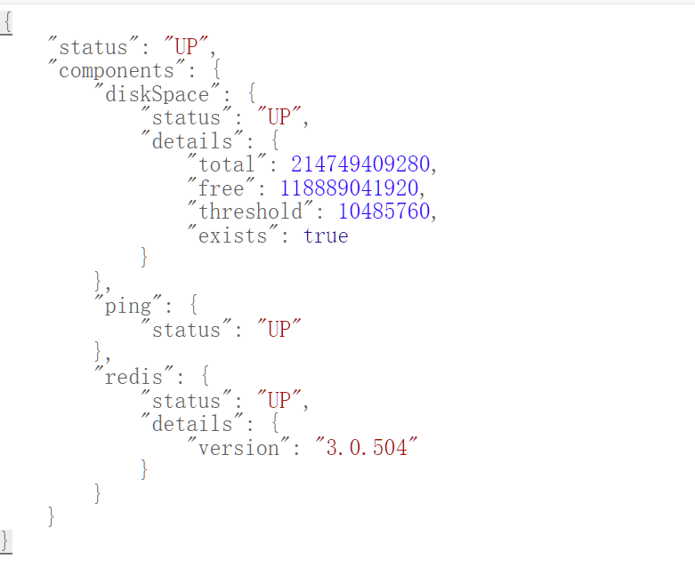

### 把其他端点的监控暴露

```yaml
management:
  endpoints:
    web:
      exposure:
        include: '*'
```

\*在properties文件里不用加引号, 特别的, **在yaml里要加引号**, 否则认为是特殊字符无法被识别

## Spring Boot Admin

>   前面上千个的Json信息, 看着很没有条例, 自己整理也不知道怎样美观...
>
>   **Spring Boot Admin**(开源项目),提供UI界面, 用于管理和监控SpringBoot应用程序


Spring Boot Admin有客户端(Client)和服务端(Server)

-   Client: 想被监控的Spring项目
-   Server: Admin的UI界面的提供


-   一般只在produce的时候用, 看看运行情况啥的, 放到deploy环境上就不会用admin了

### admin-server使用步骤

1.  创建admin-server模块

    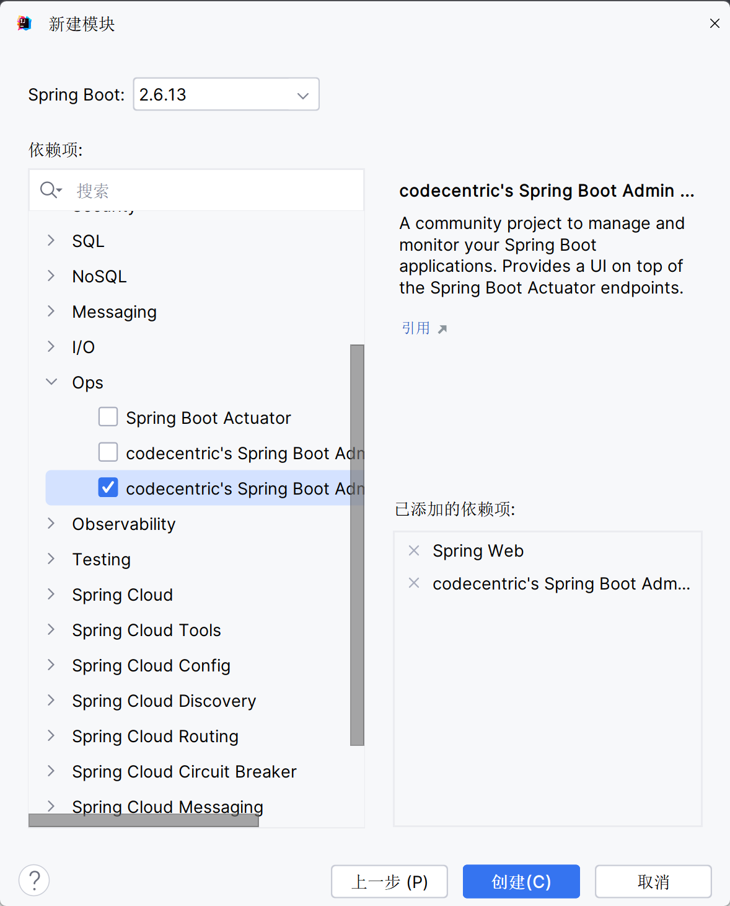

    -   Actuator不用勾选, admin-server依赖于Actuator

2.  导入依赖坐标admin-stater-server

    ```xml
    <dependency>
        <groupId>de.codecentric</groupId>
        <artifactId>spring-boot-admin-starter-server</artifactId>
    </dependency>
    ```

3.  在引导类上启用监控功能@EnableAdminServer

    ```java
    @EnableAdminServer
    @SpringBootApplication
    public class AdminServerApplication {
    
        public static void main(String[] args) {
            SpringApplication.run(AdminServerApplication.class, args);
        }
    
    }
    ```


### admin-client使用步骤

1.  创建admin-client模块

    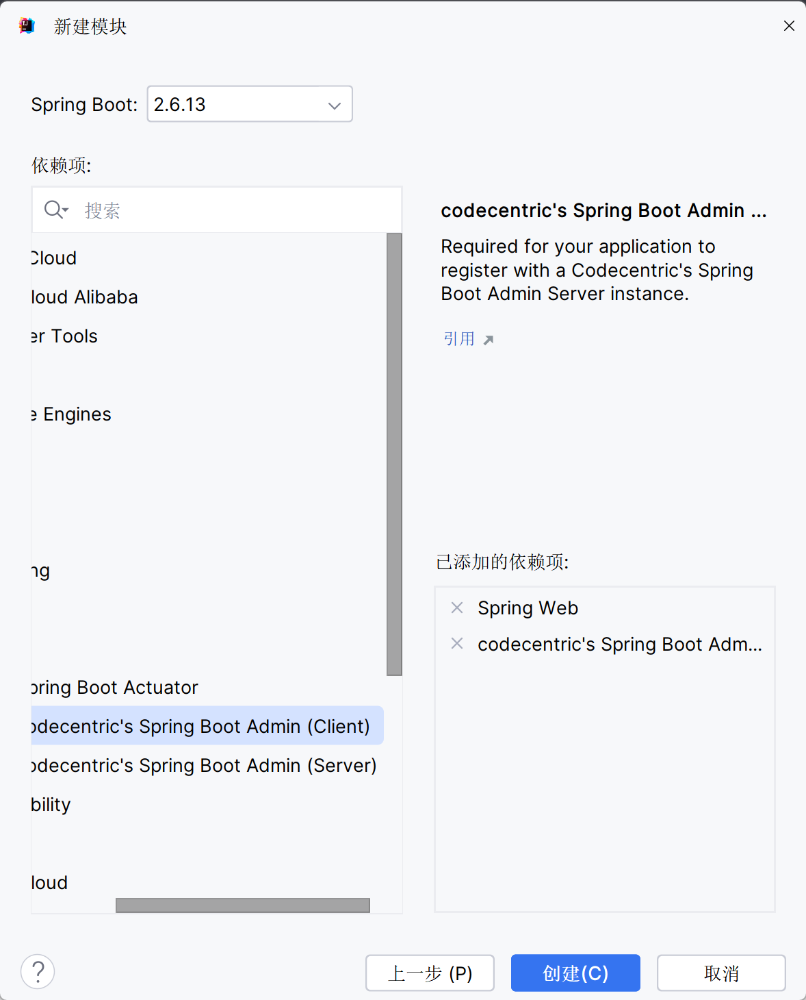

2.  导入依赖坐标admin-stater-client

    ```xml
    <dependency>
        <groupId>de.codecentric</groupId>
        <artifactId>spring-boot-admin-starter-client</artifactId>
    </dependency>
    ```

3.  配置相关信息: server地址等, 让把信息给server

    ```yaml
    # admin.server url,为了方便演示, 我把server的端口号改为了9000
    spring:
      boot:
        admin:
          client:
            url: http://localhost:9000
    ```

    

4.  启动server和client服务, 访问server

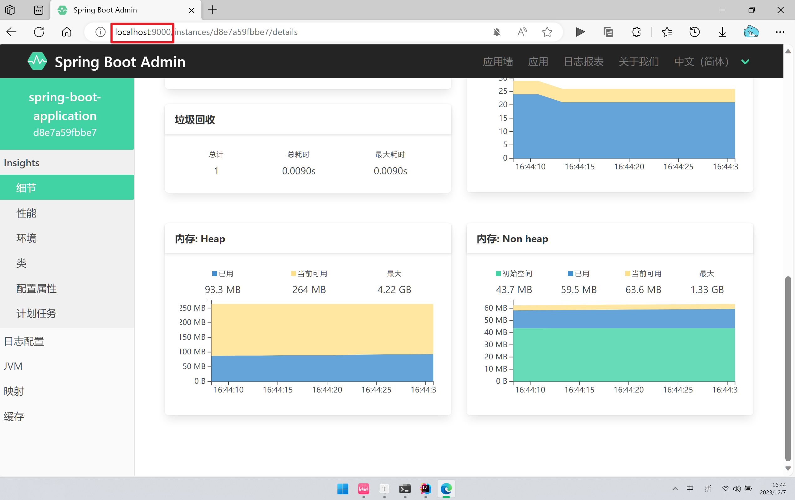

更多内容待你发现

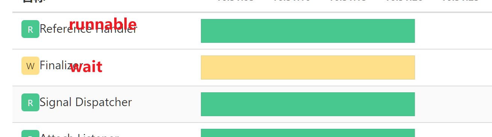

## 牛逼不过Idea

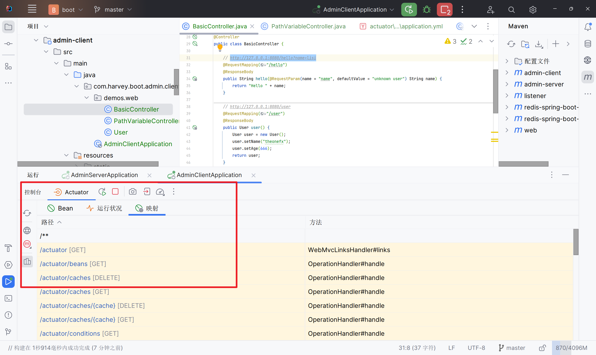

