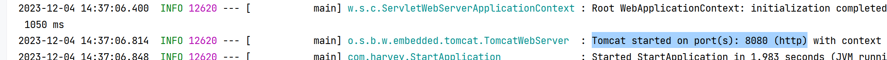
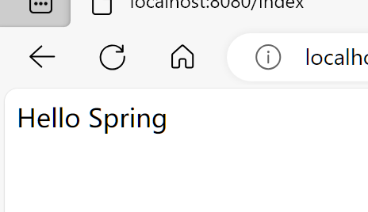
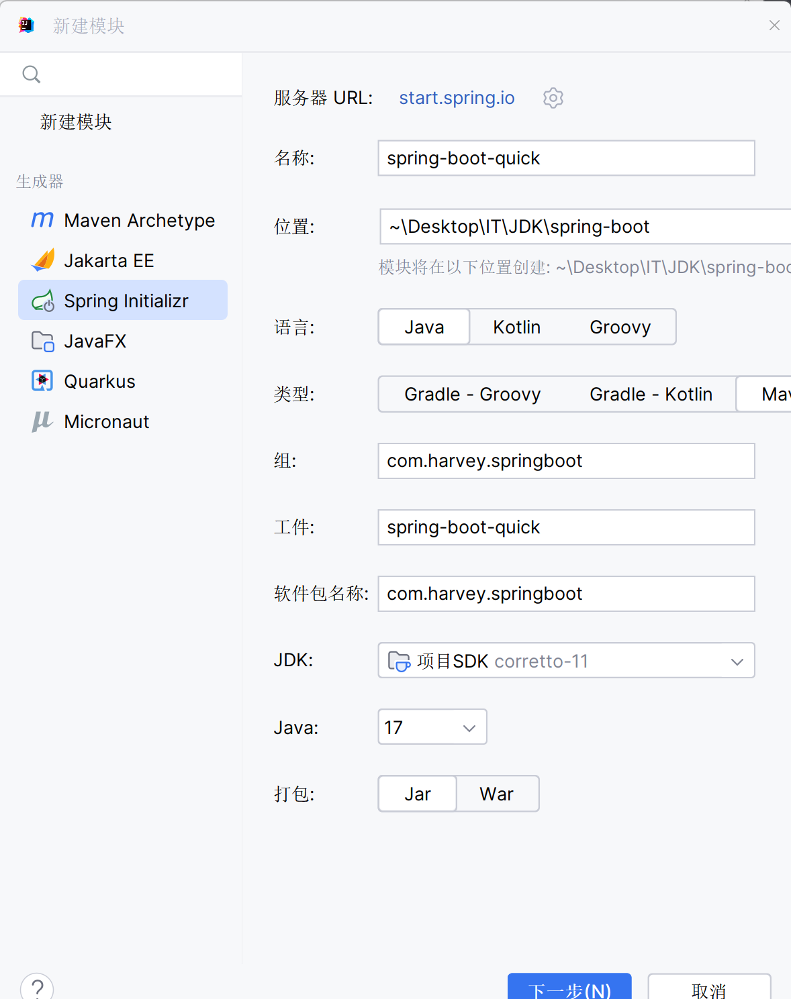
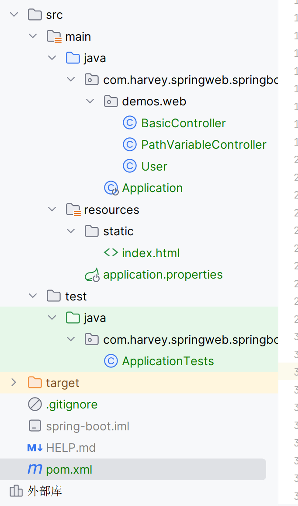

SpringBoot-Spring Cloud-Spring Cloud Data Flow

# SpringBoot

使用最小的配置快速启动SpringBoot

## Spring的缺点

-   写配置文件麻烦, 记不住
-   依赖繁琐 ,spring全家桶里有好多,他们还互相嵌套,还有版本不兼容的问题

## SpringBoot的优点

-   自动配置
    -    SpringBoot的自动配置是运行时 ( 程序启动时 )的过程, 考虑众多因素, 才决定Spring配置应该用哪个,该过程时Spring自动完成的
-   起步依赖
    -   本质上是一个Maven项目对象模型 (**ProjectObjectModel** , POM ) ,定义了对其他库的**传递依赖** , 这些东西加载一起即支持某项功能 . 
    -   起步以来就是将具备某种功能的坐标打包在一起 , 并提供一些默认的功能
    -    把导入的包包裹起来了
-   辅助功能
    -   嵌入式服务器(不需要tomcat , spring自带tomcat)
    -   安全
    -   指标
    -   健康检测
    -   外部配置
    -   ......

***Spring Boot 并不是对Spring的增强 , 而是提供了一种快速使用的Spring的方式***

  


## 快速入门

1.  创建Maven项目
2.  导入SpringBoot起步依赖
3.  定义Controller
4.  编写引导类
5.  启动测试


### 创建Maven项目

-   不要指定打包方式,spring会打jar包

```xml
<project xmlns="http://maven.apache.org/POM/4.0.0" xmlns:xsi="http://www.w3.org/2001/XMLSchema-instance"
         xsi:schemaLocation="http://maven.apache.org/POM/4.0.0 http://maven.apache.org/maven-v4_0_0.xsd">
    <modelVersion>4.0.0</modelVersion>

    <groupId>com.harvey</groupId>
    <artifactId>spring-boot</artifactId>
    <version>1.0-SNAPSHOT</version>

    <name>spring-boot</name>
    <url>http://maven.apache.org</url>

    <build>
        <finalName>spring-boot</finalName>
    </build>

</project>
```

### 导入SpringBoot起步依赖

```xml
<!--spring-boot需要继承的父工程-->
<parent>
    <groupId>org.springframework.boot</groupId>
    <artifactId>spring-boot-starter-parent</artifactId>
    <version>2.7.14</version>
</parent>


<dependencies>
    <!--spring boot的web开发的起步依赖-->
    <dependency>
        <groupId>org.springframework.boot</groupId>
        <artifactId>spring-boot-starter-web</artifactId>
    </dependency>
</dependencies>
```


### 定义Controller


```java
@RestController
public class Controller {
    @RequestMapping("/index")
    public String index() {
        String s = "Hello Spring";
        System.out.println(s);
        return s;

    }
}
```

-   业务编写代码方式一模一样

### 编写引导类

```java
@SpringBootApplication
public class StartApplication {
    public static void main(String[] args) {
        SpringApplication.run(StartApplication.class);
    }

}
```


### 测试运行



内置了Tomcat


`http://localhost:8080/index`



## 快速构建Spring模块

-   start,spring.io在JDK版本上优点问题,用[Cloud Native App Initializer (aliyun.com)](https://start.aliyun.com/)为佳



-   一步到位



```xml
<?xml version="1.0" encoding="UTF-8"?>
<project xmlns="http://maven.apache.org/POM/4.0.0" xmlns:xsi="http://www.w3.org/2001/XMLSchema-instance"
         xsi:schemaLocation="http://maven.apache.org/POM/4.0.0 https://maven.apache.org/xsd/maven-4.0.0.xsd">
    <modelVersion>4.0.0</modelVersion>
    <groupId>com.harvey.springweb</groupId>
    <artifactId>spring-boot</artifactId>
    <version>0.0.1-SNAPSHOT</version>
    <name>spring-boot</name>
    <description>spring-boot</description>
    <properties>
        <java.version>11</java.version>
        <project.build.sourceEncoding>UTF-8</project.build.sourceEncoding>
        <project.reporting.outputEncoding>UTF-8</project.reporting.outputEncoding>
        <spring-boot.version>2.6.13</spring-boot.version>
    </properties>
    <dependencies>
        <dependency>
            <groupId>org.springframework.boot</groupId>
            <artifactId>spring-boot-starter-web</artifactId>
        </dependency>

        <dependency>
            <groupId>org.springframework.boot</groupId>
            <artifactId>spring-boot-starter-test</artifactId>
            <scope>test</scope>
        </dependency>
    </dependencies>
    <dependencyManagement>
        <dependencies>
            <dependency>
                <groupId>org.springframework.boot</groupId>
                <artifactId>spring-boot-dependencies</artifactId>
                <version>${spring-boot.version}</version>
                <type>pom</type>
                <scope>import</scope>
            </dependency>
        </dependencies>
    </dependencyManagement>

    <build>
        <plugins>
            <plugin>
                <groupId>org.apache.maven.plugins</groupId>
                <artifactId>maven-compiler-plugin</artifactId>
                <version>3.8.1</version>
                <configuration>
                    <source>11</source>
                    <target>11</target>
                    <encoding>UTF-8</encoding>
                </configuration>
            </plugin>
            <plugin>
                <groupId>org.springframework.boot</groupId>
                <artifactId>spring-boot-maven-plugin</artifactId>
                <configuration>
                    <!--表示编译版本配置有效-->
                    <fork>true</fork>
                    <!--引入第三方jar包时,不添加则引入的第三方jar不会被打入jar包中-->
                    <includeSystemScope>true</includeSystemScope>
                    <!--排除第三方jar文件-->
                    <includes>
                        <include>
                            <groupId>nothing</groupId>
                            <artifactId>nothing</artifactId>
                        </include>
                    </includes>
                </configuration>
                <executions>
                    <execution>
                        <goals>
                            <goal>repackage</goal>
                        </goals>
                    </execution>
                </executions>
            </plugin>
        </plugins>
    </build>

</project>
```

