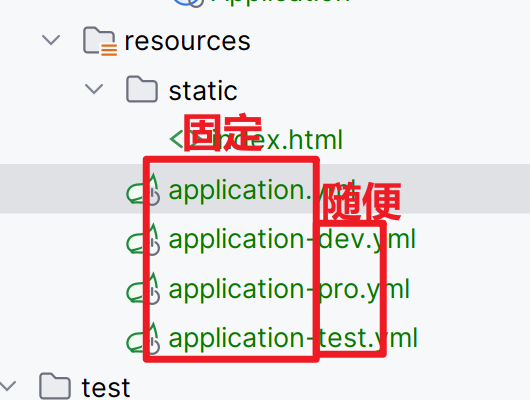
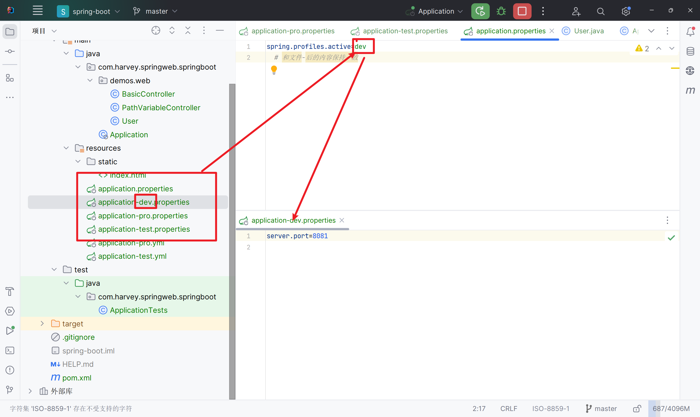
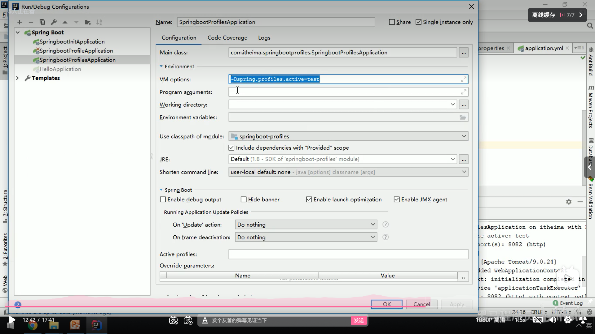
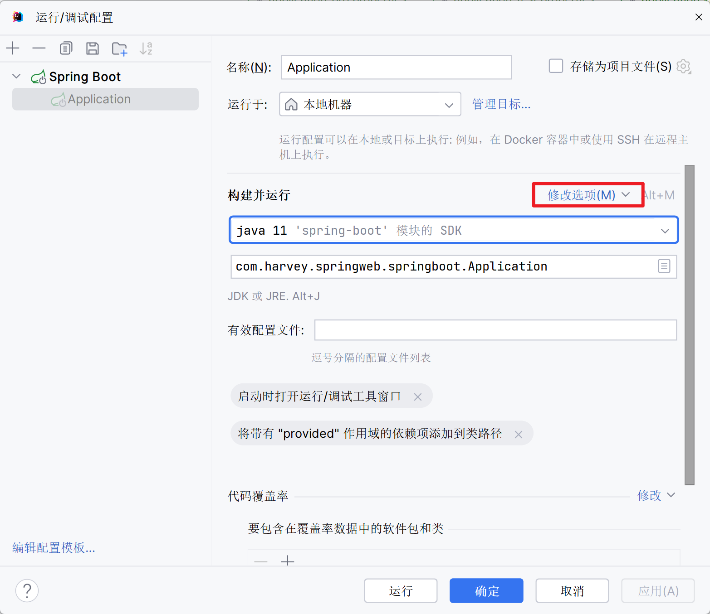
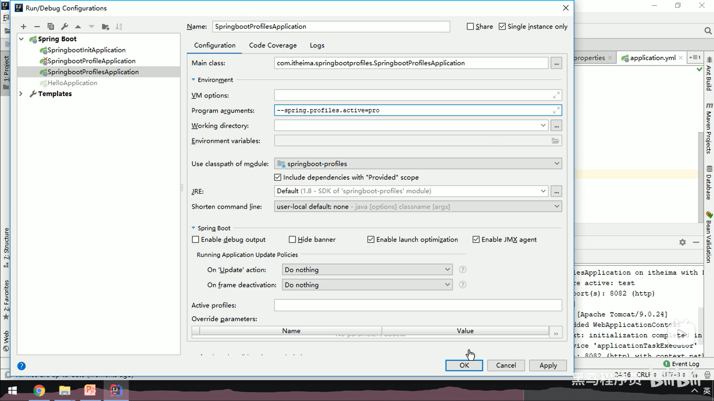
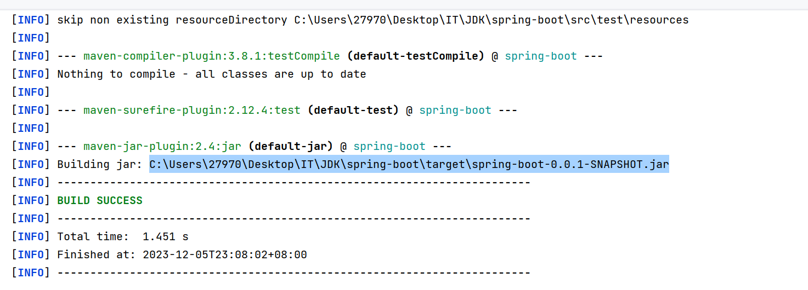
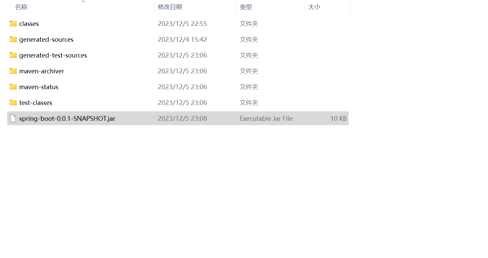

# profile环境配置

##配置方式

-   profile激活方式

    -   配置文件
        -   多profile文件
    
        -   多yml文档
    -   虚拟机参数
    -   命令行参数

###配置文件

#### 多文件





```properties
spring.profiles.active=dev
```

-   指定生产环境的对应配置文件
-   yaml的主配置也可以,也可以做环境配置
-   还可以杂交

#### yaml多文档

```yaml
---
# the first pattern
server:
  port: 8081

spring:
  profiles: dev # make a name
---
# the second pattern
server:
  port: 8082

spring:
  profiles: pro # make a name
---
# the third pattern
server:
  port: 8083

spring:
  profiles: test # make a name
---
# the forth pattern
spring:
  profiles:
    active: test
```

### 虚拟机参数

新UI找不到了?




### 命令行参数





-   这个还在



### 脱离idea工具

不用改变配置文件, 而是动态地切换, 方便又安全


1.  maven打包	

    记得装插件pom.xml

    ```xml
            <plugin>
                    <groupId>org.apache.maven.plugins</groupId>
                    <artifactId>maven-shade-plugin</artifactId>
                    <version>3.2.4</version>
                    <executions>
                        <execution>
                            <phase>package</phase>
                            <goals>
                                <goal>shade</goal>
                            </goals>
                            <configuration>
                                <transformers>
                                    <transformer implementation="org.apache.maven.plugins.shade.resource.ManifestResourceTransformer">
                                        <mainClass>com.harvey.springweb.springboot.Application</mainClass>
                                    </transformer>
                                </transformers>
                            </configuration>
                        </execution>
                    </executions>
                </plugin>
    ```

    用来指定**加载主类**的

2.  去到maven打包的地址

    

    

3.  在jar包同级目录下打开控制台

    ```bash
    java -jar .\spring-boot-0.0.1-SNAPSHOT.jar --spring.profiles.acticve=pro
    ```

    运行


