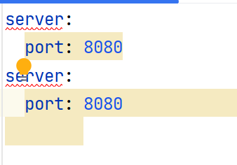
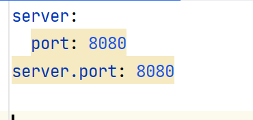
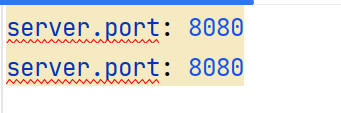
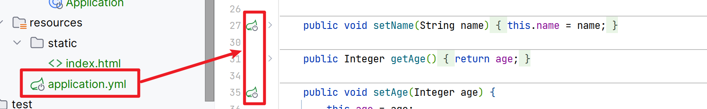

# yaml配置文件

## 基本概念

>   YAML Ain't Markup Language
>
>   一种**直观的**, **能被电脑识别的**( 不是标记语言 )数据数据序列化格式

-   容易被人类阅读
-   容易和脚本语言交互
-   可以被支持YAML库的不同的编程语言程序导入
    -   如C/C++,Ruby,Python,Java,Perl,C#,PHP
-   以数据为中心
-   比properties更清晰
-   比xml更简洁

## 基本语法

-   大小写敏感
-   **数据值前必须有空格**( 一个或多个空格无所谓 )
    -   空格作为分隔符
    -   数据值可以有一至多个
-   使用缩进表示层级关系
-   **缩进来区分层级**
    -   不允许Tab键, 只允许使用空格
        -   因为Tab的花样太多, 或(4个啊8个啊)
        -   但是**聪明的idea会出手**
    -   缩进的空格数不重要, 只要相同层级的元素左对齐即可
-   使用#表示**行注释**







## 数据格式

-   对象(map):键值对的集合

    ```yaml
    # tomcat port
    server:
      port: 8080
      address: 127.0.0.1
    ```

    ```yaml
    server:
      address: 127.0.0.1
      port: 8080
    # 等价于
    server: {address: 127.0.0.1,port: 8080}
    ```

    花括号前要有空格

-   数组

    ```yaml
    address:
      - beijing
      - shanghai
    # 等价于
    address: [beijing,shanghai] # 逗号分割
    ```

-   纯量

    单个的 , 不可再分的值

    ```yaml
    msg1: 'Hello World\n' # 单引号忽略转义字符,msg1无回车
    msg2: "Hello World\n" # 双引号识别转移字符,msg2有回车
    ```

    ```yaml
    person:
      name: "张三"
    # 等价于
    person.name: "张三"
    ```

### 参数引用

`${key}` 

```yml
server:
  port: 8080

myServer:
  port: ${server.port}
```

## 读取配置yaml文件里的内容

-   `@Value`注解
-   `Environment`对象
-   `@ConfigurationPropertoes`注解
    -   配置文件和对象映射

### `@Value`注解

#### 对象注入

```yaml
person:
  name: "human"
  age: 12
```

```java
@Value("${person.name}")
private String username;

// http://127.0.0.1:8080/yaml
@RequestMapping("/yaml")
@ResponseBody
public String yaml() {
    System.out.println(username);
    return "Hello " + username;
}
```

#### 数组注入

```yaml
address:
  - beijing
  - shanghai
```

```java
@Value("${address[0]}")
private String addr;

// http://127.0.0.1:8080/yaml
@RequestMapping("/yaml")
@ResponseBody
public String yaml() {
    System.out.println(addr);
    return "Hello " + addr;
}
```

### `Environment`对象

```yaml
person:
  name: "human"
  age: 12

address:
  - beijing
  - shanghai
```

```java
@Autowired
private Environment env;//只需要注意一个对象,value看起来更零散

// http://127.0.0.1:8080/yaml
@RequestMapping("/yaml")
@ResponseBody
public String yaml() {
    String name = env.getProperty("person.name");
    String addr = env.getProperty("address[0]");
    System.out.println(name);
    System.out.println(addr);
    return "Hello " + name + " from " + addr;
}
```

### `@ConfigurationPropertoes`注解

-   yaml

    ```yaml
    person:
      name: "human"
      age: 12
      address:
        - beijing
        - shanghai
    ```

-   pojo

    ```java
    package com.harvey.springweb.springboot.demos.web;

    import org.springframework.boot.context.properties.ConfigurationProperties;
    import org.springframework.stereotype.Component;

    import java.util.Arrays;

    @Component
    @ConfigurationProperties("person")//指明注入的属性属于哪个对象之下
    public class User {//不必同名

        private String name;
        private Integer age;
        private String[] address;//支持注入数组

        @Override
        public String toString() {...}

        //Setter函数名要一致
        public void setName(String name) {..}
        public void setAge(Integer age) {...}
        public void setAddress(String[] address) {...}

        public String getName() {...}
    	public Integer getAge() {...}
        public String[] getAddress() {...}
    }
    ```

    

    正确配置之后会有插件提示

-   Controller

    ```java
    @Autowired
    private User user;

    // http://127.0.0.1:8080/yaml
    @RequestMapping("/yaml")
    @ResponseBody
    public String yaml() {
        String userMeg = user.toString();
        System.out.println(userMeg);
        return userMeg;
    }
    ```

