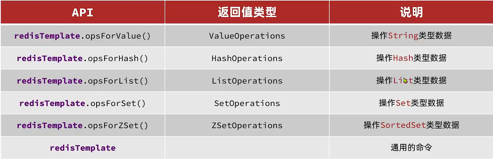
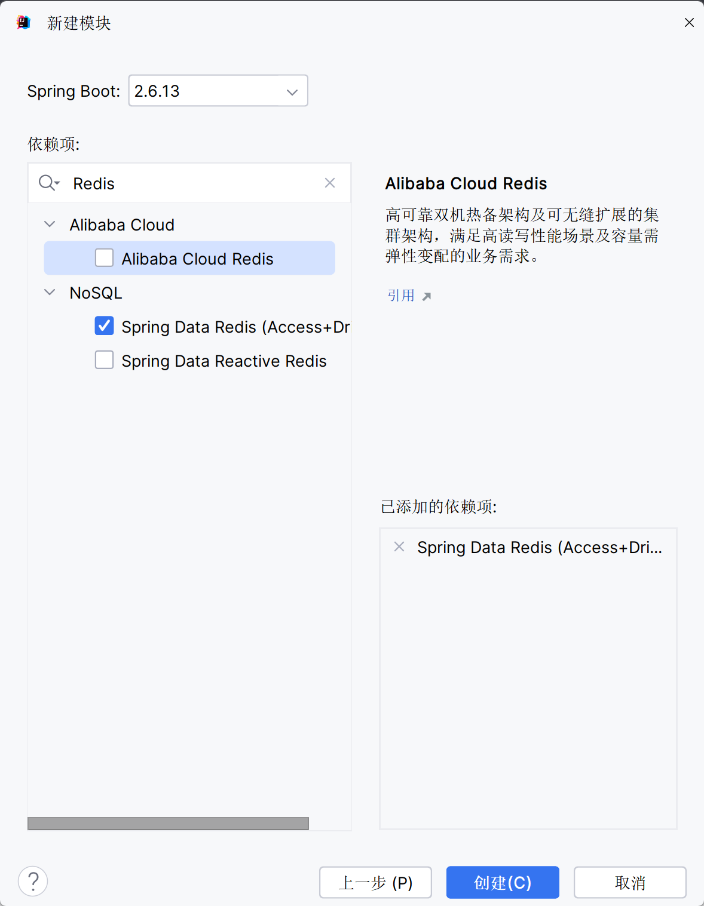

# RedisTemplate



## 快速入门

### 创建项目

使用SpringBoot



### 引入依赖

```xml
<dependency>
    <groupId>org.springframework.boot</groupId>
    <artifactId>spring-boot-starter-data-redis</artifactId>
</dependency>
```

连接池依赖

```xml
<dependency>
    <groupId>org.apache.commons</groupId>
    <artifactId>commons-pool2</artifactId>
</dependency>
```

### 配置

```yaml
spring:
  redis:
    port: 6379
    host: redis
    password: 123456
    lettuce:
      # 这是由于SpringBoot默认使用了lettuce实现的RedisTemplate
      # 想用Jedis的, 还得另外配置
      pool:
      # 已经准备好了连接池
        max-active: 8 # 最大连接数
        max-idle: 8 # 最大空闲连接
        min-idle: 0 # 最小空闲连接
        max-wait: 100ms # 等待时间
```

### 注入

```java
@Autowired
private RedisTemplate redisTemplate;
```
### 使用

```java
@SpringBootTest
class RedisApplicationTests {
    @Autowired
    private RedisTemplate redisTemplate;
    private final Logger logger = LoggerFactory.getLogger("name");

    @Test
    void testRedisTemplate(){
        // 获取键值对的操作
        ValueOperations valueOperations = redisTemplate.opsForValue();
        // 底层由自动的序列化机制
        valueOperations.set("key","value");
        valueOperations.set("id",12);// 两个参数都可以是Object

        logger.info(String.valueOf(valueOperations.get("key")));
        logger.info(String.valueOf(valueOperations.get("id")));
    }
}
```

