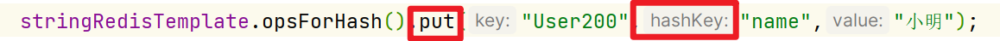
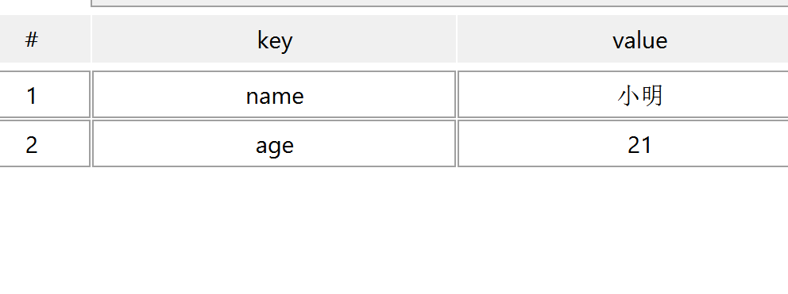

# 操作Hash结构



与指令略有不同

```java
@Test
void testHash(){
    stringRedisTemplate.opsForHash().put("user:200","name","小明");
    stringRedisTemplate.opsForHash().put("user:200","age","21");

    System.out.println(stringRedisTemplate.opsForHash().get("user:200", "name"));
    System.out.println(stringRedisTemplate.opsForHash().get("user:200", "age"));

    System.out.println(stringRedisTemplate.opsForHash().entries("user:200"));
    System.out.println(stringRedisTemplate.opsForHash().keys("user:200"));
    System.out.println(stringRedisTemplate.opsForHash().values("user:200"));

}
```

结果: 

```
小明
21
{name=小明, age=21}
[name, age]
[小明, 21]
```



其实我觉得有了Json之后, 好像什么Hash啊, List啊,好像每必要了啊

