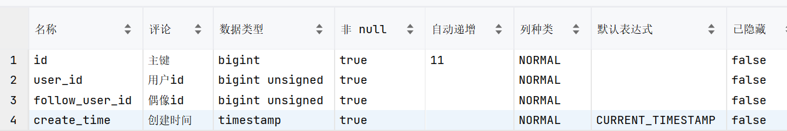

# 关注

关注,取关,互关,共同关注(intersect,并集)


## Follow数据表



## 关注和取关

-   就像一人一赞一样, 一人一关注高量显示


### 关注和取关

####Redis Set设计

-   粉丝为键:Writer集合

一个用户可能会有几十个关注

一个Writer可能会有几万个粉丝

一个平台可能会有几百万个用户

以粉丝为键, 查询一个用户是否关注一个Writer时, 是先从几十万用户中查出粉丝, 再从几十个关注中查出用户

以Writer为键, 查询一个用户是否关注一个Writer时, 是先从几十万用户中查出Writer, 再从几万个粉丝中查出粉丝

以上, 选择粉丝为键:Writer集合

#### 业务逻辑


```java
@Override
@Transactional
public void follow(Long writerId, boolean canFollow) {
    if (writerId==null){
        return;
    }
    Long fanId = UserHolder.currentUserId();
    String followedSetKey = followedSetKey(fanId);
    IFollowService followService = (IFollowService) AopContext.currentProxy();
    boolean success;
    if (canFollow) {
        // 增加关注数量
        Follow follow = new Follow();
        follow.setFollowUserId(writerId);
        follow.setUserId(fanId);
        success = followService.save(follow);
        if (success) {
            stringRedisTemplate.opsForSet().add(followedSetKey, writerId.toString());
        }
    } else {
        // 删除关注关系
        success = followService.remove(
                new LambdaQueryWrapper<Follow>().select()
                        .eq(Follow::getUserId, fanId)
                        .eq(Follow::getFollowUserId, writerId)
        );

        if (success) {
            stringRedisTemplate.opsForSet().remove(followedSetKey, writerId.toString());
        }
    }
}

```

### 查看是否关注

```java
@Override
public boolean isFollowed(Long writerId) {
    if(writerId==null){
        return false;
    }
    Long fanId = UserHolder.currentUserId();
    Boolean followed = checkIsMember(followedSetKey(fanId), writerId.toString());
    return Boolean.TRUE.equals(followed);
}
```

## 共同关注

>   交集

###Redis

```bash
redis(pc2):0>sadd setKey1 0 1 3 4 5 6
"6"
redis(pc2):0>sadd setKey2 1 2 4 7 
"4"
redis(pc2):0>sInter setKey1 setKey2
1) "1"
2) "4"
```

### MySQL

```mysql
select `tf*`.`follow_user_id` as `inter_follow_user_id` from
    (select * from `tb_follow` where `user_id` = 2) as `tf*2` INNER JOIN
    (select * from `tb_follow` where `user_id` = 1011) as `tf*`;
```

### Java

```java
set1.retainAll(set2);
stringRedisTemplate.opsForSet().intersect("setKey1","setKey2");
stringRedisTemplate.opsForSet().intersect(Set.of("setKey1","setKey2","..."));
```

### 业务逻辑

```java
@Override
public List<UserDTO> followInteraction(Long user1Id, Long user2Id) {
    log.debug(String.valueOf(user1Id));
    log.debug(String.valueOf(user2Id));

    Set<String> ids = stringRedisTemplate.opsForSet()
            .intersect(followedSetKey(user1Id), followedSetKey(user2Id));
    log.debug(String.valueOf(ids));
    if (ids == null || ids.isEmpty()) {
        return Collections.emptyList();
    }
    return userService.listByIds(ids).stream()
            .map((user ->
                    new UserDTO(user.getId(), user.getNickName(), user.getIcon()))
            ).collect(Collectors.toList());
}
```


