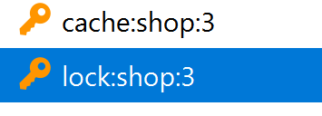

# 解决击穿

## 互斥锁

### 流程分析

1.  提交shopI

2.  从Redis查询商铺缓存

    -   在缓存中
        -   非重点
    -   不在缓存中

3.  获取锁

    -   获取锁成功

        从数据库查询并将数据写入Redis

    -   获取锁失败

        再次从Redis缓存查询

我就明说了: 怎么知道自己拿没拿到锁

Redis的`setnx`命令实现互斥锁

```bash
redis(pc2):0>setnx lockIsOpen false #第一个人
"1"
redis(pc2):0>get lockIsOpen#第一个人
"false"
redis(pc2):0>setnx lockIsOpen true#第二个人
"0"
redis(pc2):0>get lockIsOpen#第二个人set的值和get的值不同, 说明这块键已经有第一个人创建. 对于setnx,只有第一个创建key的人才有权利设置这个key的值. 就好像只有第一个拿到锁的线程才能进入被锁住的部分一样
"false"
redis(pc2):0>del lockIsOpen# 释放锁
```

存在问题: 在释放锁之前出了问题, 从此以后没有人可以进入那段被锁的逻辑了

解决方法: 给锁增加有效期, 如十秒钟(业务执行一般在一秒钟以内)


### 代码实现


#### 准备锁

`setes`的对应api: 

```java
private boolean lock(String lockKey) {
    Boolean exit = stringRedisTemplate.opsForValue()
        .setIfAbsent(lockKey, "", 10, TimeUnit.SECONDS);
    // 锁的时效设置成业务完成的十倍二十倍, 防止意外
    return exit != null && exit;
}
```


#### 释放锁的逻辑

```java
private void unlock(String lockKey) {
    Boolean exit = stringRedisTemplate.delete(lockKey);
}
```

#### 抽取数据库读写的逻辑

```java
private Shop getShopFromDbAndWriteToRedis(Long id, String shopKey) {

    // 缓存不存在
    // 使用缓存空对象的逻辑
    Shop shop;
    Long ttl = RedisConstants.CACHE_NULL_TTL;
    String shopJson = "";
    // 数据库查
    shop = this.getById(id);
    if (shop != null) {
        // 存在,写入Redis,更改TTL
        shopJson = JSONUtil.toJsonStr(shop);
        ttl = RedisConstants.CACHE_SHOP_TTL;
    }
    stringRedisTemplate.opsForValue().set(shopKey, shopJson);
    stringRedisTemplate.expire(shopKey, ttl, TimeUnit.MINUTES);
    return shop;
}
```


#### 互斥锁逻辑

```java
@Override
public Shop queryMutexFixByLock(Long id)  {
    Shop shop = null;
    String shopKey = RedisConstants.CACHE_SHOP_KEY + id;
    while (true) {
        // 从缓存查
        String json = stringRedisTemplate.opsForValue().get(shopKey);
        if (json != null) {
            System.out.println("缓存存在");
            // 缓存存在
            try {
                Thread.sleep(200);
            } catch (InterruptedException e) {
                throw new RuntimeException(e);
            }
            if (json.isEmpty()) {
                // 我们的假数据, 为了应对穿透
                return null;
            }
            shop = JSONUtil.toBean(json, Shop.class);
            return shop;
        }
        System.err.println("缓存不存在");
        String lockKey=RedisConstants.LOCK_SHOP_KEY+id;
        try {
            if (lock(lockKey)) {// 每个店铺要有自己的锁
                Thread.sleep(10000);//模拟漫长的数据库读取过程
                shop = getShopFromDbAndWriteToRedis(id, shopKey);
                // 完成读取要释放锁
                unlock(lockKey);
                return shop;
            }else {
                System.out.println("等待....");
                Thread.sleep(700);
                // 没出现问题, 不是做读写操作的, 不需要释放锁
            }
        }catch (Throwable throwable){
            // 发生问题要释放锁
            unlock(lockKey);
            throw new RuntimeException(throwable);
        }
    }
}
```


### 测试

```
....几百条缓存存在
缓存存在
缓存存在
缓存不存在 Thread1
缓存不存在 Thread2
缓存不存在 Thread3
等待.... Thread2
等待.... Thread3
缓存存在
缓存存在
缓存存在
....几百条缓存存在
```




```
缓存存在
缓存不存在	1
缓存不存在	2
缓存不存在	3
缓存不存在	4
缓存不存在	5
缓存不存在	6
缓存不存在	7
缓存不存在	8
缓存不存在	9
缓存不存在	10
等待....	1
等待....	2
等待....	3
等待....	4
等待....	5
等待....	6
等待....	7
等待....	8
等待....	9
缓存存在
缓存存在
缓存存在
```

如果缓存被~~有意~~意外删除一次, "缓存不存在"的数量应该总是""等待...."的数量+1


效果最好的一次: (用上面代码的等待时长, 十条线程, 两秒内创建, 循环永远)

```
缓存存在
缓存存在
缓存存在
缓存存在
缓存存在
缓存存在
缓存存在
缓存存在
缓存存在
缓存存在
2024-01-04 22:44:45.522  INFO 10700 --- [nio-8081-exec-5] com.zaxxer.hikari.HikariDataSource       : HikariPool-1 - Starting...
2024-01-04 22:44:45.734  INFO 10700 --- [nio-8081-exec-5] com.zaxxer.hikari.HikariDataSource       : HikariPool-1 - Start completed.
缓存存在
缓存存在
缓存存在
缓存存在
缓存存在
缓存存在
缓存存在
缓存存在
缓存存在
缓存存在
缓存不存在
缓存不存在
缓存不存在
缓存不存在
缓存不存在
缓存不存在
缓存不存在
缓存不存在
缓存不存在
缓存不存在
等待....
等待....
等待....
等待....
等待....
等待....
等待....
等待....
等待....
缓存不存在
缓存不存在
缓存不存在
缓存不存在
缓存不存在
缓存不存在
缓存不存在
缓存不存在
缓存不存在
等待....
等待....
等待....
等待....
等待....
等待....
等待....
等待....
等待....
缓存不存在
缓存不存在
缓存不存在
缓存不存在
缓存不存在
缓存不存在
缓存不存在
缓存不存在
缓存不存在
等待....
等待....
等待....
等待....
等待....
等待....
等待....
等待....
等待....
缓存不存在
缓存不存在
缓存不存在
缓存不存在
缓存不存在
缓存不存在
缓存不存在
缓存不存在
缓存不存在
等待....
等待....
等待....
等待....
等待....
等待....
等待....
等待....
等待....
缓存不存在
缓存不存在
缓存不存在
缓存不存在
缓存不存在
缓存不存在
缓存不存在
缓存不存在
缓存不存在
等待....
等待....
等待....
等待....
等待....
等待....
等待....
等待....
等待....
缓存不存在
缓存不存在
缓存不存在
缓存不存在
缓存不存在
缓存不存在
缓存不存在
缓存不存在
缓存不存在
等待....
等待....
等待....
等待....
等待....
等待....
等待....
等待....
等待....
缓存不存在
缓存不存在
缓存不存在
缓存不存在
缓存不存在
缓存不存在
缓存不存在
缓存不存在
缓存不存在
等待....
等待....
等待....
等待....
等待....
等待....
等待....
等待....
等待....
缓存不存在
缓存不存在
缓存不存在
缓存不存在
缓存不存在
缓存不存在
缓存不存在
缓存不存在
缓存不存在
等待....
等待....
等待....
等待....
等待....
等待....
等待....
等待....
等待....
缓存不存在
等待....
缓存不存在
缓存不存在
缓存不存在
缓存不存在
缓存不存在
缓存不存在
缓存不存在
缓存不存在
等待....
等待....
等待....
等待....
等待....
等待....
等待....
等待....
缓存不存在
缓存不存在
缓存不存在
缓存不存在
缓存不存在
缓存不存在
缓存不存在
缓存不存在
缓存不存在
等待....
等待....
等待....
等待....
等待....
等待....
等待....
等待....
缓存不存在
缓存不存在
缓存不存在
缓存不存在
缓存不存在
缓存不存在
缓存不存在
缓存不存在
等待....
等待....
等待....
等待....
等待....
等待....
等待....
等待....
缓存不存在
缓存不存在
缓存不存在
缓存不存在
缓存不存在
缓存不存在
缓存不存在
缓存不存在
等待....
等待....
等待....
等待....
等待....
等待....
等待....
等待....
缓存不存在
缓存不存在
缓存不存在
缓存不存在
缓存不存在
缓存不存在
缓存不存在
缓存不存在
等待....
等待....
等待....
等待....
等待....
等待....
等待....
等待....
缓存不存在
缓存不存在
缓存不存在
缓存不存在
缓存不存在
缓存不存在
缓存不存在
缓存不存在
等待....
等待....
等待....
等待....
等待....
等待....
等待....
等待....
缓存存在
缓存存在
缓存存在
缓存存在
缓存存在
缓存存在
缓存存在
缓存存在
```


## 逻辑过期的实现

我觉着吧, hash, 一个field是json(不太会改), 一个field是expire(经常改)

热点key会提前加入缓存,设定上理论过期时间,所以这些key会一直存在直到活动结束

### 提前加入热点key

-   为了检查数据, 准备了返回值

    hash, 一个field是json(不太会改), 一个field是expire(经常改)

    ```java
    public Map<Object, Object> saveShopToRedis(Long id, long expireSecond) {
        // 查询店铺信息
        Shop shop = getById(id);
        if (shop == null) {
            return Map.of();
        }
        String json = JSONUtil.toJsonStr(shop);
        String key = RedisConstants.HOT_SHOP_KEY + id;
    
        long exSec = expireSecond / 10;// 10 是瞎掰的
        LocalDateTime time = LocalDateTime.now()
            .plusSeconds(expireSecond + RandomUtil.randomLong(-exSec, exSec));
        // 对雪崩的一点小实现
        long timestamp = time.toEpochSecond(ZoneOffset.of("+8"));
    
        stringRedisTemplate.opsForHash().putAll(key, Map
                .of(
                        RedisConstants.HOT_SHOP_DATA_FIELD, json,
                        RedisConstants.HOT_SHOP_EXPIRE_FIELD, String.valueOf(timestamp)
                )
        );
    
        return stringRedisTemplate.opsForHash().entries(key);
    }
    ```


### 数据过期后重新存入

-   就是上面加入热点key的方法做了改进

```java
private void saveShopToRedis(Long id, long expireSecond) {
    // 查询店铺信息
    Shop shop = getById(id);
    String key = RedisConstants.HOT_SHOP_KEY + id;
    String json = "";
    long timestamp = RedisConstants.CACHE_NULL_TTL; // 为解决穿透的假数据
    if(shop!=null ){
        json = JSONUtil.toJsonStr(shop);
        long exSec = expireSecond / 10;
        long random = exSec>0L?RandomUtil.randomLong(-exSec, exSec):0;
        LocalDateTime time = LocalDateTime.now().plusSeconds(expireSecond + random);
        timestamp = time.toEpochSecond(ZoneOffset.of("+8"));
    }
    stringRedisTemplate.opsForHash().putAll(key, Map
            .of(
                    RedisConstants.HOT_SHOP_DATA_FIELD, json,
                    RedisConstants.HOT_SHOP_EXPIRE_FIELD, String.valueOf(timestamp)
            )
    );
}
```


### 从缓存查询

```java
private Shop getHashShopFromRedis(Long id) {
    String threadName = Thread.currentThread().getName();
    threadName = threadName.substring(threadName.length()-1)+"-";
    Shop shop = null;
    String shopKey = RedisConstants.HOT_SHOP_KEY + id;
    // 从缓存查
    Map<Object, Object> map = stringRedisTemplate.opsForHash().entries(shopKey);
    if (map.isEmpty()) {
        // 什么情况, shop完完全全的消失了?
        System.err.println(threadName+ "数据已失效");
        map.put(RedisConstants.HOT_SHOP_DATA_FIELD, "{}"); // 表示需要从数据库查
        map.put(RedisConstants.HOT_SHOP_EXPIRE_FIELD, "0");
    }
    String json = String.valueOf(map.get(RedisConstants.HOT_SHOP_DATA_FIELD));
    long expire = Long.parseLong(
        String.valueOf(map.get(RedisConstants.HOT_SHOP_EXPIRE_FIELD)));
    long timestamp = LocalDateTime.now().toEpochSecond(ZoneOffset.of("+8"));

    if (expire >= timestamp) {
        // 缓存未失效
        System.out.println(threadName + "成功从缓存获取数据");
        if (json.isEmpty()) {
            // 我们的假数据, 为了应对穿透
            return null;
        }
        shop = JSONUtil.toBean(json, Shop.class);
        return shop;
    }
    // map.isEmpty()或过期的情况,都需要从数据库查询
    shop = JSONUtil.toBean(json, Shop.class);
    shop.setId(0L);
    return shop;
}
```


### 逻辑过期时间的使用

```java
@Override
public Shop queryMutexFixByLogicalTtl(Long id) {
    String threadName = Thread.currentThread().getName();
    threadName = threadName.substring(threadName.length()-1)+"-";
    Shop shop = getHashShopFromRedis(id);
    if (shop == null/*假数据*/ || shop.getId() != 0L/*真数据*/ ) {
        return shop;
    }
    /*数据过期*/
    System.out.println(threadName + "数据已过期");
    String lockKey = RedisConstants.LOCK_SHOP_KEY + id;
    if (lock(lockKey)) {
        System.err.println(threadName + "进入锁");
        // 应该对缓存再做检查
        shop = getHashShopFromRedis(id);
        if (shop == null || shop.getId() != 0L) {
            return shop;
        }
        System.err.println(threadName + "依旧过期");
        try {
            new Thread(() -> {
                System.err.println("正在缓存数据");
                try {
                    Thread.sleep(500);
                } catch (InterruptedException ignored) {
                }
                saveShopToRedis(id, 5);//5秒过期,方便测试
                unlock(lockKey);
                System.err.println("完成缓存");
            }).start();// 用线程池
        } catch (Exception e) {
            unlock(lockKey);
            throw new RuntimeException(e);
        }
    }
    return shop;
}
```

#### DoubleCheck

如果锁成功应该再次检测redis缓存是否过期
做DoubleCheck
如果没过期则无需重建
缓存失效

不做的下场:

    8-数据已过期
    2-数据已过期
    6-数据已过期
    5-数据已过期
    1-数据已过期
    8-进入锁
    8-依旧过期
    正在缓存数据
    完成缓存
    3-数据已过期
    9-数据已过期
    1-进入锁
    1-依旧过期
    正在缓存数据
    完成缓存
## 测试

最终的测试(100条线程一秒完成)结果

```text
3-数据已过期
7-数据已过期
....
2-数据已过期
9-数据已过期
3-进入锁----------------------------------------------
3-依旧过期----------------------------------------------
正在缓存数据----------------------------------------------
2024-01-05 15:11:20.975  INFO 5388 --- [io-8081-exec-99] com.zaxxer.hikari.HikariDataSource       : HikariPool-1 - Starting...
2024-01-05 15:11:21.124  INFO 5388 --- [io-8081-exec-99] com.zaxxer.hikari.HikariDataSource       : HikariPool-1 - Start completed.
7-数据已过期
2-数据已过期
3-数据已过期
0-数据已过期
7-数据已过期
4-数据已过期
4-数据已过期
.....
8-数据已过期
8-数据已过期
9-数据已过期
6-数据已过期
7-数据已过期
3-数据已过期
3-成功从缓存获取数据
0-数据已过期
7-成功从缓存获取数据
1-成功从缓存获取数据
2-成功从缓存获取数据
5-成功从缓存获取数据
1-成功从缓存获取数据
2-成功从缓存获取数据
9-成功从缓存获取数据
9-成功从缓存获取数据
完成缓存----------------------------------------------
5-成功从缓存获取数据
2-成功从缓存获取数据
2-成功从缓存获取数据
6-成功从缓存获取数据
6-成功从缓存获取数据
```

