# 基于Session的短信登录

1.  发送短信验证码
2.  短信验证码登录注册
3.  校验登录状态

## 发送短信验证码

### 流程分析

1.  输入手机号

2.  校验手机号

    -   手机号不合法

        重来

3.  生成验证码

4.  保存验证码在本地

    -   session中

5.  给用户发送短信验证码

### 查看前端请求

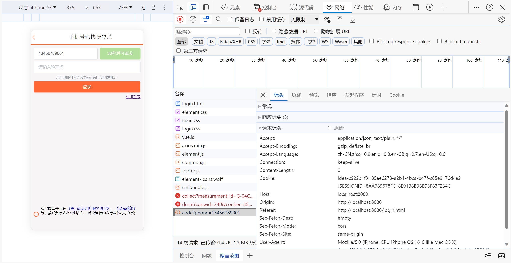

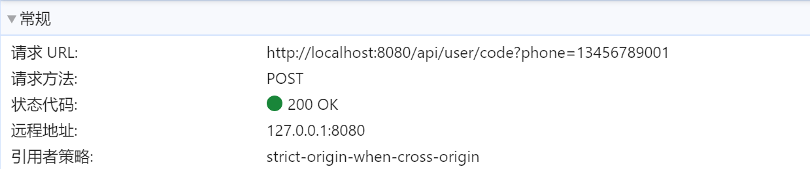

### 实现功能

`com.harvey.review_system.controller.UserController`

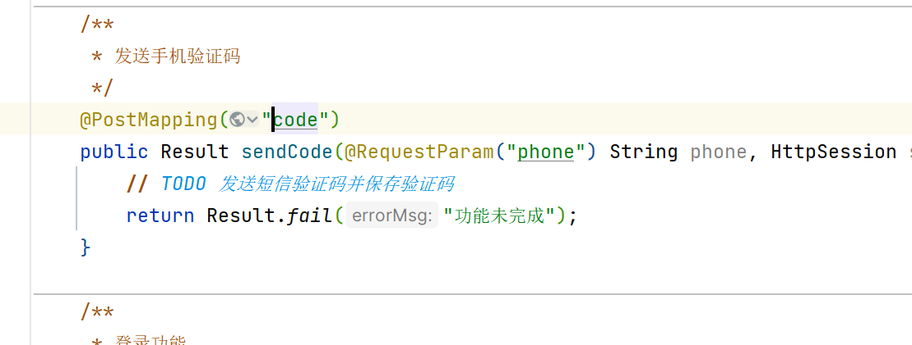

不加斜杠, 不规范(在SpringBootWeb是没区别的),加上

#### Result部分

```javaa
public class Result {
    private Boolean success;
    private String errorMsg;
    private Object data;
    private Long total;

    public static Result fail(String errorMsg){
        return new Result(false, errorMsg, null, null);
    }
    public static Result ok(){
        return new Result(true, null, null, null);
    }
    ...
}
```

#### Service

-   判断手机号是否合法

    ```java
    public class RegexUtils {
        /**
         * 是否是有效手机格式
         * @param phone 要校验的手机号
         * @return true:有效，false：无效
         */
        public static boolean isPhoneEffective(String phone){
            return match(phone, RegexPatterns.PHONE_REGEX);
            // PHONE_REGEX = ^1([38][0-9]|4[579]|5[0-3,5-9]|6[6]|7[0135678]|9[89])\\d{8}$
        }
        // 校验是否不符合正则格式
        private static boolean match(String str, String regex){
            if (StrUtil.isBlank(str)) {// hutool工具包
                return false;
            }
            return str.matches(regex);
        }
        // 其他有关正则的方法
        ...
    }
    ```

    原来的方法有点反人类,中招了, 所以我改了

-   业务代码

    ```java
    @Override
    public Result sendCode(String phone, HttpSession session) {
        // 1. 校验手机号
        if(!RegexUtils.isPhoneEffective(phone)){
            // 不符合,返回错误信息
            return Result.fail("手机号无效");
        }else {
            // 生成验证码, 长度为六位的数字
            // hutool工具
            String code = RandomUtil.randomNumbers(/*length*/ 6);
            // 保存到session
            session.setAttribute("code",code);
            session.setAttribute("phone",phone);
            // TODO 发送短信验证码
            // 好像要和什么什么合作啊,我不到啊,搞个假的
            log.debug("\n尊敬的"+phone+"用户:\n\t您的短信验证码是: "+code);
            // log是MP的ServiceImpl里的
            // 返回ok
            return Result.ok();
        }
    }
    ```

#### controller

```java
/**
 * 发送手机验证码
 */
@PostMapping("/code")
public Result sendCode(@RequestParam("phone") String phone, HttpSession session) {
    // 发送短信验证码并保存验证码
    return userService.sendCode(phone,session);
}
```

#### ~~牢骚~~

>   我认为, **将验证码存入session**,**决定返回什么Result**, 不是service层该做的事情, 应该在controller来完成

我就改了一下

-   Service

    ```java
    @Override
    public String sendCode(String phone) {
        String code = null;
        if(RegexUtils.isPhoneEffective(phone)){
            code = RandomUtil.randomNumbers(6);
            // TODO 发送短信验证码
            // 好像要和什么什么合作啊,我不到啊,搞个假的
            log.debug("\n尊敬的"+phone+"用户:\n\t您的短信验证码是: "+code);
        }
        return code;//单一出口
    }
    ```

-   controller

    ```java
    @PostMapping("/code")
    public Result sendCode(@RequestParam("phone") String phone, HttpSession session) {
        // 发送短信验证码并保存验证码
        String code = userService.sendCode(phone);
        if (code==null){
            return Result.fail("手机号不合法");
        }
        session.setAttribute("code",code);
        session.setAttribute("phone",phone);
        return Result.ok();
    }
    ```

但无奈, 很多情况下, controller需要返回的Result信息, 不能单单依靠service方法的返回值来判断

但我觉得这样更合理,尽量分层解耦吧?

### 测试

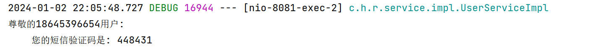

小问题: 输入了不合法的电话之后,还是要等待60秒,不过这是前端的事情: 只有在手机号合法之后才等待60s

## 验证码登录注册

### 流程分析

1.  用户提交验证码

2.  校验验证码

    -   不一样

        重来

3.  根据手机号查询用户信息

    -   查不到该用户

        创建新用户,造一些信息,保存到数据库

4.  保存用户信息在Session

    -   对于保存的用户, 我们不关注它的密码和创建时间, 电话号码等信息

    -   也就是说 ,从数据库的entity的User不适合保存再User里

    -   我们选择用UserDto保存

        UserDto:

        ```java
        public class UserDTO {
            private Long id;
            private String nickName;
            private String icon;
        }
        ```

        需要

5.  登陆

### 查看前端请求

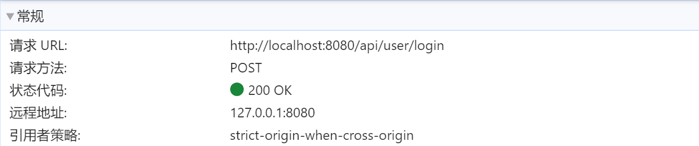

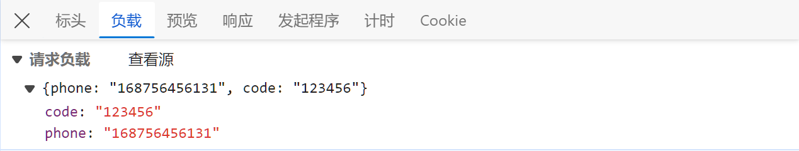

-   以Json格式请求

### 实现功能

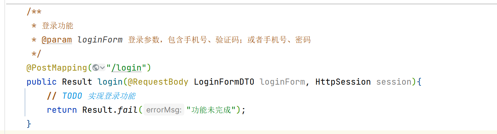

```java
public class LoginFormDTO {
    private String phone;
    private String code;
    private String password;
    ...
}
```

`password`的目的:

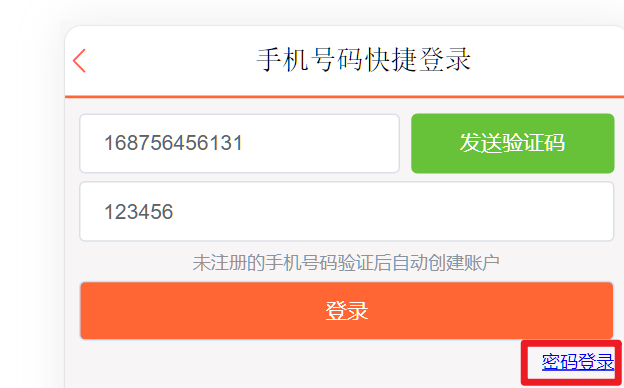

是我的话可能会写俩类, 造成代码的冗余, 归根结底是不够熟练. 反省反省

#### Service

-   Session的键是自己定义的一些常量

```java
@Override
public User loginByCode(Object phoneCache, Object codeCache, String phone, String code) {
    // 手机号格式已经正确, 故不需要校验
    if (!phone.equals(phoneCache.toString())){
        return null;
    }
    // code的长度已经正确,code不为null
    if (!code.equals(codeCache.toString())){
        return null;
    }

    // 如果验证码手机号一致, 去数据库查找用户
    User user = selectByPhone(phone);

    // 判断用户是否存在
    if(user==null ){
        // 不存在就创建新用户并保存
        user = new User();
        user.setPhone(phone);

        // 这些默认的设置中, 我仍未还是在无参构造中作为初始化的好
        // newUser.setId()主键会自增, 不必管他
        // user.setIcon(User.DEFAULT_ICON);//头像使用默认的, 本项目中null的话前端会选择默认头像
        user.setNickName(User.DEFAULT_NICKNAME);//昵称使用默认的,或随机的,看业务要求,这里没有唯一要求
        // 随机生成或直接为null,为null就百分百无法通过密码登录了.
        // 随机可能被猜中?
        user.setPassword(null);// null的话这步省略,又或者为了可读性留着?
        // user.setUpdateTime(LocalDateTime.now());//数据库会使用default
        //这里就先不要增改扰了人家数据库清静
        baseMapper.insert(user);
        // user为null, user的id怎么确认? 再查一次? 太反人类了吧
        // 查看数据库, 发现有依据电话号码创建索引, 依据电话查
        user = selectByPhone(phone);
    }
    // log.debug(String.valueOf(user));
    // 返回user
    return user;
}

private User selectByPhone(String phone) {
    LambdaQueryWrapper<User> lambdaQueryWrapper = new LambdaQueryWrapper<>();
    lambdaQueryWrapper.select().eq(User::getPhone, phone);
    return baseMapper.selectOne(lambdaQueryWrapper);
}
```

顺便写了依据密码登录

```java
@Override
public User loginByPassword(String phone, String password) {
    // 依据电话号码从service取数据
    User user = selectByPhone(phone);
    // 取出来的数据和密码作比较
    if (user==null){
        User nullUser = new User();
        nullUser.setId(-1L);
        return nullUser;//用户名不存在
    }
    if (!password.equals(user.getPassword())){
        // password经过检验, 非null, 数据库里的password可能是null
        return null;//用户名或密码错误
    }
    // log.debug(String.valueOf(user));
    // 正确则返回user值
    return user;
}
```

没见过的警告

```warnning
WARNING: An illegal reflective access operation has occurred
WARNING: Illegal reflective access by com.baomidou.mybatisplus.core.toolkit.SetAccessibleAction (file:/D:/IT_study/maven/repository/com/baomidou/mybatis-plus-core/3.4.3/mybatis-plus-core-3.4.3.jar) to field java.lang.invoke.SerializedLambda.capturingClass
WARNING: Please consider reporting this to the maintainers of com.baomidou.mybatisplus.core.toolkit.SetAccessibleAction
WARNING: Use --illegal-access=warn to enable warnings of further illegal reflective access operations
WARNING: All illegal access operations will be denied in a future release
```

这是由于JDK9之后不允许通过反射访问非`public`字段,我这里使用JDK11

#### Controller

简单的选择是用账号密码登录还是短信验证码登录的程序

```java
private Result chooseLoginWay(LoginFormDTO loginForm, HttpSession session) {
    String phone = loginForm.getPhone();
    String code = loginForm.getCode();
    String password = loginForm.getPassword();
    if (phone==null
            || !RegexUtils.isPhoneEffective(phone)
        // 网上说参数校验放在controller, 这算参数校验吗?
    ){
        return Result.fail("请正确输入电话号");
    }
    if ((password == null) == (code == null)){
        // 无法决定是密码登录还是验证码登录的情况
        return Result.fail("请正确输入验证码或密码");
    }
    User user /* = null*/;

    if (code!=null){
        if (code.length()!=6){
            return Result.fail("请输入正确格式的验证码");
        }
        // 使用验证码登录
        Object phoneCache = session.getAttribute(PHONE_SESSION_KEY);
        Object codeCache = session.getAttribute(CODE_SESSION_KEY);
        if(phoneCache==null||codeCache==null ){
            return Result.fail("您的表单数据已丢失,请重新输入");
        }
        user = userService.loginByCode(phoneCache,codeCache,phone,code);
        if(user == null){
            return Result.fail("验证码不正确");

        }else {
            // 如果成功了, 就删除会话
            // 删除电话,验证码会话
            session.removeAttribute(PHONE_SESSION_KEY);
            session.removeAttribute(CODE_SESSION_KEY);
            // 否则不删除会话,给用户一个再次输入验证码的机会
        }
    }else /*if(password!=null)*/{
        user = userService.loginByPassword(phone,password);
        if(user == null){
            return Result.fail("密码不正确");
        }else if(user.getId().equals(-1L)){
            return Result.fail("该用户不存在");
        }
    }

    session.setAttribute(USER_SESSION_KEY,user);
    return Result.ok();
}
```

登录功能

```java
/**
 * 登录功能
 * @param loginForm 登录参数，包含手机号、验证码；或者手机号、密码
 */
@PostMapping("/login")
public Result login(@RequestBody LoginFormDTO loginForm, HttpSession session){
    //实现登录功能
    Result result = chooseLoginWay(loginForm, session);
    // System.out.println(result);
    return result;//Result.fail("功能未完成");
}
```

## 校验登录状态

### 分析

由于对于每一次的请求都需要校验用户信息, 我们将这个功能做在拦截器`Interceptor`

### 流程分析

1.  请求并携带Cookie

2.  依据Cookie获取Session

3.  判断用户是否存在

    -   不存在

        拦截

        结束

4.  保存用户到ThreadLocal

    -   因为每次请求都会用到
    -   拦截器获取了用户信息, Controller也需要用户信息
    -   为了加快访问速度, 不能放到数据库

5.  放行

### 查看请求

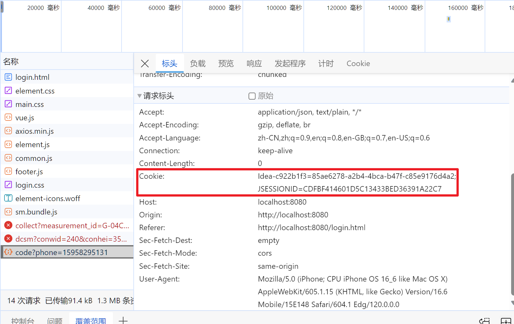

依据Cookie取得Session, 依据Session取得用户信息

### 实现

#### 保存到Thread

-   已经放在工具类里了

```java
public class UserHolder {
    private static final ThreadLocal<UserDTO> TL = new ThreadLocal<>();

    public static void saveUser(UserDTO user){
        TL.set(user);
    }

    public static UserDTO getUser(){
        return TL.get();
    }

    public static void removeUser(){
        TL.remove();
    }
}
```

#### 编写拦截器

```java
public class LoginInterceptor implements HandlerInterceptor {
    @Override
    public boolean preHandle(HttpServletRequest request,
                             HttpServletResponse response,
                             Object handler)
            throws Exception {
        // 进入controller之前进行登录校验

        // 从request里获取session,再获取user
        HttpSession session = request.getSession();
        Object o = session.getAttribute(Constants.USER_SESSION_KEY);
        if(!(o instanceof UserDTO)){
            response.setStatus(401);
            // 状态码 401 Unauthorized 未授权 请求要求用户的身份认证
            return false;
        }
        // 经过检验, 可以转换
        /*User  = null
        user instanceof User =>false*/
        UserDTO user = (UserDTO) o;
        // 保存session
        UserHolder.saveUser(user);
        return true;
    }

    @Override
    public void afterCompletion(HttpServletRequest request,
                                HttpServletResponse response,
                                Object handler, Exception ex)
            throws Exception {
        // 完成Controller之后移除UserHolder, 以防下一次用这条线程的请求获取到不属于它的用户信息
        UserHolder.removeUser();
    }
}
```

#### 配置拦截器

排除一些路径

```java
@Configuration
public class MvcConfig implements WebMvcConfigurer {
    @Override
    public void addInterceptors(InterceptorRegistry registry) {
        registry.addInterceptor(new LoginInterceptor())
                .excludePathPatterns(// 排除不需要拦截的路径
                        "/user/code",// 发送验证码
                        "/user/login",// 登录
                        "/blog/hot",//热点
                        "/shop/**",//店铺相关
                        "/shop-type/**",// 店铺信息
                        "/voucher/**",// 优惠券信息的查询
                        "/upload/**"// 上传,为了测试就放行吧
                        );
    }
}
```

#### 完成将当前用户信息返回前端的Controller

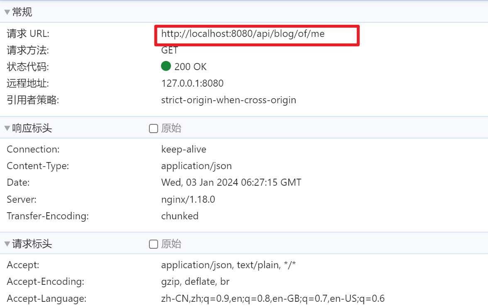

```java
@GetMapping("/me")
public Result me(){
    // 获取当前登录的用户并返回
    return Result.ok(UserHolder.getUser());
}
```

## Session存在的问题

>   Session共享问题

存储再一台Tomcat里的Session数据, 其他Tomcat服务器是看不到的

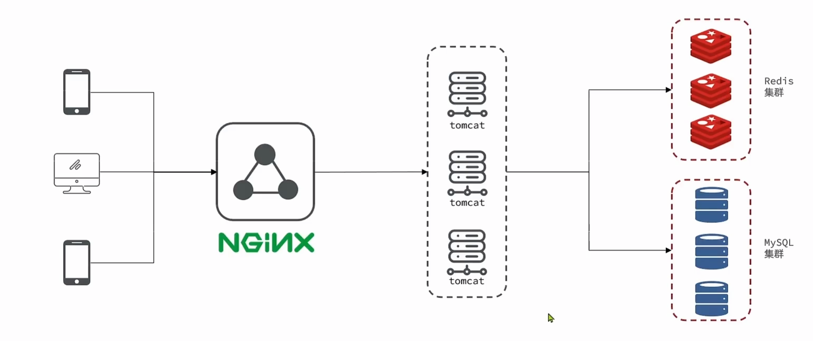

为了负载均衡, 用户每次分配到的Tomcat是不一样的, Session是不一样的

怎么办呢? 不愧是你Apache. 它做了Session拷贝的功能

但是Session拷贝也有问题:

-   数据冗余, 内存空间浪费
-   Session拷贝存在延迟, 可能数据还每拷贝到, 已经在访问了, 看到的却是老数据

所以我们选择Redis

