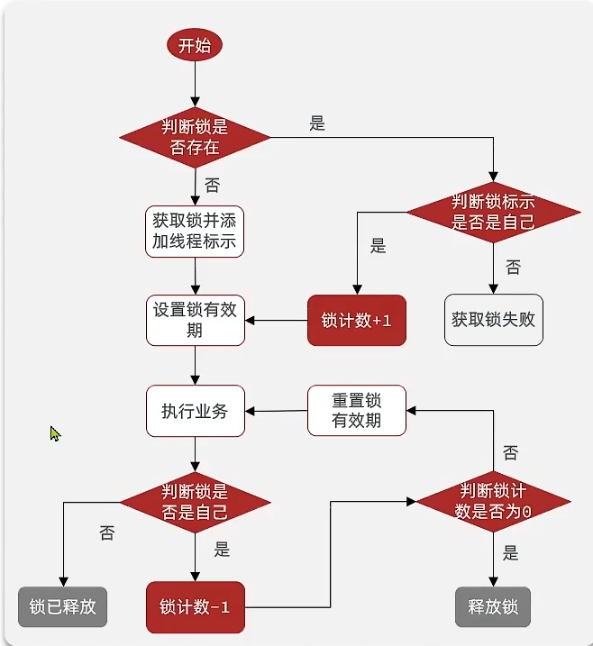
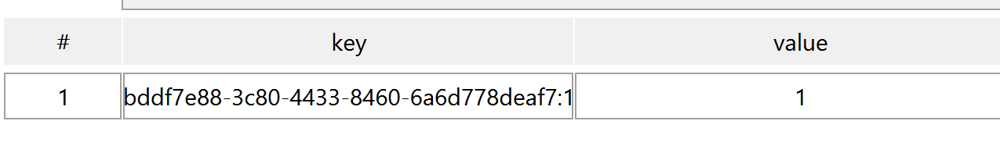
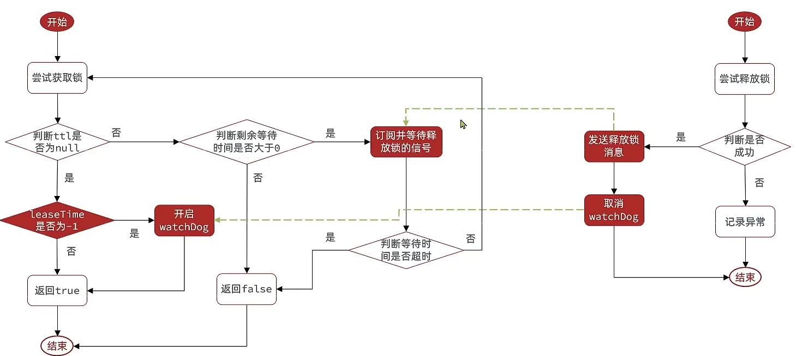
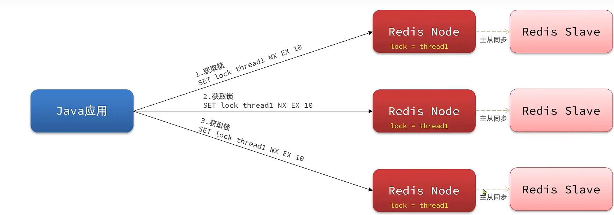
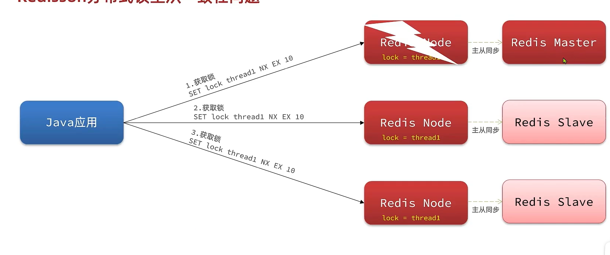

# Redission

## 引入依赖

```xml
<!--Redisson-->
<dependency>
    <groupId>org.redisson</groupId>
    <artifactId>redisson</artifactId>
    <version>3.13.6</version>
</dependency>
```

Reddison是有Spring-starter的, 但是会覆盖Spring提供的Redis实现, 所以不推荐


## 配置客户端

```java
/**
 * Spring的一些Bean的创建
 *
 * @author <a href="mailto:harvey.blocks@outlook.com">Harvey Blocks</a>
 * @version 1.0
 * @date 2024-01-21 21:13
 */
@Configuration
public class ApplicationConfig {

    @Bean
    public RedissonClient redissonClient() {
        // 配置类
        Config config = new Config();
        // 添加Redis地址, 这里添加了单点的地址
        config.useSingleServer().setAddress("redis://centos:6379").setPassword("123456");
        // 也可以使用config.useClusterServers()添加集群地址
        return Redisson.create(config);
    }
    
}
```

## Redisson的分布式锁

```java
@Component
public class RedissonLock {
    @Resource
    private RedissonClient redissonClient;

    @Getter
    private Long errorResult = -1L;

    public void setErrorResult(Long errorResult) {
        this.errorResult = errorResult;
    }

    /**
     * 分布式锁
     * @param lockKey lock的键
     * @param supply 获取值的方法
     * @return id
     */
    public Long asynchronousLock(String lockKey, Supplier<Long> supply) 
        throws InterruptedException {
        // 获取锁(可重入)
        RLock lock = redissonClient.getLock(lockKey);
        // 尝试获取锁, 参数分别为: 获取锁的最大等待时间(期间会重试),锁自动释放时间, 时间单位
        long waitTime = -1L;// 等待时间, 默认-1不等待
        long releaseTime = 30L;// 自动释放时间,默认30s
        boolean isLock = lock.tryLock(waitTime, releaseTime, TimeUnit.SECONDS);
        if(isLock){
            try {
                return supply.get();
            }finally {
                lock.unlock();
            }
        }
        return errorResult;
    }

}

```

## Redisson可重入锁原理

 

### 可重入锁

```java
public static void main(String[] args) {
    RLock lock = getLcok();
    if (!lock.tryLock()) {
        System.err.println("获取锁失败");
    }
    try {
        System.out.println("成功");
        method(lock);
    } finally {
        System.out.println("释放锁");
        lock.unlock();
    }
}

private static void method(RLock lock) {
    if (!lock.tryLock()) {
        System.err.println("method获取锁失败");
    }
    try {
        System.out.println("method成功");
    } finally {
        System.out.println("method释放锁");
        lock.unlock();
    }
}
```

结果

```
成功
method成功
method释放锁
释放锁
```


会去判断进入线程的是不是自己的这个线程, 是自己的线程就会允许获取锁

为了实现上述**method里的锁释放时只会释放掉其对应的锁**, 可重入锁会记录一个线程获取了几次锁

-   类似于栈的思想, 但是对于栈来说, 栈里的每一个数据都是不同的, 但是如果时获取可重入锁, 锁都是相同的, 或者说, 可重入锁和其锁中锁都只有两种状态: 没占由(包括没获取和已释放) 和 占用. 因此每一把锁都可以抽象成0 和 1,即用一个数值来代表栈 ,而不需要数据结构


### Redis分布式可重入锁的实现原理

-   现在需要锁记录三个数据
    -   锁的键, 获取锁, 判断是否占用锁的唯一标识
    -   对线程的唯一标识, 确保只能由创建锁的线程释放锁
    -   获取锁的次数, 在锁内获取锁时, 次数加一, 释放锁时, 次数减一

#### 实现结构

>   Hash

-   key - 锁的唯一标识
-   field - 线程的唯一标识
-   value - 获取锁的次数
    -   当value为非0时, 表示锁还未完全释放
    -   当value为0时, 表示锁已被完全释放, 可以删除这个锁在Redis的存储, 释放锁的资源

#### 实现流程

1.  判断锁是否存在

    -   是

        判断是否是自己的

        -   否

            获取锁失败

        -   是

            锁计数加一

    -   否

        获取锁并添加线程标识

2.  设置锁的有效期

3.  执行业务

4.  判断是否是自己的

    -   否

        释放锁失败,啥也不干

    -   是

    1. 锁计数减一

    2. 判断锁计数是否被减到0

        -   是

            删除锁

        -   否

        1.  重置有效期
        2.  执行业务



采用Lua脚本保证业务的原子性

-   获取锁

    ```lua
    local key  = KEYS[1];
    local threadId = ARGV[1];
    local releaseTime = ARGV[2];
    -- 判断锁是否存在
    if(redis.call('exits',key)==0) then
        -- 不存在, 获取锁
        redis.call('hset',key,threadId,'1');
        -- 设置有效期
        redis.call('expire',key,releaseTime);
        return 1;
    end;
    -- 锁已经存在, 判断threadId是否是值
    if(redis.call('hexists',key,threadId)==1) then
        -- 不存在,获取锁, 重入次数+1
        redis.call('hincreby',key,threadId,'1');
        -- 重置有效期
        redis.call('expire',key,releaseTime);
        return 1;
    end
    -- 锁不是自己的
    return 0;
    ```

-   释放锁

    ```lua
    local key = KEYS[1];
    local threadId = ARGV[1];
    local releaseTime = ARGV[1];
    
    -- 判断当前锁是否还被自己持有
    if(redis.call('hExists',key,threadId)) then
        return nil;
    end;
    -- 是自己的锁
    local count = redis.call("hincreby",key,threadId,-1);
    if(count>0) then
        redis.call('expire',key,releaseTime);
    else
        redis.call('del',key);
    end
    return nil;
    ```



## 可重试锁原理

-   可重试 `waitTime`

    -   倘若获取锁失败, 依旧有机会再次获取锁

    -   PubSub重试订阅, 不是使用不停重试, 而是依据**等待, 唤醒**的机制

        等待唤醒机制可以有效减少对CPU的占用

    -   不是不断重试,是在一定时间

-   超时续约

    -   为避免业务实际执行时间较长导致的锁的超时释放, 有产生线程安全问题的隐患
    -   利用watchDog看门狗机制, 每隔一段时间 (`releaseTime/3`), 如果锁还未释放, 重置超时时间

```lua
if (redis.call('exists', KEYS[1]) == 0) then 
	redis.call('hincrby', KEYS[1], ARGV[2], 1); 
	redis.call('pexpire', KEYS[1], ARGV[1]);
	return nil; 
end; 
if (redis.call('hexists', KEYS[1], ARGV[2]) == 1) then 
	redis.call('hincrby', KEYS[1], ARGV[2], 1); 
	redis.call('pexpire', KEYS[1], ARGV[1]); 
	return nil; 
end;
-- 失败, 获取剩余有效期
return redis.call('pttl', KEYS[1]);
```



## 主从一致性

>   对于一个Redis集群, 有一台主机负责写, 几台从机负责读. 倘若主机宕机, 从机中选出新的主机. 新主机不带有原主机的锁,便可能造成线程安全隐患

Redisson解决主从一致性问题原理`Multilock`连锁机制

### 原理

-   让所有的节点变成独立的Redis节点, 不再存在主从关系,都可以获取主从关系

-   只有从所有的节点都能获取锁, 才是获取锁成功

-   此时一个节点宕机了, 由于互无关系, 所以节点依然可用

-   即使是

    

的结构, 用形成锁的节点去给其从节点做主从同步

宕机时,其从节点变成主节点



依旧无法从新的主节点成功获取资源. 因为要获取所有的(3个)锁,其他线程就不能拿到锁,就不会有锁失效的问题

### 获取MultiLock

```java
RLock lock1 = redissonClient1.getLock(lockKey);
RLock lock2 = redissonClient2.getLock(lockKey);
RLock multiLock = redissonClient.getMultiLock(lock1,lock2);
```

