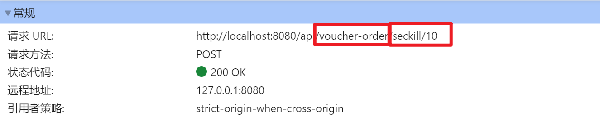
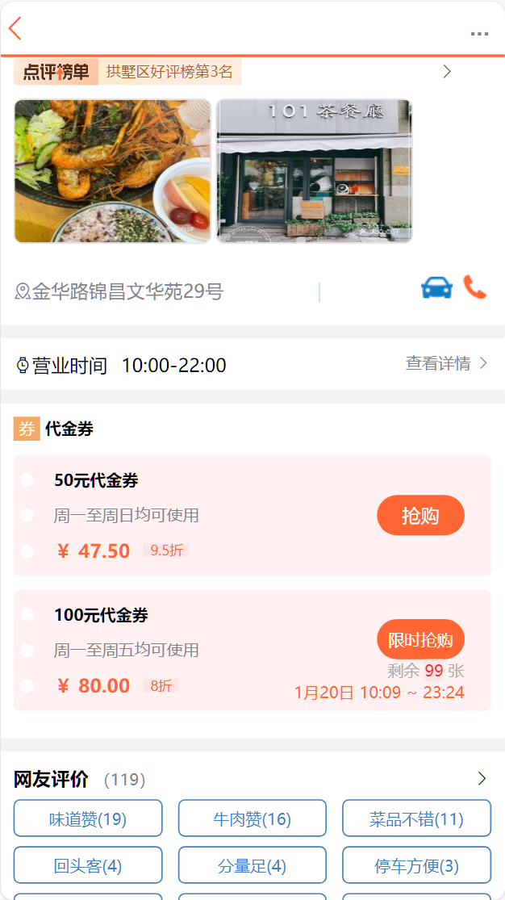
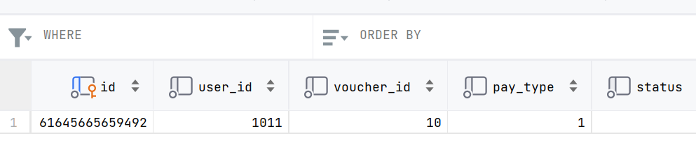

# 抢购

-   秒杀
-   时间限制
-   库存限制
-   高并发


## 数据库结构

-   `tb_voucher`
    -   优惠券的基本信息
    -   优惠金额
    -   使用规则
-   `tb_seckill_voucher`
    -   优惠券的库存
    -   开始抢购的库存
    -   开始抢购的时间(开始, 结束)

## 请求分析



```java
@RestController
@RequestMapping("/voucher-order")
public class VoucherOrderController {
    @PostMapping("seckill/{id}")
    public Result seckillVoucher(@PathVariable("id") Long voucherId) {
        // 1. 创建订单
        // 2. 扣减库存
        return Result.fail("功能未完成");
    }
}
```

## 下单

### 需求分析

1.  秒杀是否开始或结束
    -   如果尚未开始或已经结束则无法下单
    -   过期了? 为啥还要在前端显示? 
2.  库存是否充足
    -   如果不充足就无法下单

-   当然, 这些需求是在前端有过初步的检查
    -   但是前端的静态资源, 不刷新 ,不会改变
    -   在高并发的情况下, 前端的检查就难以起作用了

### 流程分析

1.  前端提交优惠券ID
2.  查询优惠券信息
3.  条件判断
    -   不符合条件返回异常
4.  扣减库存
5.  创建订单
6.  返回订单ID

### 实现下单过程

#### 查询优惠券并判断

```java
@PostMapping("seckill/{id}")
public Result seckillVoucher(@PathVariable("id") Long voucherId) {
    //1.  前端提交优惠券ID
    //2.  查询优惠券信息
    SeckillVoucher voucher = seckillVoucherService.getById(voucherId);
    //3.  条件判断
    //    -   不符合条件返回异常
    LocalDateTime now = LocalDateTime.now();
    if (voucher.getBeginTime().isAfter(now)){
        return Result.fail("秒杀活动未开始");
    }
    if (voucher.getEndTime().isBefore(now)){
        return Result.fail("秒杀活动已结束");
    }
    if (voucher.getStock()<=0){
        return Result.fail("已经没有库存啦");
    }
    
    
    
    long orderId = voucherOrderService.seckillVoucher(voucher);
    if (orderId==IVoucherOrderService.STOCK_SHORTAGE_ID){
        return Result.fail("已经没有库存啦");
    }
    if (orderId==IVoucherOrderService.SAVE_FAIL_ID){
        return Result.fail("您的订单保存失败, 请重试");
    }
    return Result.ok(orderId);
}
```

#### 扣减库存


```java
public class SeckillVoucherServiceImpl 
    extends ServiceImpl<SeckillVoucherMapper, SeckillVoucher> 
    implements ISeckillVoucherService {

    /**
     * 自动扣减(减一)库存
     * @param id 优惠券id
     * @return 是否更新成功
     */
    @Override
    public boolean decrStock(long id) {
        return this.update()
                .setSql("stock = stock - 1")
                .eq("voucher_id",id)
                .update();
    }
}
```

#### 创建订单

```java
Long voucherId = voucher.getVoucherId();

// 创建订单对象
VoucherOrder voucherOrder = new VoucherOrder();
long orderId = redisIdWorker.nextId("order");
voucherOrder.setId(orderId);
voucherOrder.setUserId(UserHolder.getUser().getId());
voucherOrder.setVoucherId(voucherId);
```
#### 下单业务

```java
@Resource
private ISeckillVoucherService seckillVoucherService;
@Resource
private RedisIdWorker redisIdWorker;
/**
 * 秒杀购买业务
 * @param voucher 查询到的秒杀优惠券
 * @return 返回订单ID,STOCK_SHORTAGE_ID表示库存不足,SAVE_FAIL_ID表示存储失败????
 */
@Override
@Transactional
public long seckillVoucher(SeckillVoucher voucher) {
    Long voucherId = voucher.getVoucherId();

    // 创建订单对象
    VoucherOrder voucherOrder = new VoucherOrder();
    long orderId = redisIdWorker.nextId("order");
    voucherOrder.setId(orderId);
    voucherOrder.setUserId(UserHolder.getUser().getId());
    voucherOrder.setVoucherId(voucherId);

    // 4.  扣减库存
    if (!seckillVoucherService.decrStock(voucherId)){
        return STOCK_SHORTAGE_ID;
    }
    // 5. 保存订单信息
    boolean saved = this.save(voucherOrder);
    if (!saved){
        return SAVE_FAIL_ID;
    }
    return orderId;
}
```

#### 测试





