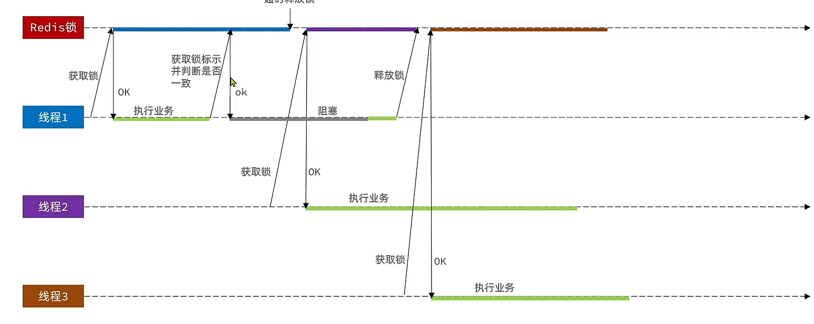

# 基于Redis的分布式锁

## 原理

1.  利用`setnx`实现互斥

2.  为确保释放锁, 设置TTL, 时常一般比业务执行时间的长一点, 例如10s

3.  为了确保`setnx`和`expire TTL`能同时执行, 同时失败, 两者应该具有**原子性**

    ```bash
    set key字段 value字段 EX 设置过期时间单位秒 NX
    set lock thread1 EX 10 NX
    ```

    ```java
    private boolean lock(String lockKey) {
        logger.debug("lock");
        Boolean exit = stringRedisTemplate.opsForValue().setIfAbsent(lockKey, "", cacheConstants.lockTtl(), TimeUnit.SECONDS);
        // 锁的时效设置成业务完成时间的十倍二十倍, 防止意外
        return exit != null && exit;// Boolean.TRUE.equals(exit),null也返回false
    }
    ```

    自动拆箱的时候要时刻做好空指针的判断

4.  释放锁

    ```java
    private void unlock(String lockKey) {
        logger.debug("unlock");
        stringRedisTemplate.delete(lockKey);
    }
    ```

## 实现机制

发现资源被占用

-   阻塞

    =>等待

-   非阻塞

    =>放弃抢夺锁

本业务使用非阻塞式的, 首先非阻塞式对系统的占用更小, 更重要的是, 从本业务的内容出发, 既然本锁已经被占用, 说明一个用户已经在抢了, 反正最后都是**一人一单**, 不需要再抢第二张, 反正没有意义

```java
/**
 * 依靠互斥锁实现防止,击穿,同时还防止了雪崩
 *
 * @param keyPrefix key前缀
 * @param supply      函数
 * @return id
 */
public Long asynchronousLock(String lockKey, Supplier<Long> supply) {
    logger.debug("asynchronousLock");
    try {
        if (lock(lockKey)) {// 每个店铺要有自己的锁
            logger.debug("进入锁");
            // 完成读取要释放锁
            unlock(lockKey);
            return supply.get();
        } else {
            // 存在方法耦合, 但由于用的是我独创的(恶心臃肿的方法写的)CacheClient类的, 所以不一样
            return IVoucherOrderService.OVER_PURCHASES_ID;
        }
    } catch (Exception e) {
        // 发生问题要释放锁
        unlock(lockKey);
        logger.error("发生问题了, 但依旧释放了锁...");
        throw new RuntimeException(e);
    }
}
```

#### 全局锁改造

```java
Long userId = UserHolder.getUser().getId();
long orderId = cacheClient
        .asynchronousLock(userId.toString(),
                ()-> voucherOrderService.seckillVoucher(voucher));
```

##### CacheClient的注入

```java
private final CacheClient<Entity> cacheClient;

public VoucherOrderController(StringRedisTemplate stringRedisTemplate) {
    cacheClient = new CacheClient(stringRedisTemplate,Entity.class, 
    				new CacheConstants() {
        				@Override
        				public  Long errorId(){// 新增加的类, 默认返回-1.
            				return IVoucherOrderService.OVER_PURCHASES_ID;
        				}
    				});
    this.cacheClient = cacheClient;
}
```

## 全局锁的问题

### 业务阻塞

#### 锁在线程不知情的情况下被释放

为了防止长久不释放锁, 我们设置了一个超时时长. 超过时长(TTL),锁被自动释放

当线程A的**业务被阻塞, 甚至超过了设置的TTL**, 另一条线程B就有机会在锁自动释放之后乘虚而入, 进入锁, 

而后, 被阻塞的业务完成, 由此, 就拿到了两份资源了

并且, 被阻塞的业务完成之后, 会主动释放锁, 这个锁是线程B的锁, 线程B在不值情的情况下锁被释放, 

由此, 第三条线程C就有机会乘虚而入

原因: 该线程的锁在该线程不知道的情况下被释放, 可能是业务阻塞造成的TTL超时, 也有可能是被其他线程释放.

#### 解决方案

我们加锁的语句:

```java
private boolean lock(String lockKey) {
    logger.debug("lock");
    Boolean exit = stringRedisTemplate.opsForValue()
	    .setIfAbsent(lockKey, "", cacheConstants.lockTtl(), TimeUnit.SECONDS);
    // 锁的时效设置成业务完成时间的十倍二十倍, 防止意外
    return exit != null && exit;// Boolean.TRUE.equals(exit),null也返回false
}
```

我们设置的值是空, 可以把这个值作为当前线程的唯一标识, 让想要释放锁的其他线程判断, 是否可以释放这个锁, 哪个线程造的锁, 哪个线程才有权力释放

```java
private boolean lock(@NonNull  String lockKey,@NonNull String uniqueIdentification) {
    logger.debug("lock");
    Boolean exit = stringRedisTemplate.opsForValue()
        .setIfAbsent(lockKey, uniqueIdentification, 
                     cacheConstants.lockTtl(), TimeUnit.SECONDS);
    // 锁的时效设置成业务完成时间的十倍二十倍, 防止意外
    return exit != null && exit;// Boolean.TRUE.equals(exit),null也返回false
}

private void unlock(@NonNull String lockKey,@NonNull String uniqueIdentification) {
    String value = stringRedisTemplate.opsForValue().get(lockKey);
    if(uniqueIdentification.equals(value)){
        logger.debug("unlock");
        stringRedisTemplate.delete(lockKey);
    }
    logger.error("不是自己的锁,你的锁没了,什么都不做");
}
```

选用UUID作为`uniqueIdentification`

不用ThreadId作为唯一标识. ThreadId是JVM创建的连续的数字. 俩JVM很容易引起ThreadId冲突

```java
String identification = UUID.randomUUID().toString(true)+"-"+Thread.currentThread().getId();
```

`toString(true)`标识把UUID里的`-`去掉

### 释放锁时阻塞

>   JVM的垃圾回收器执行时, 会造成线程的阻塞

当在**判断是可以释放的锁**和在**删除锁**之前发生阻塞,  锁将超时释放

其他线程乘虚而入, 成功获取锁, 开始执行自己的业务

此时阻塞结束 , 原线程运行, 

此时已经**结束判断锁是不是自己的**, 因此可以肆无忌惮地删除锁

那么, 此时后来的线程的锁又在其不之情的情况下被删除了



#### 解决方案

>   让***判断锁和删除锁具有原子性***

-   Redis具有**事务**
    -   Redis的事务具有原子性, 却不具有一致性
    -   事务的多个操作, 实际上是一个**批处理**,是在最终一次性去执行
    -   没判法查询, 判断, 释放, 因为查询是拿不到结果的, 是最终一次性执行
    -   只能利用Redis的乐观锁去做判断, 然后再释放的时候没有线程去修改
    -   很复杂
-   Lua脚本
    -   在一个脚本中编写多条Redis命令. 确保多条命令执行时的原子性
    -   Lua脚本是一种[编程语言](https://www.runoob.com/lua/lua-tutorial.html)

#### 使用Lua实现原子性

问题

1.  Java调用Lua脚本执行

    ```java
    /*
     * (non-Javadoc)
     * @see org.springframework.data.redis.core.RedisOperations#execute(org.springframework.data.redis.core.script.RedisScript, java.util.List, java.lang.Object[])
     */
    @Override
    public <T> T execute(RedisScript<T> script/*脚本*/, 
                         List<K> keys/*传入脚本的KEYS*/, 
                         Object... args/*传入脚本的参数*/) {
        return scriptExecutor.execute(script, keys, args);
    }
    ```

2.  Lua脚本调用Redis

    Redis官方提供

    ```lua
    redis.call('命令名称','key','其他参数',....)
    ```

    `set name Jack`

    ```lua
    redis.call('set','name','Jack')
    ```

3.  编写Lua脚本

    ```lua
    redis.call('set','name','Jack')
    local name = redis.call('get','name')
    return name
    ```

4.  Redis执行脚本

    调用脚本

    ```redis
    EVAL "脚本" 传入脚本的key类型参数数量 key1 key2 .... arg1 arg2 arg3 ...
    ```

    ```redis
    EVAL "redis.call('set','name','Jack')" 0
    ```

    参数

    -   作为key的参数会放入KEYS数组, 其他参数放入ARGV数组
    -   在几哦啊本中可以通过KEYS和ARGV数组获取这些参数

    ```Redis
    EVAL "redis.call('set',KEYS[1],ARGV[1])" 1 name Rose
    ```

    ```java
    redis(pc2):0>EVAL "local a = redis.call('get',KEYS[1]);return a;" 1 icr:order:24:01
    "62556"
    ```

脚本

```lua
-- key由业务决定, 应该是参数
local key = KEYS[1];

-- 获取锁中的线程标识, 即key
local value = redis.call('get',key);

local id = ARGV[1];

-- 判断是否于只是的标识
if(value == id) then
    -- 如果一致, 就释放锁
    return redis.call('del',key);
    -- 成功返回 1
end
return 0;
-- 失败返回 0
```

简化

```lua
if(redis.call('get',KEYS[1]) == ARGV[1]) then
     return redis.call('del',KEYS[1])
end
return 0
```

Java调用Lua代码

```java
private static final DefaultRedisScript<Long> UNLOCK_SCRIPT;

static {
    UNLOCK_SCRIPT = new DefaultRedisScript<>();
    UNLOCK_SCRIPT.setLocation(new ClassPathResource("unlock.lua"));
    UNLOCK_SCRIPT.setResultType(Long.class);
}

private void unlock(@NonNull String lockKey, @NonNull String uniqueIdentification) {
    stringRedisTemplate.execute(
            UNLOCK_SCRIPT,
            List.of(lockKey),
            uniqueIdentification);
}
```

### 不可重入

>   同一个线程无法多次获取同一把锁

### 不可重试

>   获取锁只尝试一次就返回false, 没有重试机制

### 超时释放

>   锁超时释放是虽然可以避免死锁, 但如果是业务执行耗时较长, 也会导致锁释放, 存在安全隐患

### 主从一致性

>   读写分离时
>
>   如果Redis提供了主从同步存在延时, 当主机宕机/或存在延时时, 如果从并同步主中的锁数据, 则会出现锁释放

## Redisson

>   基于Redis的分布式锁框架
>
>   [Redisson](https://redisson.org/)

-   实现Java驻内存数据网络( In-Memory Data Grid ) 
-   提供了一系列的分布式的Java对象和分布式服务
-   包含各种分布式锁的实现
    -   分布式锁(Lock)和同步器(Synchronizer)

