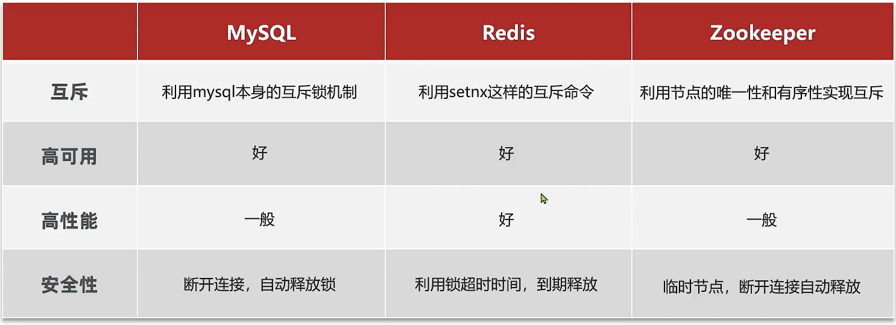

# 集群下的并发

>   JVM的集群😓

## 集群下的并发问题

集群下JVM的锁是不同的, 一个JVM的锁是在JVM内部维护的

怎么办呢?**把锁放到Redis里去做key, 看它有没有被占用**

## 分布式锁

-   将锁监视器, 放到JVM之外
-   分布式系统或集群模式下**多进程可见**并且**互斥的锁**
-   *高可用*
-   *高并发*
-   *高性能*
    -   因为本身就会加锁会减慢性能,不能再雪上加霜了
-   *安全性*

### 分布式锁下的业务实现流程

1.  在服务一对锁监视器,查看锁是否存在

    -   存在

        资源被锁住, 等待

    -   不存在

        资源可访问, 访问资源

### 不同分布式锁的实现方案差异

#### MySQL实现互斥

对于**事务和写机制**会又互斥的锁

再业务执行前, 向MySQL申请一个互斥锁,然后执行业务

业务执行完之后提交事务, 锁被释放

业务出现异常, 回滚, 一样释放锁

#### Redis实现互斥

利用setnx命令

key存在表示存在锁, 资源被锁住, 不存在表示资源可访问

或主动删除key释放锁, 或利用**过期时间(当无法请求到Redis向其发生删除key命令时)**释放锁

#### Zookeeper实现互斥

可以创建数据节点

数据节点具有 **唯一性和有序性(递增)** 实现互斥

利用有序性, 规定最小的节点为锁

删除节点,最小的节点就改变了, 最早等待的就是最小的节点了, 节点就释放了

Zookeeper的节点都是临时节点. 时间一到, 自动释放节点

