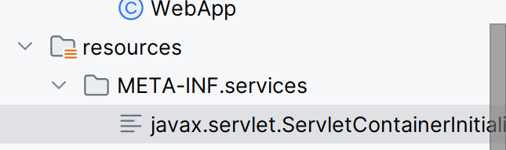
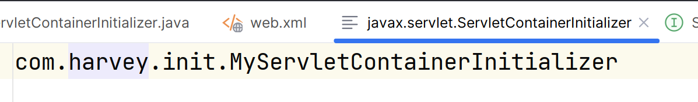
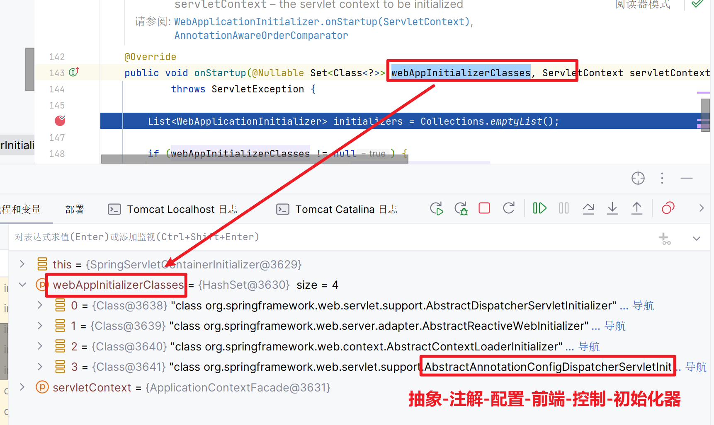
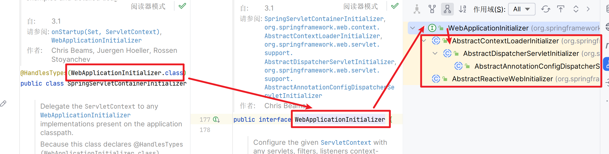

## web.xml

>   一般不会抛弃web.xml

```xml
<web-app xmlns:xsi="http://www.w3.org/2001/XMLSchema-instance"
         xmlns="http://xmlns.jcp.org/xml/ns/javaee"
         xsi:schemaLocation="http://xmlns.jcp.org/xml/ns/javaee
         http://xmlns.jcp.org/xml/ns/javaee/web-app_4_0.xsd"
         version="4.0">

    <!--配置所有jsp文件编码格式为utf-8-->
    <jsp-config>
        <jsp-property-group>
            <url-pattern>*.jsp</url-pattern>
            <page-encoding>UTF-8</page-encoding>
        </jsp-property-group>
    </jsp-config>    

    <!--配置ContextLoaderListener的初始化参数-->
    <context-param>
        <param-name>contextClass</param-name>
        <param-value>com.harvey.config.MyAnnotationConfigWebApplicationContext</param-value>
    </context-param>

    <!--配置Spring的ContextLoaderListener-->
    <listener>
        <listener-class>org.springframework.web.context.ContextLoaderListener</listener-class>
    </listener>    

    <servlet>
        <servlet-name>DispatcherServlet</servlet-name>
        <servlet-class>org.springframework.web.servlet.DispatcherServlet</servlet-class>
        <!--初始化时,依据配置文件,创建容器-->
        <init-param>
            <param-name>contextClass</param-name>
            <param-value>com.harvey.config.MyAnnotationConfigWebApplicationContext</param-value>
        </init-param>
    </servlet>

    <!--前端控制器-->
    <servlet-mapping>
        <servlet-name>DispatcherServlet</servlet-name>
        <url-pattern>/</url-pattern>
    </servlet-mapping>

</web-app>
```

1.  Spring的入口listener

2.  Spring-MVC入口DispatcherServlet

    ​	

### Container Initializer初始化器

>   **Servlet3.0环境中**

1.  实现接口javax.servlet.ServletContainerInitializer

    ```java
    @HandlesTypes({MyService.class})
    //这个HandlesType里的集合里的对象不会被实例化,而是实例化它的子类或实现类
    public class MyServletContainerInitializer implements ServletContainerInitializer {
        /**
         * @param set 一个自解码对象的集合.<br>
         *            这个自解码对象是继承或实现了,被注解了
         *            {@link javax.servlet.annotation.HandlesTypes HandlesTypes}注解的类.<br>
         *            如果没有匹配的自解码对象,
         *            或本ServletContainerInitializer的实现类没有被注解HandlesTypes,
         *            则为 null<br>;
         *
         *  @param servletContext 网页应用的上下文,此时服务器被开启且这个服务器程序中包含c中的类.
          * @throws ServletException 有异常时抛出
         */
        @Override
        public void onStartup(Set<Class<?>> set, ServletContext servletContext) 
            ServletException {
            System.out.println("My servlet container initializer on startup");
            servletContext.addListener(ContextLoaderListener.class);//就像这样加入监听器
        }
    ```

2.  对应的类加载路径(`src/main/java`下)的`META-INF/services`目录下创建一个名为`javax.servlet.ServletContainerInitializer`的文件

    

3.  文件内容指定具体的ServletContainerInitializer实现类

    

-> web容器启动就会酝酿下这个初始化器做的一些组件内的初始化工作

>   以上是JavaWeb的内容

### Spring的消除web.xml方法

-   基于Container Initializer初始化器,
Spring定义了一个实现类`SpringServletContainerInitializer`(它定义实现类的方法和上述基本一致),
实现`ServletContainerInitializer`
-   而`ServletContainerInitializer`会查找实现了`WebApplicationInitializer`的类

->因此,我们只需要自己写一个WebApplicationInitializer的实现类即可

#### SpringServletContainerInitializer



#### WebApplicationInitializer



#### 自己的WebApplicationInitializer

-   当然,我们不会直接实现WebApplicationInitializer

    我们选择实现实现它的抽象类**AbstractAnnotationConfigDispatcherServletInitializer**

```java
package com.harvey.init;

import com.harvey.config.SpringConfig;
import com.harvey.config.SpringMVCConfig;
import org.springframework.web.servlet.support.AbstractAnnotationConfigDispatcherServletInitializer;

/**
 * ...
 */
public class MyAnnoConfigDispatcherServletInitializer 
    extends AbstractAnnotationConfigDispatcherServletInitializer {
    /**
     * 获取根的配置自解码对象,
     * 即Spring的核心配置类
     */
    @Override
    protected Class<?>[] getRootConfigClasses() {
        return new Class[]{SpringConfig.class};
    }

    /**
     * 在初始化时,帮你去加载Spring-MVC的核心配置类
     */
    @Override
    protected Class<?>[] getServletConfigClasses() {
        return new Class[]{SpringMVCConfig.class};
    }

    /**
     * 配置前端控制器的映射路径
     */
    @Override
    protected String[] getServletMappings() {
        /*
        <!--前端控制器-->
        <servlet-mapping>
            <servlet-name>DispatcherServlet</servlet-name>
            <url-pattern>/</url-pattern>
        </servlet-mapping>
        */
        return new String[]{"/"};
    }
}
```

-   可以删除MyServletContainerInitializer(SpringServletContainerInitializer已经继承ServletContainerInitializer)

-   不需要手动配置Listener

-   可以删除

    ```xml
    <context-param>
        <param-name>contextClass</param-name>
        <param-value>com.harvey.config.MyAnnotationConfigWebApplicationContext</param-value>
    </context-param>
    ```

    和

    ```xml
    <servlet>
        <servlet-name>DispatcherServlet</servlet-name>
        <servlet-class>org.springframework.web.servlet.DispatcherServlet</servlet-class>
        <!--初始化时,依据配置文件,创建容器-->
        <init-param>
            <param-name>contextClass</param-name>
            <param-value>com.harvey.config.MyAnnotationConfigWebApplicationContext</param-value>
        </init-param>
    </servlet>
    ```

    里的org.springframework.web.servlet.DispatcherServlet

