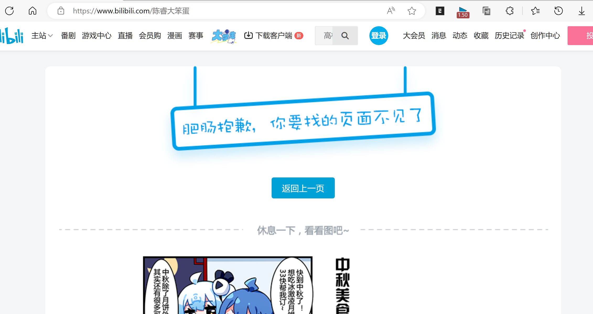
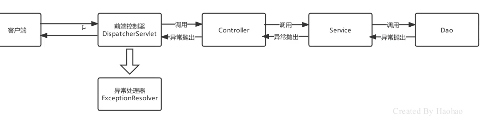

# SpringMVC异常机制

>   同一方便地处理异常

原来是在service层做异常处理的

现在不管三七二十一往上抛

在前端控制器遇到异常去找对应的异常处理器

->然后我们可以即使用户搞得不对头了,也可以给他看我们自己做的页面,而不是给他看500或404之类的

就像这样

综上,好处有:

## 好处

-   同一处理
-   友好提示
-   用户体验

## 流程

