#SpringMVC原理

##图解

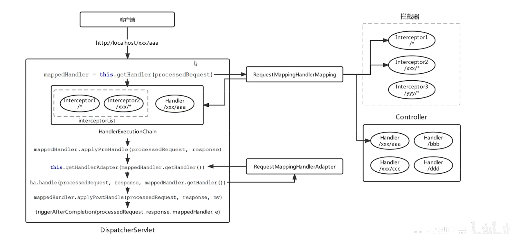

1.  服务端请求

    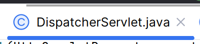

2.  SpringMVC对资源进行映射

    -   使用处理器映射器HandlerMapping

        

    1.  经过Interceptor

    2.  经过拦截器层层阻围,得到Controller

    3.  把Intercepter(**可能有多个**)和Controller(**只有一个**)封装成对象HandlerExcutionChain

        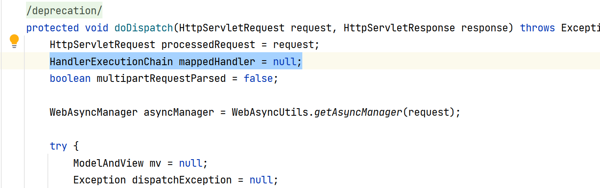

        

    4.  经过HandlerMapping把对象HandlerExcutionChain返回

        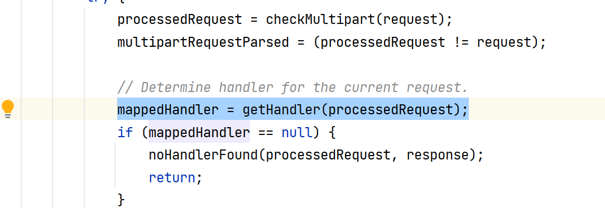

3.  运行HandlerExcutionChain的内容

4.  ...


## 拦截器

###前端控制器


#### doDispatch();


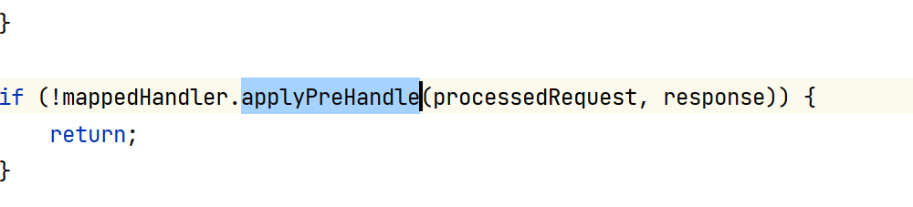


#### 

```java
mv = ha.handle(processedRequest, response, mappedHandler.getHandler());
```

-    Actually invoke the handler.
-   执行资源(这里不赘述)


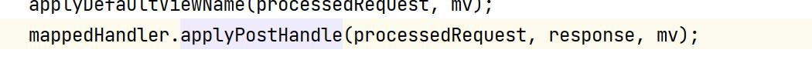


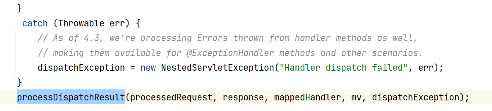


####applyPreHandle()

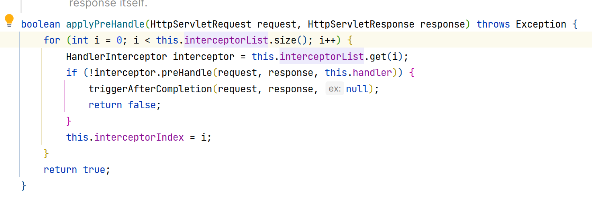

**你看这循环,从前到后**


####applyPreHandle()

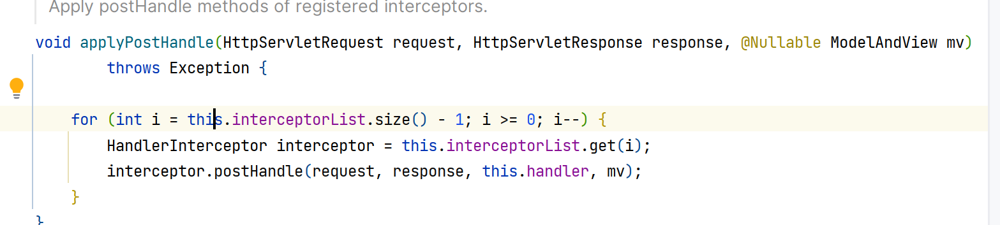

-   **你看这循环, 从后到前**

#### processDispachResult

-   processDispatchResult()

    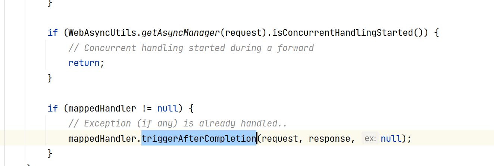

-   triggerAfterCompletion()

    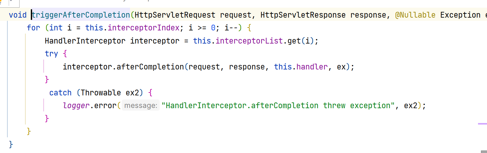

    -   **你看这循环, 从后到前**