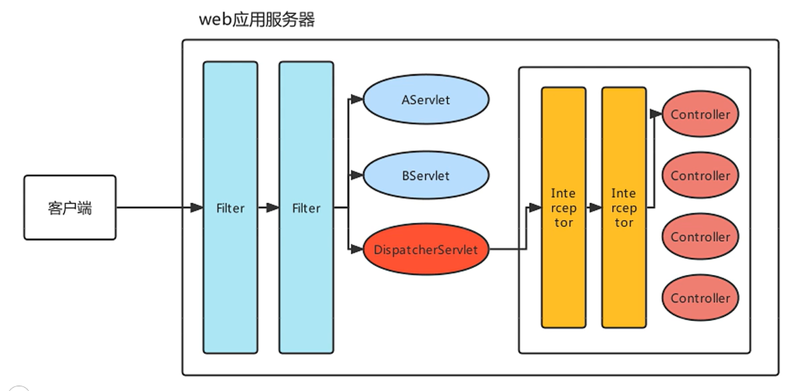
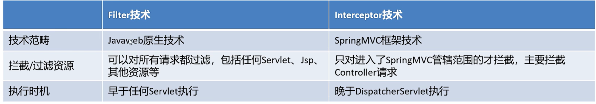
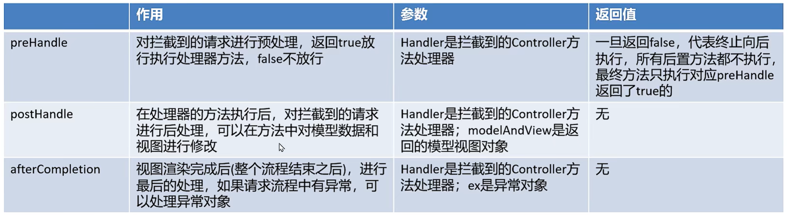

# 拦截器

-   简介
-   快速入门
-   执行顺序
-   原理

## 简介

>   Interceptor 拦截器
>
>   对Controller资源访问时进行拦截操作, 当拦截后可以进行权限控制, 功能增强都是可以的
>
>   拦截器有点类似Javaweb开发的Filter, 区别如下:



### 拦截器与过滤器

1.  拦截器独属SpringMVC
2.  过滤器属于所有Web工程




### 接口规范

-   接口

    

```java
package org.springframework.web.servlet;

import javax.servlet.http.HttpServletRequest;
import javax.servlet.http.HttpServletResponse;
import org.springframework.lang.Nullable;

public interface HandlerInterceptor {
    default boolean preHandle(HttpServletRequest request, HttpServletResponse response, Object handler) throws Exception {
        return true;//result==true?(放行,目标资源执行):不放行
    }

    default void postHandle(HttpServletRequest request, HttpServletResponse response, Object handler, @Nullable ModelAndView modelAndView) throws Exception {
    }

    default void afterCompletion(HttpServletRequest request, HttpServletResponse response, Object handler, @Nullable Exception ex) throws Exception {
    }
}
```


​										/→ 执行处理器方法-^方法执行^-→ postHandle() -^视图渲染^-\
preHandle() ---^放行^---→|																						↓				      
​										\\-----------------------------------------------------------------------+------→ afterCompletion()

## 快速入门


### 接口规范

```java
package com.harvey.interceptor;

import org.springframework.web.servlet.HandlerInterceptor;
import org.springframework.web.servlet.ModelAndView;
import javax.servlet.http.HttpServletRequest;
import javax.servlet.http.HttpServletResponse;

/**
 * @author Harvey Blocks
 * @version 1.0
 * @className MyInterceptor
 * @description 1. 放入容器
 *              2. 配置哪些地址得截,哪些地址不截
 * @date 2023-11-29 14:53
 */
public class MyInterceptor implements HandlerInterceptor {//不是Intercptor接口
    @Override
    public boolean preHandle(HttpServletRequest request, HttpServletResponse response, Object handler) throws Exception {
        System.out.println("MyInterceptor::preHandle");
        return true;
    }

    @Override
    public void postHandle(HttpServletRequest request, HttpServletResponse response, Object handler, ModelAndView modelAndView) throws Exception {
        System.out.println("MyInterceptor::postHandle");

    }

    @Override
    public void afterCompletion(HttpServletRequest request, HttpServletResponse response, Object handler, Exception ex) throws Exception {
        System.out.println("MyInterceptor::afterCompletion");

    }
}
```


### spring-mvc.xml配置

```xml
<mvc:interceptors>
    <mvc:interceptor>
        <!--对请求的路径进行拦截-->
        <mvc:mapping path="/**"/>
        <!--
            /*  :   /aaa        拦截一层
            /**  :   /aaa/bbb... 拦截多层
        -->
        <bean class="com.harvey.interceptor.MyInterceptor"/>
    </mvc:interceptor>
</mvc:interceptors>
```


### 测试与结果

`http://localhost:8080/Spring_mvc_quickstart/body2`

-   preHandler return true

    ```txt
    MyInterceptor::preHandle
    -------------/body2-----------
    User{username='张三', age=18, hobby=[足球,  篮球, java], birthday=Sun Nov 11 08:00:00 CST 2018, address=Address{city='霓虹', area='Tokyo'}}
    MyInterceptor::postHandle
    MyInterceptor::afterCompletion
    ```

-   preHander() return false

    ```txt
    MyInterceptor::preHandle
    ```

