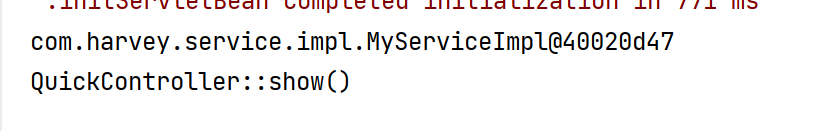

# Web层注入Service层

-   Bean->service层
-   Control->web层

-   在Control中访问容器中的Bean

>   在Control中访问容器中的Bean => 如何直接获取Service进行注入


1.  创建MyService接口

2.  创建MyService接口的实现类MyServiceImpl

    -   注解@Serevice

3.  创建Spring配置文件spring.xml

    -   扫包,管理Service

        ```xml
        <context:component-scan base-package="com.harvey.service"/>
        ```

4.  在web-xml中配置spring.xml

    ```xml
    <!--服务器启动时,ServletContext创建,
        监听器执行,
        执行内部加载配置文件,
        配置之文件开始扫包,
        扫到service将其放入容器-->
    
    <!--配置ContextLoaderListener的初始化参数-->
    <context-param>
        <param-name>contextConfigLocation</param-name>
        <param-value>classpath:spring.xml</param-value>
    </context-param>
    
    <!--配置Spring的ContextLoaderListener-->
    <listener>
        <listener-class>org.springframework.web.context.ContextLoaderListener</listener-class>
    </listener>
    ```

    web.xml的完整版是这样的:

    ```xml
    <!DOCTYPE web-app PUBLIC
            "-//Sun Microsystems, Inc.//DTD Web Application 2.3//EN"
            "http://java.sun.com/dtd/web-app_2_3.dtd" >
    
    <web-app>
        <display-name>Archetype Created Web Application</display-name>
        <!--配置ContextLoaderListener的初始化参数-->
        <context-param>
            <param-name>contextConfigLocation</param-name>
            <param-value>classpath:spring.xml</param-value>
        </context-param>
    
        <!--配置Spring的ContextLoaderListener-->
        <listener>
            <listener-class>org.springframework.web.context.ContextLoaderListener</listener-class>
        </listener>
    
    
        <servlet>
            <servlet-name>DispatcherServlet</servlet-name>
            <servlet-class>org.springframework.web.servlet.DispatcherServlet</servlet-class>
            <!--初始化时,依据配置文件,创建容器-->
            <init-param>
                <param-name>contextConfigLocation</param-name>
                <param-value>classpath:spring-mvc.xml</param-value>
            </init-param>
        </servlet>
        <servlet-mapping>
            <servlet-name>DispatcherServlet</servlet-name>
            <url-pattern>/</url-pattern>
        </servlet-mapping>
    
    </web-app>
    ```

-   注入

    ```java
    public class QuickController {
        @Autowired
        private MyService myService ;
    
        @RequestMapping("/show")
        public String show() {
            System.out.println(myService);
            System.out.println(this.getClass().getSimpleName()+"::show()");
    
            return "/index.jsp";//返回前端文件的路径
        }
    }
    ```

-   成功注入


