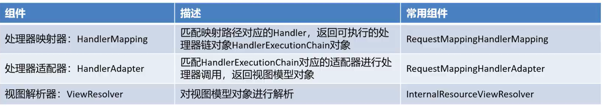
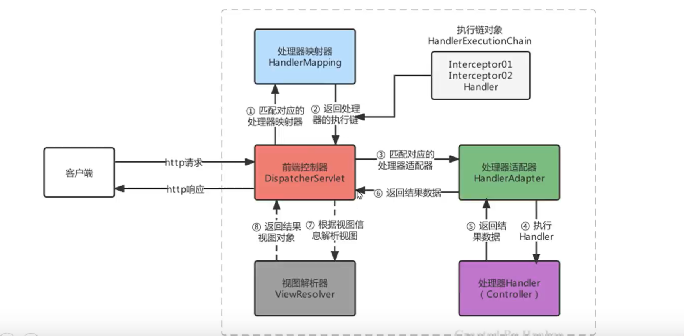
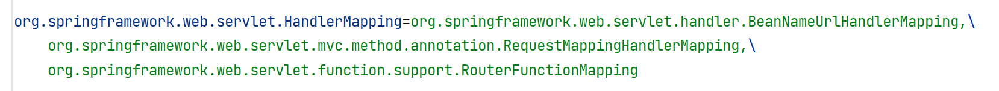
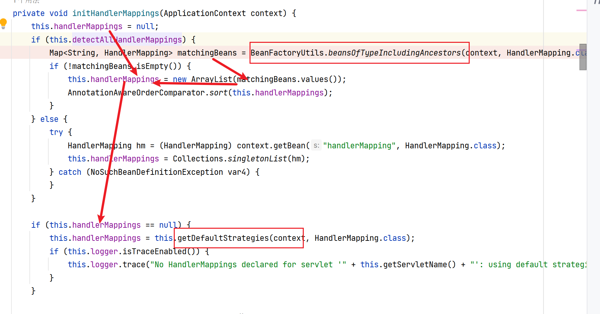

# SpringMVC关键组件

>   参与Web项目中的SpringMVC的核心功能类被称为组件,
>
>   DispatcherServlet前端控制器指派任务给组件
>
>   当请求到达服务器时:
>
>   ​	是哪个组件接收的请求?
>
>   ​	是哪个组件帮我们找到的Controller?
>
>   ​	是哪个组件帮我们调用的方法?
>
>   ​	是哪个组件最终解析的视图?



-   接口规范------------------------------------------------------------------实现


## HandlerMappering

>   处理器映射器

-   映射

    地址->目标QuickController::show()

-   返回:

    -   HanderExcutionChain

        封装了类QuickController

        和最终的目标对象(方法)

        的一些信息

        这里分装的Controller叫做Hander


## HanderAdapter

>   处理器适配器

-   执行调用的对象


## ViewResolver

>   视图处理器

-   根据调用对象的返回值(视图文件名)去打开视图文件
-   但是我们传Json分装了的对象啦,一般不会直接去返回一个视图文件
-   (不过作为测试返回的视图不错)



## SpringMVC默认采用的组件实现类

查看配置文件:**org.springframework.web.servlet.DispatcherServlet.properties**



```properties
接口全限定名=默认的实现
```

另外有一个解析Propertis的类吧

-   BeanNameUrlHandlerMapping,原先用,现在不用的
-   RequestMappingHandlerMapping现在用的
-   RouterFunctionMapping别管!


-   前端控制器在初始化的时候就会加载这个Propertis文件

-   把默认的组件的实现加载进去一个容器(DispatcherServlet的ArrayList)

-   举个例子:

    ```java
    @Nullable
    private List<HandlerMapping> handlerMappings;
    ```

没有放到Spring容器中....尊嘟假嘟?

1.  源码说:先看Spring容器里有没有对应的Handler

    -   有
        -   加载你的

    -   没有?
        -   加载默认的

```java
<!--手动配置一个HandlerMappering-->
<bean class="org.springframework.web.servlet.mvc.method.annotation.RequestMappingHandlerMapping"/>
```

-   然后打断点,它不会进入给默认HandlerMappering的那个分支里去



-   所以以后用自己的HandlerMapping的时候,它就不会加载默认的HandlerMappering了!

    ```xml
    <!--手动配置一个HandlerMappering-->
    <bean class="org.springframework.web.servlet.mvc.method.annotation.RequestMappingHandlerMapping"/>
    ```

    
