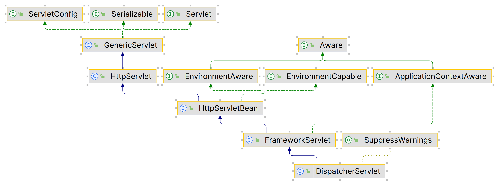

## DispatcherServlet

### 作用

1.  DispatcharServlet是SpringMVC的入口
2.  负责调用其他组件
3.  DispatcharServlet的本质时Servlet
4.  服务器创建启动时执行初始化方法
5.  每次请求执行service方法

### 继承体现




# 初始化

1.  获得Spring-MVC的ApplicationContaxt容器

2.  注册SpringMVC的九大组件

    ```java
    protected void initStrategies(ApplicationContext context) {
        initMultipartResolver(context);//文件上传解析器
        initLocaleResolver(context);
        initThemeResolver(context);
        initHandlerMappings(context);//处理器映射器(将请求映射到具体的处理器)
        initHandlerAdapters(context);//处理器适配器(负责将处理器（Controller）包装成一个处理器对象)
        initHandlerExceptionResolvers(context);
        initRequestToViewNameTranslator(context);
        initViewResolvers(context);//初始化视图解析器
        initFlashMapManager(context);
    }
    ```

