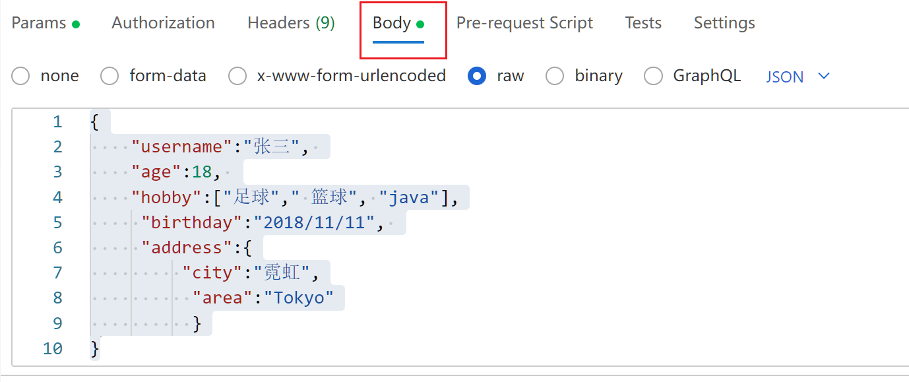
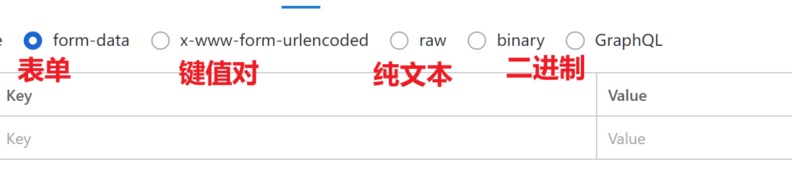
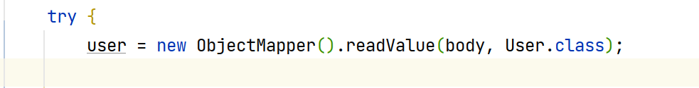
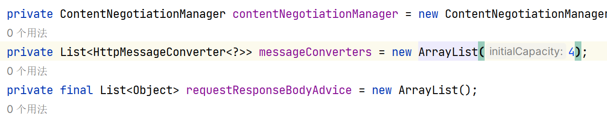
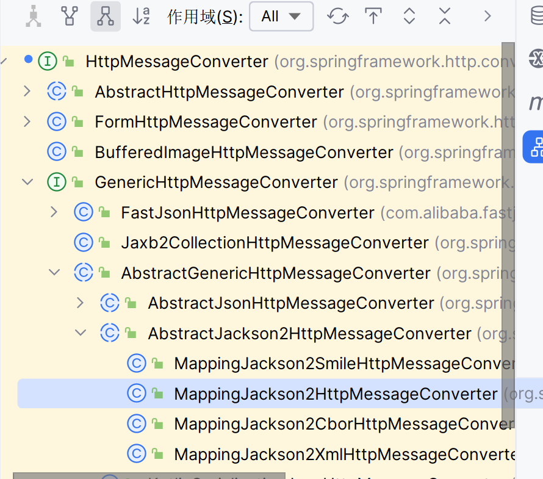

# Body

>   请求体
>
>   就整一字符串

-   POSTMAN里有Body






-   row就是一长串字符串
-   这个row没有格式的限制,也可以做一些选择

我这里选择了JSON(见右上角)

```java
@PostMapping ("/body")
public String getParam(@RequestBody String body) {
    System.out.println("-------------/body-----------");
    System.out.println(body);
    return "/index.jsp";
}
```

获取Body的完整字符串

```Json
{
    "username":"张三", 
    "age":18, 
    "hobby":["足球"," 篮球", "java"],
     "birthday":"2018/11/11", 
     "address":{
         "city":"霓虹",
          "area":"Tokyo"
          }
}
```

然后解析


## JSON类型的数据接收

[JSON(字符串)解析实体类](..\..\blog\java网络\JSP和AJAX\Day42-JSON.md)

### FastJSON

```xml
<dependency>
    <groupId>com.alibaba</groupId>
    <artifactId>fastjson</artifactId>
    <version>1.2.62</version>
</dependency>
```

```java
T com.alibaba.JSON.parseObject(String text, Class<T> clazz){...}
```


-   ```java
    @PostMapping ("/body")
    public String getParam(@RequestBody String body) {
        System.out.println("-------------/body-----------");
        System.out.println(body);
        User user = JSON.parseObject(body,User.class);
        System.out.println(user);
        return "/index.jsp";
    }
    ```

-   输出结果:

    ```
    -------------/body-----------
    {
        "username":"张三", 
        "age":18, 
        "hobby":["足球"," 篮球", "java"],
         "birthday":"2018/11/11", 
         "address":{
             "city":"霓虹",
              "area":"Tokyo"
              }
    }
    User{username='张三', age=18, hobby=[足球,  篮球, java], birthday=Sun Nov 11 00:00:00 CST 2018, address=Address{city='霓虹', area='Tokyo'}}
    ```

    

### Jackson

>   也是一个解析JSON的包,是Spring里集成的是JacksonJson,而不是FastJSON

```xml
<dependency>
    <groupId>com.fasterxml.jackson.core</groupId>
    <artifactId>jackson-databind</artifactId>
    <version>2.13.5</version>
</dependency>
```


com.fasterxml.jackson.databind.Object

```java
<T> T readValue(String content, Class<T> valueType) 
    throws JsonProcessingException, JsonMappingException{...}
```


-   ```java
    @PostMapping ("/body")
    public String getParam(@RequestBody String body) {
        System.out.println("-------------/body-----------");
        System.out.println(body);
        User user = null;
        try {
            user = new ObjectMapper().readValue(body,User.class);
        } catch (JsonProcessingException e) {
            e.printStackTrace();
    }
        System.out.println(user);
        return "/index.jsp";
    }
    ```
    
-   输出结果:

    ```
    -------------/body-----------
    {
        "username":"张三", 
        "age":18, 
        "hobby":["足球"," 篮球", "java"],
         "birthday":"2018-11-11", 
         "address":{
             "city":"霓虹",
              "area":"Tokyo"
              }
    }
    User{username='张三', age=18, hobby=[足球,  篮球, java], birthday=Sun Nov 11 00:00:00 CST 2018, address=Address{city='霓虹', area='Tokyo'}}
    ```

-   这里有一件很**离谱**的事情,封装Data对象的时候,如果JSON里**2018/11/11会报错**,只有**2018-11-11才是对的**,太离谱啦

#### 枚举类型与JSON

枚举类型转化成JSON之后将以什么形式呈现:

-   标注符?(默认)
-   值?

使用注解@JsonVAlue指定转化为Json的呈现形式

```java
public enum Gender {

    FEMALE("女","女性"),MALE("男", "男性");

    @EnumValue //数据库传入的值
    private final String value;

    @JsonValue
    private final String desc;// description
    
    
   Gender(String value, String desc) {
        this.value = value;
        this.desc = desc;
    }
}
```


### 简化JSON的转换

但是!




要来回new ObjectMapper,要调用函数,要传参,真是不好!😥

因此要要配置一个能转换JSON格式的[适配器适配器](..\SpringMVC简介\Day01-浅析SpringMVC关键组件.md)

一个RequestMappingHandlerAdapter,

```xml
<!--配置带Json转换器的请求适配器HandlerAdapter-->
<bean class="org.springframework.web.servlet.mvc.method.annotation.RequestMappingHandlerAdapter">
    <!--配置了适配器就不会加载默认的了-->

</bean>
```

-   有参数要配置



-   HttpMessageConverter:Http消息中的参数的转换器

    ```xml
    <bean class="org.springframework.web.servlet.mvc.method.annotation.RequestMappingHandlerAdapter">
        <property name="messageConverters">
            <list>
    
            </list>
        </property>
    </bean>
    ```

-   需要配置这个list,这个list里配些啥呢?
    -   配HttpMessageConver
    -   但HttpMessageConver是一个接口
    -   我们需要配它的实现类org.springframework.http.converter.json.**MappingJackson2HttpMessageConverter**
    -   着就是一个JSON转换器



```xml
<bean class="org.springframework.web.servlet.mvc.method.annotation.RequestMappingHandlerAdapter">
    <property name="messageConverters">
        <list>
            <!--配置List,List的元素是一个单例对象,可以嵌套着地配一个bean-->
            <bean class="org.springframework.http.converter.json.MappingJackson2HttpMessageConverter"/>
        </list>
    </property>
</bean>
```
```xml
<!--配置带Json转换器的请求适配器HandlerAdapter-->
<bean class="org.springframework.web.servlet.mvc.method.annotation.RequestMappingHandlerAdapter">
    <!--配置了适配器就不会加载默认的了-->
    <property name="messageConverters">
        <list>
            <!--配置List,List的元素是一个单例对象,可以嵌套着地配一个bean-->
            <bean class="org.springframework.http.converter.json.MappingJackson2HttpMessageConverter"/>
        </list>
    </property>
    <!--配置好了之后就不用人为去new ObjectMapper.realValue()了-->
</bean>
```


然后就可以写一个简洁的方法啦

```java
@PostMapping("/body2")
public String getParam2(@RequestBody User user) {
    System.out.println("-------------/body2-----------");
    System.out.println(user);
    return "/index.jsp";
}
```


```
-------------/body2-----------
User{username='张三', age=18, hobby=[足球,  篮球, java], birthday=Sun Nov 11 08:00:00 CST 2018, address=Address{city='霓虹', area='Tokyo'}}
```

####

