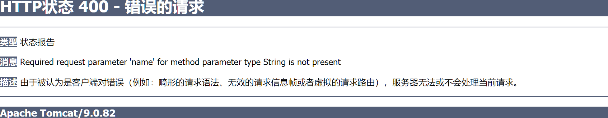
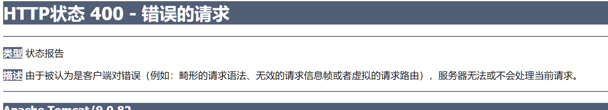
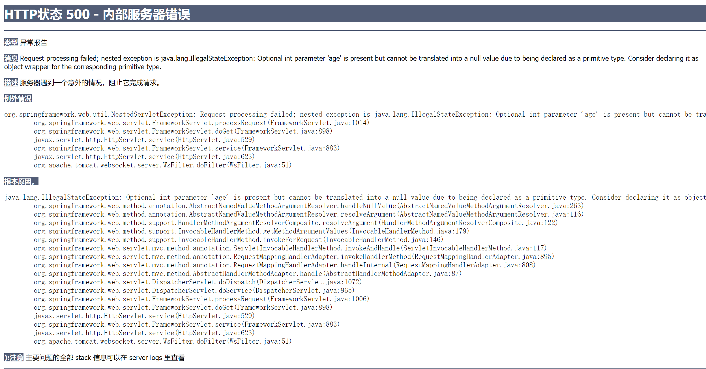
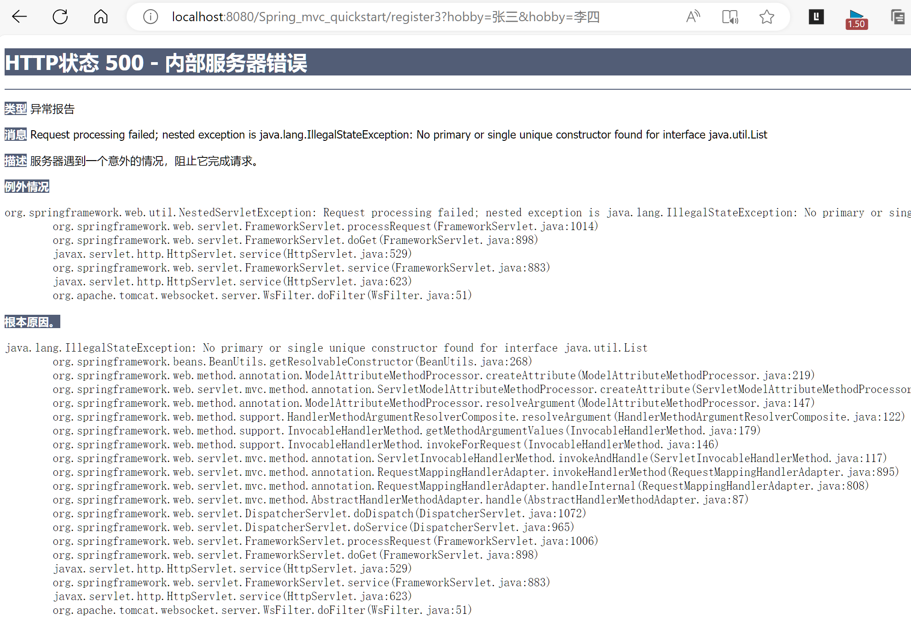
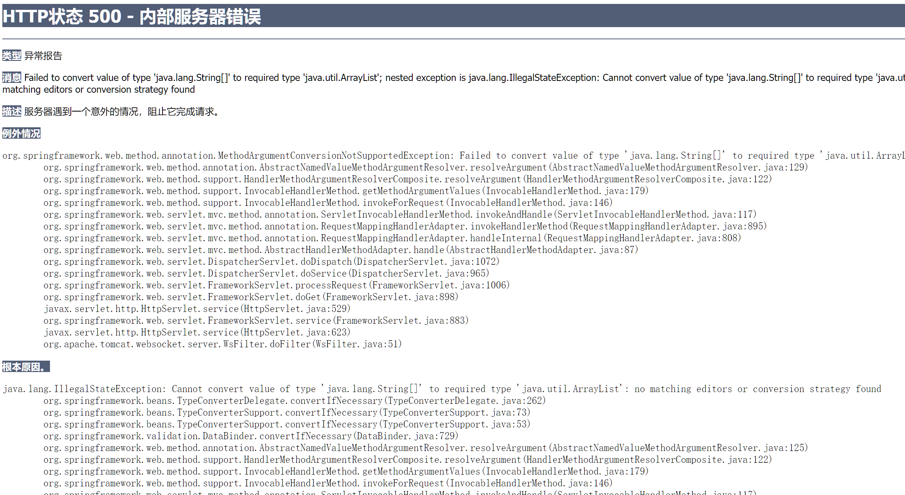
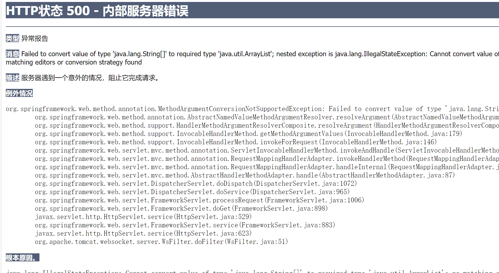
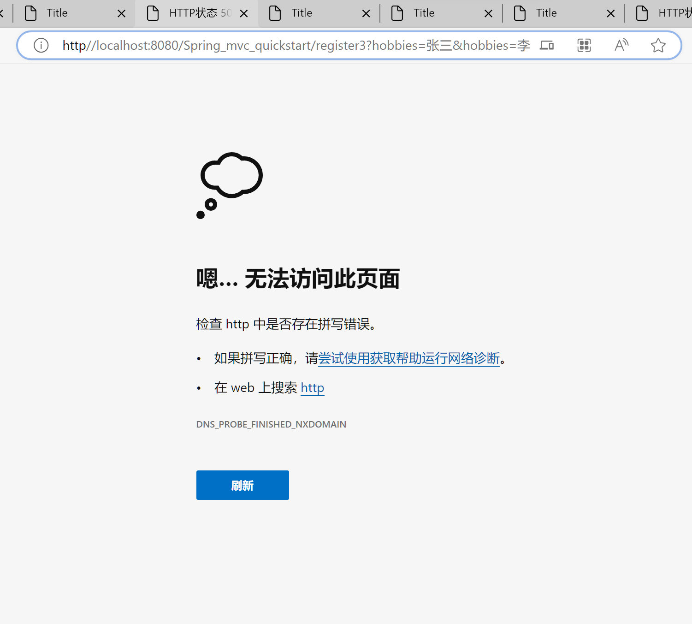
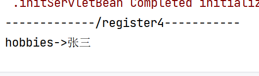
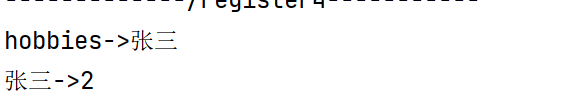
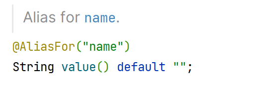

#请求数据的接收

>   Get请求数据-键值对
>
>   Post请求数据-Json,文件等


## Get请求数据-键值对

### 键值对接收


```java
//http://localhost:8080/Spring_mvc_quickstart/register?username=张三&age=18
@GetMapping("register")//这里本来request.getParameter("username")巴拉巴拉,但Spring帮我们封装好了
public String getParam(String username,Integer age){//但又一个要求:参数名和URL里的键应一一对应
    System.out.println(username+"->"+age);
    return "/index.jsp";
}
```


-   正常匹配键值对
    -   `http://localhost:8080/Spring_mvc_quickstart/register?age=18&username=张三`
    -   `张三->18`
    
-   参数数量和键的数量不一致
    -   `http://localhost:8080/Spring_mvc_quickstart/register?age=18`

    -   `nul->18`

    -   这个有点特殊,如果参数是**基本类型**int,age不写**会报错**.否则,如果是**引用类型**,age不写,会赋值个null,**不会报错**

        所以用包装类的好

-   参数名和键不一致
    -   ``http://localhost:8080/Spring_mvc_quickstart/register?age=18&name=张三``
    -   `null->18`
    
-   **不会直接报错,只是会给你一个null**

-   值不符合规则

    -   `?username=张三&age=张三`

    -   返回400错误

        

>   我就是要对name匹配给username,咋办捏?

```java
public String getParam(@RequestParam("name") String username, int age){...}
```

`http://localhost:8080/Spring_mvc_quickstart/register?age=18&username=张三`

​	->用变量名这个会400报错?!

-   `name=张三&age=李四`

    

-   `?username=张三&age=18`

    

-   `register?name=张三`

    

    

###Get请求一键对多值

>   把接收的数据,以字符串**数组**接收

```java
//http://localhost:8080/Spring_mvc_quickstart/register2?hobby=张三&hobby=李四
@GetMapping("/register2")
public String getParam( String[] hobby){
    Arrays.stream(hobby).forEach(System.out::println);
    return "/index.jsp";
}
```

-   用RequestParam("hobby")也行

    ```java
    @RequestParam("hobby") String[] hobbies
    ```

>   把接收的数据以集合接收

```java
//http://localhost:8080/Spring_mvc_quickstart/register3?hobby=张三&hobby=李四
@GetMapping("/register3")
public String getParam( List<String> hobby){
    hobby.forEach(System.out::println);
    return "/index.jsp";
}
```

-   非法状态异常



-   啥情况捏\~\(￣▽￣\)\~\*
    -   Spring会尝试帮我们把传入的类型封装成对象
    -   就是说会尝试把String,List,int**封装成对象(对象-->被new出来)**
        -   int会不会包装成Integer然后再封装我是不知道
    -   然后再把输入**填入Spring容器**的对象里
    -   但是List能被封装吗?
    -   人家是**接口**啊

-   改成ArrayList就行了...吗?

    -   ```java
        //http://localhost:8080/Spring_mvc_quickstart/register3?hobby=张三&hobby=李四
        @GetMapping("/register3")
        public String getParam(@RequestParam("hobby") ArrayList<String> hobbies){
            System.out.println("-------------/register3-----------");
            hobbies.forEach(h->System.out.println(h==null|| h.isEmpty() ?"null":h));
            return "/index.jsp";
        }
        ```

    -   

        他说:不能把填入的数据:String转成ArrayList


-   使用不含参数的注解@RequestParam

    ```java
    //http://localhost:8080/Spring_mvc_quickstart/register3?hobbies=张三&hobbies=李四
    @GetMapping("/register3")//("hobby")
    public String getParam(@RequestParam List<String> hobbies){
        				//告诉Spring,只需要把数据封进去,不要创建对象....?不创建对象咋封装捏?
        System.out.println("-------------/register3-----------");
        hobbies.forEach(h->System.out.println(h==null|| h.isEmpty() ?"null":h));
        return "/index.jsp";
    }
    ```

-   ```txt
    -------------/register3-----------
    张三
    李四
    ```

-   成功


-   但是List成功了ArrayList能成功吗?

    

    狠狠地报错

    他说:不能把填入的数据:String转成ArrayList

-   这种情况也时有发生

    

### 用Map接收Get的各色键值对请求


`/register4?hobbies=张三&hobbies=李四`



-   这是个啥原理?它说李四到还好理解...

    ```java
    @GetMapping("/register4")
    public String getParam(@RequestParam Map<String,String> map){
        System.out.println("-------------/register4-----------");
        map.put("张三","1");
        map.put("张三","2");
        map.forEach((k,v)->{
            System.out.println(k+"->"+v);
        });
    
        return "/index.jsp";
    }
    ```

    

    可能在解析URL的时候是从后往前解析的

    `?hobbies=李四&hobbies=张三`

    


-   `register4?hobbies=李四&hobbies=张三&username=王五&age=18`当集合和普通的参数共存呢?

    ```java
    //http://localhost:8080/Spring_mvc_quickstart/register4?hobbies=张三&hobbies=李四
    @GetMapping("/register4")
    public String getParam( @RequestParam Map<String, String> map,String username, int age) {
        System.out.println("-------------/register4-----------");
        map.forEach((k, v) -> {
            System.out.println(k + "->" + v);
        });
        System.out.println(username + "->" + age);//注意这一排不是键值对
        return "/index.jsp";
    }
    ```

    结果

    ```txt
    -------------/register4-----------
    hobbies->李四
    username->王五
    age->18
    王五->18
    ```

    都会有,挺好的

>   常用的还是传键值对的

```java
@GetMapping("/register")//这里本来request.getParameter("username"),但Spring帮我们封装好了
public String getParam(@RequestParam("name") String username, int age) {
    				//但又一个要求:参数名和URL里的键应一一对应
    System.out.println("-------------/register-----------");
    System.out.println(username + "->" + age);
    return "/index.jsp";
}
```


###@requesrParam

####属性

-   **value**:键名指定

    

-   **required = true(default)**

    不写这个参数就会报错

    **required = false**

    -   不写不报错

    -   `/register?age=18`

    -   ```
        -------------/register-----------
        null->18
        ```

-   **defaultValue**

    ```java
    @RequestParam(value = "name",required = true ,defaultValue = "UnnamedUser")
    ```

    `/register?age=18`

    ```
    -------------/register-----------
    UnnamedUser->18
    ```

    

## 把请求的数据封装的实体

法一 : 手动Getter-Setter(忽略)

法二 : 使用工具类:

1.  request.getParameterMap();获取所有数据的map

2.  然后new一个实体类的对象

3.  BeanUtils.populate(Object bean, Map properties)进行自动填充,映射填充


-   法二已经被SpringMVC封装到底层啦

    注意映射填充的时候是调用set方法,而不是直接注入属性

    `register5?username=张三&age=18&hobby=足球&hobby=篮球&hobby=java&birthday=2018/11/11`

    ```java
    @GetMapping("/register5")
    public String getParam(User user) {//直接输入User
        System.out.println("-------------/register5-----------");
        System.out.println(user);
        return "/index.jsp";
    }
    ```

    -   需要封装的参数有:

        1.  **基本类型**的int age

        2.  **引用类型**的String username

        3.  **数组**的 String[] hobby

        4.  **嵌套的实体类**Address address

        5.  要以**奇奇怪怪**方式set至今我也没弄懂为啥简简单单的字符串能给它正确set的**Date**

            既然说了奇奇怪怪,我就来还愿你对Data()的好奇吧!
        
            ```java
    Date date = new Date("");
            ```
        
            嗯
        
            ```java
            @Deprecated
    public Date(String s) {
                this(parse(s));
    }
            ```
        
            嗯,还很正常
        
            ```java
            @Deprecated
            public static long parse(String s) {
                int year = Integer.MIN_VALUE;
                int mon = -1;
                int mday = -1;
                int hour = -1;
                int min = -1;
                int sec = -1;
                int millis = -1;
                int c = -1;
                int i = 0;
                int n = -1;
                int wst = -1;
                int tzoffset = -1;
                int prevc = 0;
            syntax:
                {
                    if (s == null)
                        break syntax;
                    int limit = s.length();
                    while (i < limit) {
                        c = s.charAt(i);
                        i++;
                        if (c <= ' ' || c == ',')
                            continue;
                        if (c == '(') { // skip comments
                            int depth = 1;
                            while (i < limit) {
                                c = s.charAt(i);
                                i++;
                                if (c == '(') depth++;
                                else if (c == ')')
                                    if (--depth <= 0)
                                        break;
                            }
                            continue;
                        }
                        if ('0' <= c && c <= '9') {
                            n = c - '0';
                            while (i < limit && '0' <= (c = s.charAt(i)) && c <= '9') {
                                n = n * 10 + c - '0';
                                i++;
                            }
                            if (prevc == '+' || prevc == '-' && year != Integer.MIN_VALUE) {
                                // timezone offset
                                if (n < 24)
                                    n = n * 60; // EG. "GMT-3"
                                else
                                    n = n % 100 + n / 100 * 60; // eg "GMT-0430"
                                if (prevc == '+')   // plus means east of GMT
                                    n = -n;
                                if (tzoffset != 0 && tzoffset != -1)
                                    break syntax;
                                tzoffset = n;
                            } else if (n >= 70)
                                if (year != Integer.MIN_VALUE)
                                    break syntax;
                                else if (c <= ' ' || c == ',' || c == '/' || i >= limit)
                                    // year = n < 1900 ? n : n - 1900;
                                    year = n;
                                else
                                    break syntax;
                            else if (c == ':')
                                if (hour < 0)
                                    hour = (byte) n;
                                else if (min < 0)
                                    min = (byte) n;
                                else
                                    break syntax;
                            else if (c == '/')
                                if (mon < 0)
                                    mon = (byte) (n - 1);
                                else if (mday < 0)
                                    mday = (byte) n;
                                else
                                    break syntax;
                            else if (i < limit && c != ',' && c > ' ' && c != '-')
                                break syntax;
                            else if (hour >= 0 && min < 0)
                                min = (byte) n;
                            else if (min >= 0 && sec < 0)
                                sec = (byte) n;
                            else if (mday < 0)
                                mday = (byte) n;
                            // Handle two-digit years < 70 (70-99 handled above).
                            else if (year == Integer.MIN_VALUE && mon >= 0 && mday >= 0)
                                year = n;
                            else
                                break syntax;
                            prevc = 0;
                        } else if (c == '/' || c == ':' || c == '+' || c == '-')
                            prevc = c;
                        else {
                            int st = i - 1;
                            while (i < limit) {
                                c = s.charAt(i);
                                if (!('A' <= c && c <= 'Z' || 'a' <= c && c <= 'z'))
                                    break;
                                i++;
                            }
                            if (i <= st + 1)
                                break syntax;
                            int k;
                            for (k = wtb.length; --k >= 0;)
                                if (wtb[k].regionMatches(true, 0, s, st, i - st)) {
                                    int action = ttb[k];
                                    if (action != 0) {
                                        if (action == 1) {  // pm
                                            if (hour > 12 || hour < 1)
                                                break syntax;
                                            else if (hour < 12)
                                                hour += 12;
                                        } else if (action == 14) {  // am
                                            if (hour > 12 || hour < 1)
                                                break syntax;
                                            else if (hour == 12)
                                                hour = 0;
                                        } else if (action <= 13) {  // month!
                                            if (mon < 0)
                                                mon = (byte) (action - 2);
                                            else
                                                break syntax;
                                        } else {
                                            tzoffset = action - 10000;
                                        }
                                    }
                                    break;
                                }
                            if (k < 0)
                                break syntax;
                            prevc = 0;
                        }
                    }
                    if (year == Integer.MIN_VALUE || mon < 0 || mday < 0)
                        break syntax;
                    // Parse 2-digit years within the correct default century.
                    if (year < 100) {
                        synchronized (Date.class) {
                            if (defaultCenturyStart == 0) {
                                defaultCenturyStart = gcal.getCalendarDate().getYear() - 80;
                            }
                        }
                        year += (defaultCenturyStart / 100) * 100;
                        if (year < defaultCenturyStart) year += 100;
                    }
                    if (sec < 0)
                        sec = 0;
                    if (min < 0)
                        min = 0;
                    if (hour < 0)
                        hour = 0;
                    BaseCalendar cal = getCalendarSystem(year);
                    if (tzoffset == -1)  { // no time zone specified, have to use local
                        BaseCalendar.Date ldate = (BaseCalendar.Date) cal.newCalendarDate(TimeZone.getDefaultRef());
                        ldate.setDate(year, mon + 1, mday);
                        ldate.setTimeOfDay(hour, min, sec, 0);
                        return cal.getTime(ldate);
                    }
                    BaseCalendar.Date udate = (BaseCalendar.Date) cal.newCalendarDate(null); // no time zone
                    udate.setDate(year, mon + 1, mday);
                    udate.setTimeOfDay(hour, min, sec, 0);
                    return cal.getTime(udate) + tzoffset * (60 * 1000);
                }
        // syntax error
                throw new IllegalArgumentException();
    }
            ```
    
            啊?

    输出结果[HTTP状态 400 - 错误的请求](http://localhost:8080/Spring_mvc_quickstart/register5?username=张三&age=18&hobby=足球&hobby=篮球&hobby=java&birthday=2018/11/11)
    
    ```
    -------------/register5-----------
    User{username='张三', age=0, hobby=null, birthday=null, address=null}
    -------------/register5-----------
    User{username='张三', age=18, hobby=null, birthday=null, address=null}
    -------------/register5-----------
    User{username='张三', age=18, hobby=[足球], birthday=null, address=null}
    -------------/register5-----------
    User{username='张三', age=18, hobby=[足球, 篮球], birthday=null, address=null}
    -------------/register5-----------
    User{username='张三', age=18, hobby=[足球, 篮球, java], birthday=null, address=null}
-------------/register5-----------
    User{username='张三', age=18, hobby=[足球, 篮球, java], birthday=Sun Nov 11 00:00:00 CST 2018, address=null}
    ```
-   肥肠的斯巴拉西啊

现在想想怎么搞嵌套的类?

`&address.city=霓虹&address.area=Tokyo`

全矣

```json
-------------/register5-----------
User{
    username='张三', 
    age=18, 
    hobby=[足球, 篮球, java], 
	birthday=Sun Nov 11 00:00:00 CST 2018, 
	address=Address{
        city='霓虹', 
        area='Tokyo'
    }
}
```

​    


