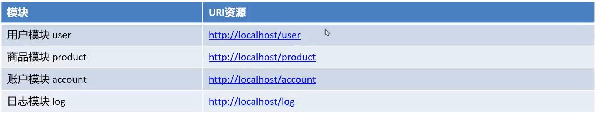
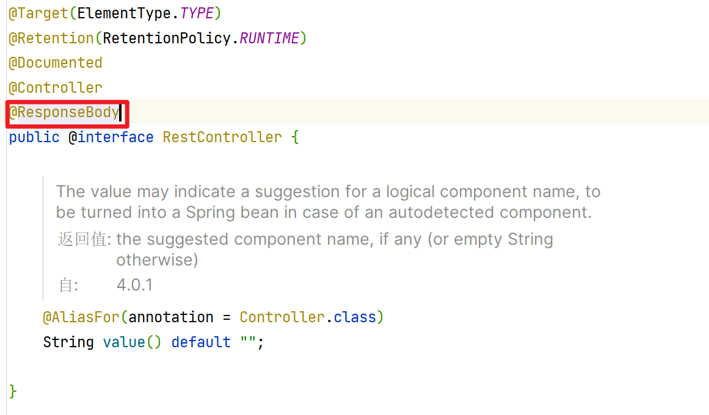
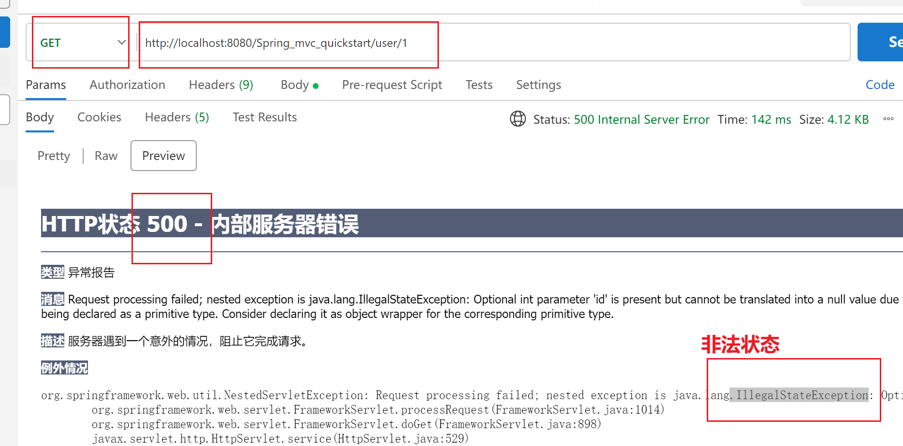

#Restful风格的数据接收

##Restful风格

>   Rest(Representational State Transfer) 表象化状态转变 (表述性状态转变) , **基于Http,URI,xml,JSON**等标准和协议
>
>   是Web服务的一种新网络应用程序的**设计风格和开发标准**

## 规则

1.  用URI表示某个资源模块,资源名称为名词

    user所对应的增删改查等所有操作,都是在user资源下这个完成

    即在user后边添加一些其他的更细的地址或数据

    -   即在user后边再加上"资源",直接表示数据`http://localhost/user/100`,100就作为了一个参数
    -   不使用?+键值对的方式了

2.  用请求方式表示模块的具体业务动作

    怎么决定增删改查的操作呢?

    -   GET - 查询
    -   POST - 插入
    -   PUT - 更新
    -   DELETE - 删除

    

    -   模块后边没数据?->
        -   不是新增操作
        -   就是修改操作
        -   得看它的请求体里的Json
    -   模块后边有数据?->
        -   不是Get查
        -   就是Delete删

3.  依据HTTP响应状态码表示响应结果,

    -   500->服务器错误
    -   400->客户端错误
    -   200->正常运行

    国内常用的部分响应:响应状态码,响应信息,数据

    ```json
    {
    	"code":200,
        "message":"成功",
        "data":{
            "username":"张三",
            "age":18
        }
    }
    {
    	"code":300,
        "message":"未找到资源",
        "data":""
    }
    ```


## 对请求的实践

###使用@RestController

1.  注解在类上
    -   这个类上的所有方法皆被管理


#### 看源码



-   注意,只能响应响应体,不能响应页面了


###实践

```java
//Get查
@GetMapping("/user/{id}")//使用占位符,一会儿id就会被get
public String findUserById(int id){
    System.out.println(id);
    return  "/index.jsp";
}
```



诶呀,不是这么配的

```java
@GetMapping("/user/{id}/{username}")//使用占位符,一会儿id就会被get
public String findUserById(
    @PathVariable("id") int id,
    @PathVariable("username") String username){
    //@PathVariable把路径转成数据
    System.out.println(username+"->"+id);
    return  "/index.jsp";
}
```

`http://localhost:8080/Spring_mvc_quickstart/user/1/Mike`

### 问题

以上实践的问题: 响应的页面都是String文字,并非我们的目的,解决方案:使用**ModelAndView**

```java
@GetMapping("/user/{id}/{username}")//使用占位符,一会儿id就会被get
public ModelAndView findUserById(
        @PathVariable("id") int id,
        @PathVariable("username") String username){
    //@PathVariable把路径转成数据
    System.out.println(username+"->"+id);
    
    ModelAndView modelAndView = new ModelAndView();
    modelAndView.setViewName("/index.jsp");
    return  modelAndView;
}
```