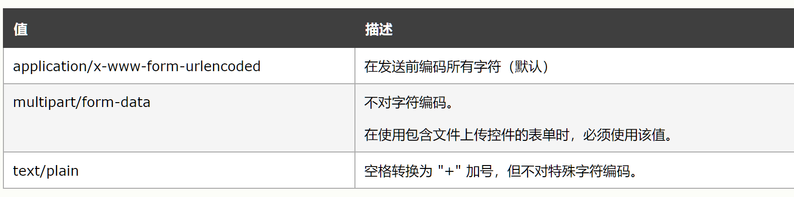
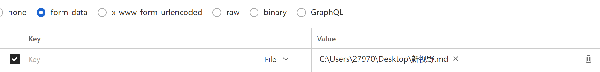
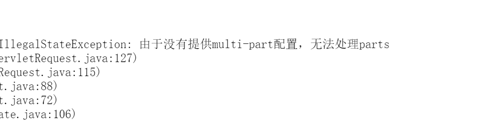
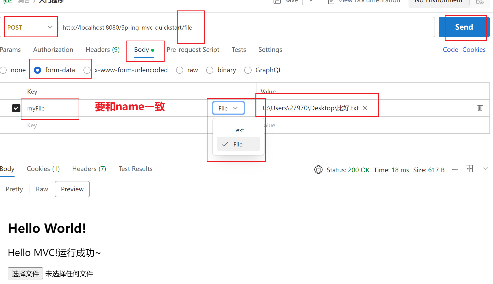

# 接收文件上传的数据

## 文件上传的要求

1.  表单的提交方式必须是**POST**(URL的长度有限制,表单更合适做文件的上传)

2.  表单的enctype属性(缺省是"application/x-www-form-urlencoded")必须是**multipart/form-data**

    

    不对字符编码,即使用字节输入流,传输的不一定是文本文件

3.  文件上传项必须有name属性

```html
<form action="" enctype="multipart/form-data" method="post">
        <input type="file" name="myFile">
</form>
```


<form action="" enctype="multipart/form-data" method="post">
        <input type="file" name="myFile">
</form>

-   这个文件上传是这个样子的

## Postman模拟文件上传



1.  在key的text/file选择**File**
2.  选择文件地址

## 文件上传

1.  Spring规定了这个文件的类型是**MultipartFile**类型的
2.   由于是Post请求,这个文件存在于**请求体**当中 -> 前边加一个**@RequestBody**

```java
@PostMapping("/file")
public String addFile(@RequestBody MultipartFile myFile){
    System.out.println(myFile.getName());
    return "/index.jsp";
}
```



-   此时直接上,会出现:
    -   `Failed to parse multipart servlet ,IllegalStateException: multi-part配置`
-   这是无法解析文件
-   文件解析器没有开启,这是应为Spring认为这个功能难得用到一次,就没有默认配置
-    需要人为**手动开启文件解析器**

### 配置文件上传解析器

-   配置文件上传解析器,**注意id的名字是固定写法**

    -   **本来的话**Spring是默认**按照类型**去匹配的,但是人家天生反骨

-   CommonsMultipartResolver

    -   通用的,公共的表单的解析器

-   ```xml
    <bean id="multipartResolver" 
          class="org.springframework.web.multipart.commons.CommonsMultipartResolver"/>
    ```

-   CommonsMultipartyResolver底层使用Apache的Common-fileuplad等工具API进行上传

-   这里给出依赖的地址

    ```xml
    <dependency>
        <groupId>commons-fileupload</groupId>
        <artifactId>commons-fileupload</artifactId>
        <version>1.4</version>
    </dependency>
    ```

### Postman测试与运行结果



-   这个**要和name一致指的是要和参数名一致**,这个是模拟表单输入,以后只要html的form的表单里的name="myFile"就行啦

#### 运行结果

`MultipartFile[field="myFile", filename=??????.txt, contentType=text/plain, size=160]`

### 表单解析器的可配置参数

```xml
<bean id="multipartResolver" 
      class="org.springframework.web.multipart.commons.CommonsMultipartResolver">
    <property name="defaultEncoding" value="UTF-8"/><!--文件的编码格式 默认是ISO8859-1-->
	<property name="maxUploadSizePerFile" value="1048576"/><!--上传文件的大小限制,单位字节-->
	<property name="maxUploadSize" value="3145728"/><!--上传文件的总大小-->
	<property name="maxInMemorySize" value="1048576"/><!--上传文件的缓存大小-->
</bean>
```
-   1048576=1024\*1024
-   3145728=1024\*1024\*3
-   超过字节就报异常啦

## 将上传的文件保存到服务器本地

```xml
<dependency>
    <groupId>commons-fileupload</groupId>
    <artifactId>commons-fileupload</artifactId>
    <version>1.4</version>
</dependency>
```

-   这个依赖里自带了[commons-io框架](..\..\blog\javaIO流\Day35-IO框架.md)

```java
@PostMapping("/file")
public String addFile(@RequestBody MultipartFile myFile) {
    // Spring规定了这个文件的类型是MultipartFile类型的
    // 由于是Post请求,这个文件存在于请求体当中 -> 前边加一个@RequestBody
    System.out.println(myFile);
    System.out.println(myFile.getName());//myFile
    System.out.println(myFile.getOriginalFilename());//新视野.md
    // 文件保存
    // 决定文件输出位置
    String directPath = "C:\\Users\\27970\\Desktop\\" + "(副本)" + myFile.getOriginalFilename();
    try (
        // 1. 获取上传的文件输入流
         InputStream inputStream = myFile.getInputStream();
         // 2. 获取文件的输出流
         OutputStream outputStream = new FileOutputStream(directPath)
    ){
        // 3. 执行文件拷贝
        IOUtils.copy(inputStream, outputStream);
    } catch (IOException e) {
        throw new RuntimeException(e);
    }
    //4. 关闭资源
    return "/index.jsp";
}
```


## 上传多个文件

```java
public String addFile(@RequestBody MultipartFile myFile1,@RequestBody MultipartFile myFile2)
```

