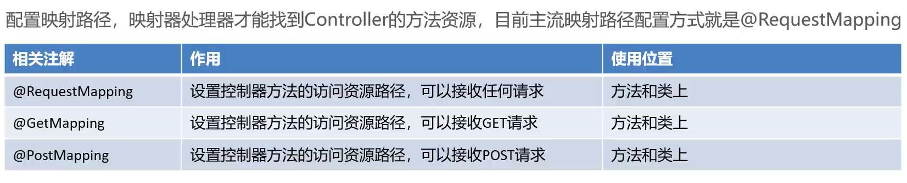
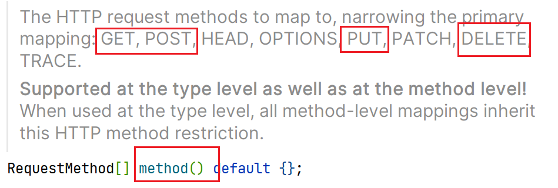
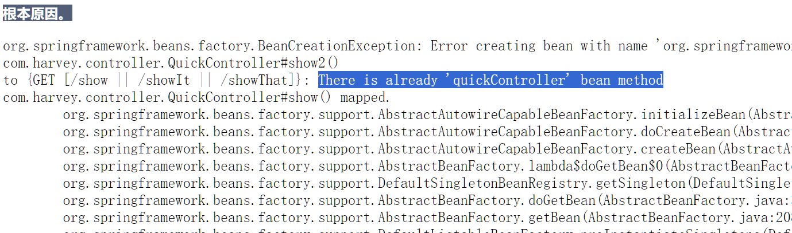

# 请求和响应

-   请求映射路径的配置
-   请求数据的接收
-   Javaweb常用对象的获取(在框架中获取原来的Javaweb类)
-   请求静态资源
-   注解驱动\<mvc:annotation-driven\>

```java
@RequestMapping("/show")//路径配置
public String show() {
    System.out.println(myService);
    System.out.println(this.getClass().getSimpleName()+"::show()");

    return "/index.jsp";//请求静态资源
}
```



-   @RequestMapping的源码:

    -   ```java
        @AliasFor("path")
        String[] value() default {};
        
        @AliasFor("value")
        String[] path() default {};
        ```

        互为别名,可以相互平替

    -   可以用配置method的方式来指定它是请求头什么的干活

        ```java
        public enum RequestMethod {
            GET, HEAD, POST, PUT, PATCH, DELETE, OPTIONS, TRACE
        }
        ```

    -   ```java
        @RequestMapping({"/show","/showIt","showThat"})//多个地址映射到一个对象
        @RequestMapping(path = {"/show","/showIt","showThat"},method = RequestMethod.POST)
        //多个地址映射到一个对象,只能Post的请求方式的进
        ```

    -   一个路径映射到两个方法会报错

        

        

    ##GetMapping和PostMappering

```java
@RequestMapping(path = {"/show","/showIt","showThat"},
        method = {RequestMethod.GET,RequestMethod.PUT})
@RequestMapping(path={"/show213"},method = RequestMethod.GET)
//这两个注解不能叠加加
```

使用注解:

```java
@GetMapping(path = {"/Hello"})
@PostMapping(path = {"hello"})
```

-   简单,直观,优雅,高效


## 类上匹配请求注解

```java
@Controller//@Component的三个衍生注解,比Component更具备语义化
@RequestMapping(value = "/quick",method = RequestMethod.POST)
public class QuickController {

    @Autowired
    private MyService myService ;

    //@RequestMapping({"/show","/showIt","showThat"})//多个地址映射到一个对象
    @RequestMapping(path = {"/show","/showIt","showThat"},
                    method = RequestMethod.GET)//多个地址映射到一个对象
    public String show() {
```

-   要访问.show()的方法时,请求路径:

    localhost:8080/项目名**/quick/show**

-   由于类配置请求方法时Post,导致过滤了一次,只留下了Post

    又由于方法show的请求方式指定了Get

    所以show方法永远不会通过响应直接访问到