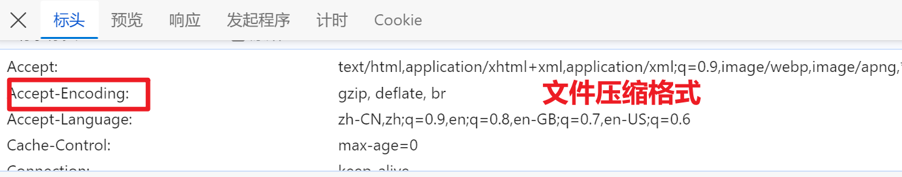
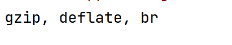
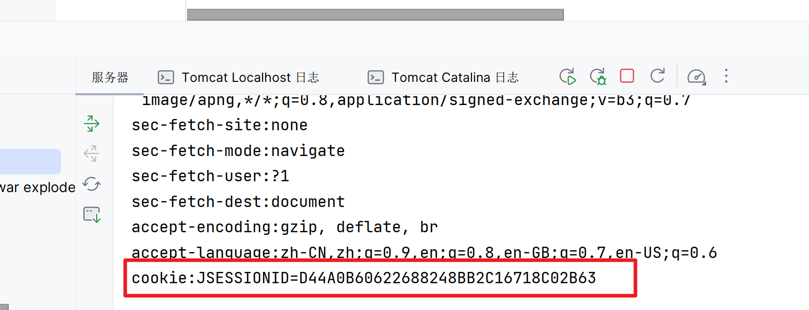
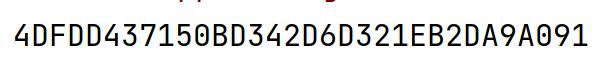

# 服务器接收客户端的请求头

## 获取单独的头

-   键值对



-   我们获取这个请求头


```java
@GetMapping(value = "/header")
public String getHeader(@RequestHeader("Accept-Encoding") String headerValue){
    System.out.println(headerValue);
    return "/index.jsp";
}
```




## 获取所有的头

-   用Map集合接收

```java
@GetMapping(value = "/headers")
public String getHeader(@RequestHeader Map<String,String> map){
    map.forEach((k,v)-> System.out.println(k+":"+v));
    return "/index.jsp";
}
```

## 获取Cookie

-   对于服务端来说,接收Cookie的时候,Cookie的本质还是一个头



其实在获取所有头的时候已经有一个Cookie被获取到了


**但是**

这个头的键是cookie,而我们需要的Cookie的键是JSESSIONID

```java
@GetMapping(value = "/cookie")
public String getCookie(@CookieValue("JSESSIONID") String jSessionId){
    System.out.println(jSessionId);
    return "/index.jsp";
}
```



