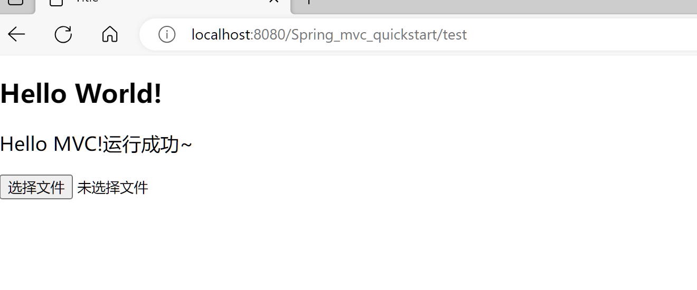
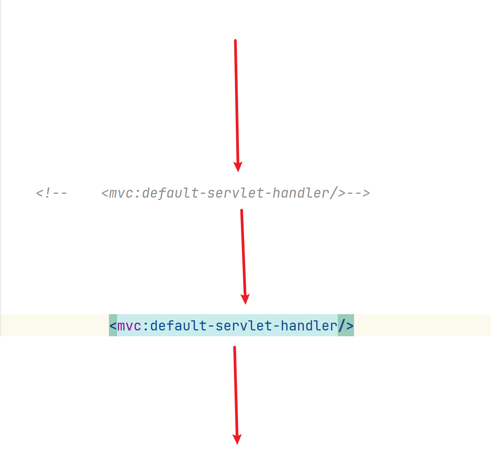
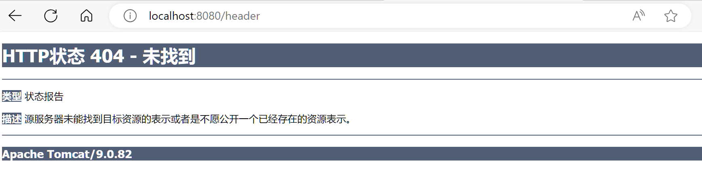
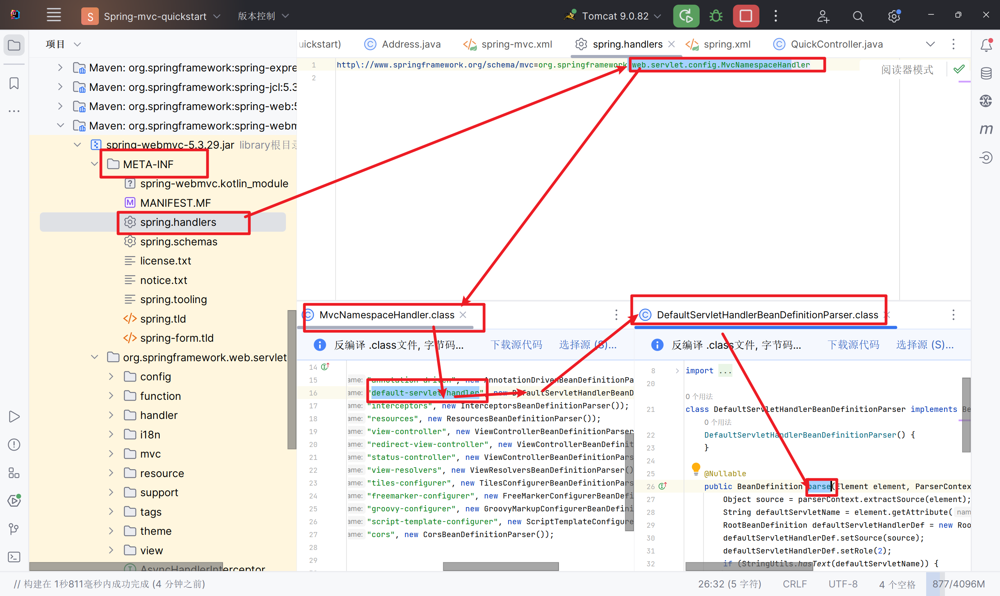
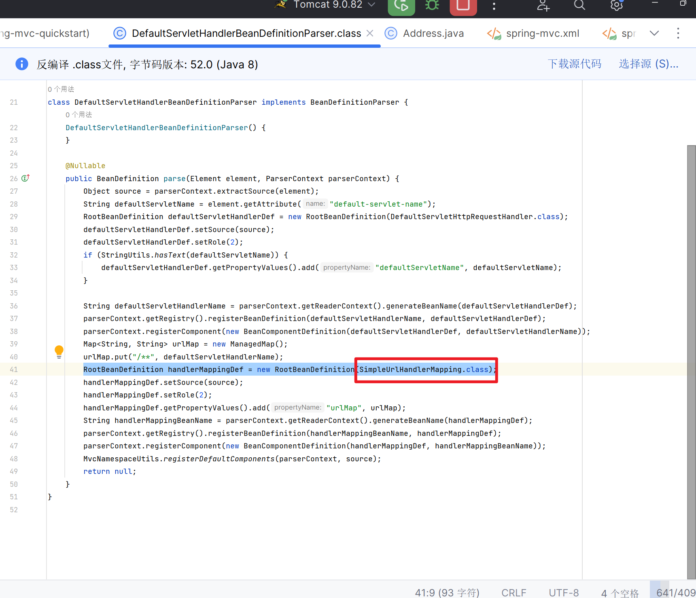
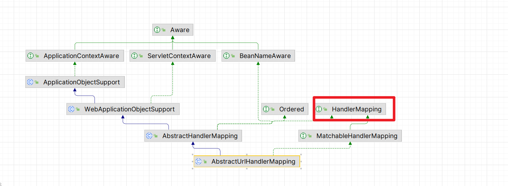
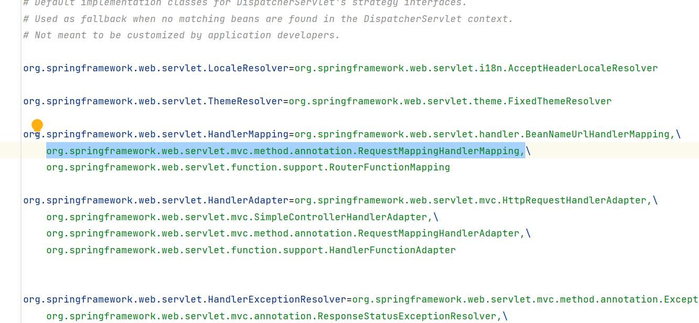
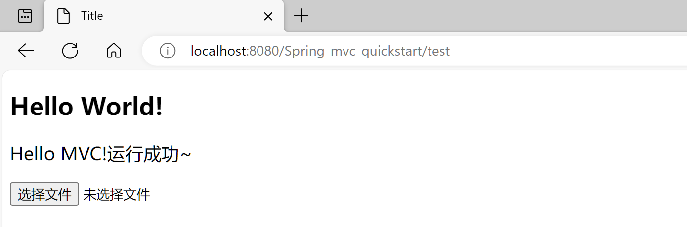

# 注解驱动

>   标签\<mvc:annotation-driven\>

## 拆东墙,补西墙







-   **动态资源反而不能加载啦??????????**
-   发生什么事了?

```xml
<mvc:resources mapping="/image/*" location="/img/"/>
```

```xml
<mvc:default-servlet-handler/>
```





-   在使用`<mvc:default-servlet-handler/>`时,它会自动帮你注入一个**SimpleUrlHandlerMapping**

    

    你看它也实现了HandlerMapping

-   所以,注入了一个**SimpleUrlHandlerMaping**之后,就不会帮你注入**默认的HandlerMapping**了



-   可是,解析我们动态资源的HandlerMapping是谁呢?

    **RequestMappingHandlerMapping**

-   那么`<mvc:resources mapping="/image/*" location="/img/"/>`行不行呢?

-   不行,原理一样

### 解决方案

-   自己手动配置**RequestMappingHandlerMapping**

```xml
<bean class="org.springframework.web.servlet.mvc.method.annotation.RequestMappingHandlerMapping"/>
<mvc:default-servlet-handler/>
```



-   启动成功

## 最终方案annotation-driven

>标签\<mvc:annotation-driven\>

-   (3.1.X版本之后)帮助注册

    1.  **RequestMappingHandlerMapping**

        ```xml
        <bean class="org.springframework.web.servlet.mvc.method.annotation.RequestMappingHandlerMapping"/>
        ```

    2.  **RequestMappingHandlerAdapter**

        -   自动往里头有注入**Json消息转换器**

        ```xml
        <!--配置HandlerAdapterJson转换器-->
        <bean class="org.springframework.web.servlet.mvc.method.annotation.RequestMappingHandlerAdapter">
            <!--配置了适配器就不会加载默认的了-->
            <property name="messageConverters">
                <list>
                    <bean class="org.springframework.http.converter.json.MappingJackson2HttpMessageConverter"/>
                </list>
            </property>
            <!--配置好了之后就不用认为去new ObjectMapper了-->
        </bean>
        ```

-   还有日期转换器等等组件

### 测试

-   Json能运行,但Json里的birthday,有要求换成2018-11-11了,你还记得吗?

```txt
-------------/body-----------
{
    "username":"张三", 
    "age":18, 
    "hobby":["足球"," 篮球", "java"],
     "birthday":"2018-11-11", 
     "address":{
         "city":"霓虹",
          "area":"Tokyo"
          }
}
User{username='张三', age=18, hobby=[足球,  篮球, java], birthday=Sun Nov 11 08:00:00 CST 2018, address=Address{city='霓虹', area='Tokyo'}}
```

