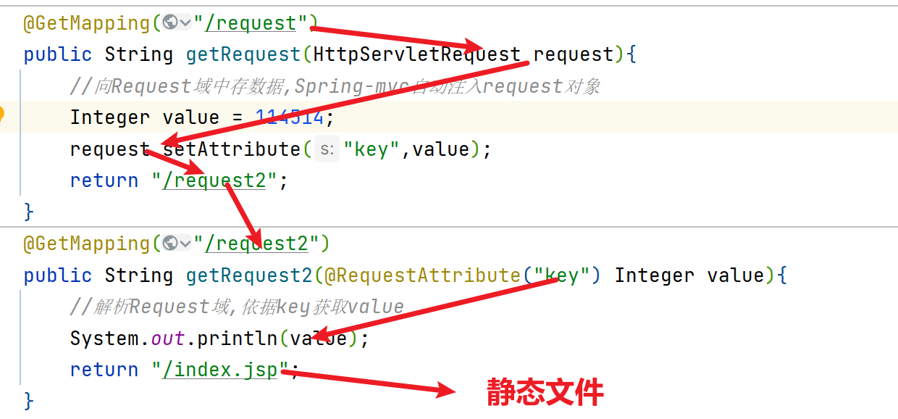

# 获取Request域中的数据

在进行资源之间转发是,有时需要将一些参数存储到request域中携带给下一个资源


>   Q: 请求转发是不是就是对request域中的数据进行资源间的传递

>   A: 是的，请求转发是指在服务器内部将请求从一个Servlet资源传递到另一个Servlet资源。在这个过程中，可以将请求域中的数据传递给下一个资源，实现资源间的数据传递

`request.getRequestDispatcher("资源B路径").forward(request,response))`

## 实现方法

### 导入坐标

```xml
<dependency>
    <groupId>javax.servlet</groupId>
    <artifactId>javax.servlet-api</artifactId>
    <version>4.0.1</version>
</dependency>
```

-   HttpServletRequest

### 获取Request


```java
@GetMapping("/request")
public String getRequest(HttpServletRequest request){
    //向Request域中存数据,Spring-mvc自动注入request对象
    Integer value = 114514;
    request.setAttribute("key",value);
    return "/request2";
}
@GetMapping("/request2")
public String getRequest2(@RequestAttribute("key") Integer value){
    //解析Request域,依据key获取value
    System.out.println(value);
    return "/index.jsp";
}
```



-   也可以举一反三一波,搞个`@SessionAttribute("key")`,可以直接获取Session域中的数据

