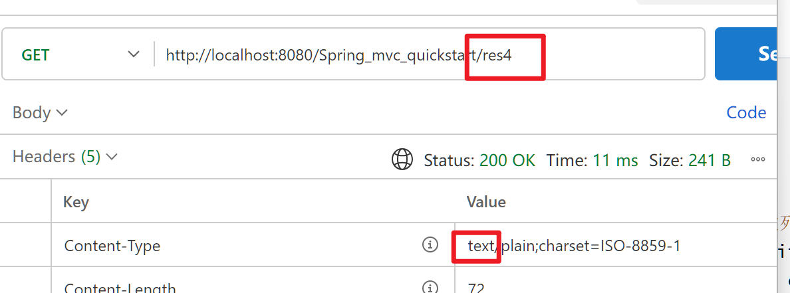
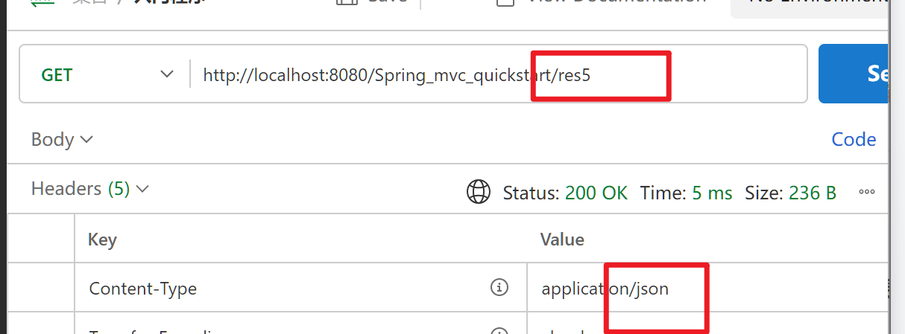

# 异步方式

-   回写数据的对象
    -   同步方式给浏览器进行页面展示
    -   异步方式给Ajax引擎
        -   谁访问服务端服务端的数据就(基于监听的方式,JS)响应给谁
-   回写的数据格式
    -   同步方式一般就是无特定格式的字符串
    -   异步方式大多是Json格式字符串

```java
//直接回写字符串
@GetMapping("/res4")
@ResponseBody
public String res4() {
    try {
        // 弊端:麻烦,原来不是可以放在参数列表里吗?
        return new ObjectMapper().writeValueAsString(user);
    } catch (JsonProcessingException e) {
        throw new RuntimeException(e);
    }
}
```


```java
@GetMapping("/res5")
@ResponseBody
public User res5() {
    return user;// Spring会尝试将user转换为Json字符串,如果没问题,就响应字符串
}
```


-   手动转换为字符串还有一个弊端:

    **真的传了个字符串,人家浏览器还不知道你是Json嘞**

    

-   相比之下的Spring:

    

    看看人家,多长志气

