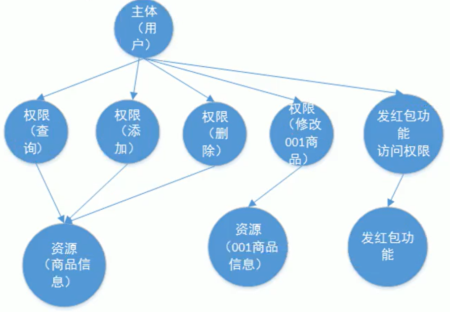
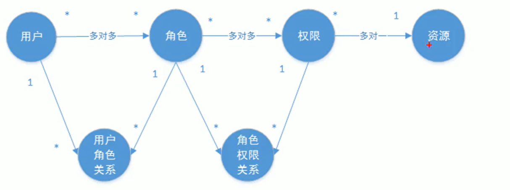

## 基本概念

OAuth2.0

-   认证协议
-   针对分布式系统

认证

-   识别身份

授权

-   校验用户权限

认证授权的

## 认证

>   系统判断判断身份是否合法的过程

### 目的

保护系统的隐私数据和资源

### 方式

-   用户密码登录
-   二维码登录
-   收集短信登录
-   指纹认证

## 会话

>   为了避免每次操作都进行认证, 让用户在退出之前的操作, 都保有用户的合法信息

### 基于Session的认证方式

1.  用户登录成功
2.  服务端创建一个Session  
3.  Session中存储用户的信息
4.  服务端向客户端响应Session的ID
5.  这个ID被客户端存在了Cookie
6.  下一次用户就可以带着这个Session ID的值来访问我们的Web服务器
7.  此时我们的Web服务端就校验, 用户已经存在这个Session了,就不再使用认证了

### 基于token的认证方式

1.  用户创建成功
2.  服务端生成token(令牌)
3.  令牌最终会返回客户端
4.  客户端保存在令牌
    -   可以保存在Cookie
    -   如果客户端不支持Cookie, 就可以保存在localStorsge
5.  携带token访问服务端
6.  web服务器进行校验.

### token和Session的区别

1.   客户端对认证的保持方式不同
    -   token不要求把令牌存储在Cookie中
    -   Session只能依赖Cookie技术

2.   服务端存储的方式不同
    -   Session需要在服务器存储用户的账号和密码
    -   token可以让服务器基于生成令牌的算法校验令牌是否合法

3.   Token具有时效性,支持跨域请求, 把信息存在客户端具有可拓展性,适合负载均衡

## 授权

>   校验用户是否有权限使用功能
>
>   可以理解为什么样的**用户**可以对什么样的**资源**进行什么样的**操作**

-   认证是为了包装身份的合法性
-   授权是为了更细粒度低对隐私数据进行划分, 保护资源有误权限去使用

### 主体

一般指用户,也可以指程序(爬虫)

谁来使用这个系统, 谁就是主题

### 资源

系统菜单, 页面, 按钮, 代码方法, 信息

-   系统功能资源

    -   系统菜单, 页面, 按钮, 代码, 方法
    -   常常对应一个URL

-   数据资源/实体资源

    -   商品信息, 商品编号

    -   包括(不是分为)资源类型和资源示例

        -   资源类型:

            类似Java类

            如: 商品信息

        -   资源实例

            类似Java对象

            如: 商品编号

### 权限/许可

### 主体, 资源, 权限的关系



### 角色

>   对用户的一个打包, 关联了权限和用户

-   管理员
-   普通用户
-   VIP用户

### 授权的数据模型



由于权限与资源高度相关, 可以把资源和权限合成一张表

### RBAC技术

-   认证的方式五花八门, 但主要思想大差不差
-   授权主要使用RBAC技术

#### 基于角色的访问控制

>Role-Based Access Control

```pseudocode
权限(主体){
	if 主体.判断角色(是否是使用权限的角色) 
		then 使用权限和资源
}
```

例如查工资, 总经理可以查工资, 然后写了这个代码

然后我要部门经理也要查工资, 这个代码要不要改?

要去用`主体.判断角色(是否是使用权限的角色A)||主体.判断角色(是否是使用权限的角色B)  `去改, 拓展性差了

#### 基于资源的访问控制

>   Rresources-Based Access Control

```pseudocode
权限(主体){
	if 主体.判断权限(有这个使用权限) 
		then 使用权限和资源
}
```

