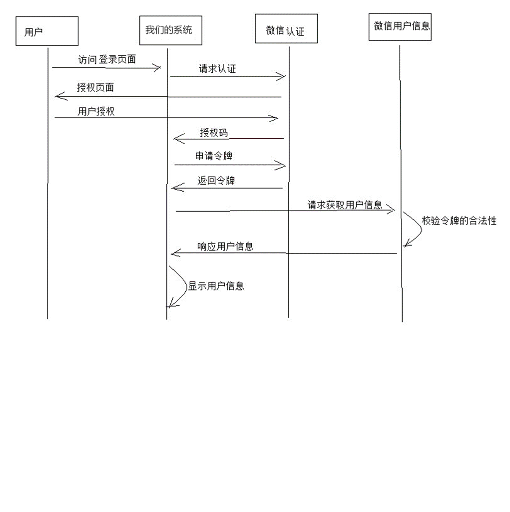
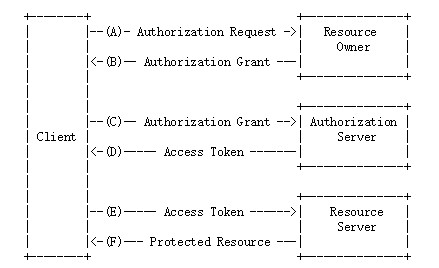
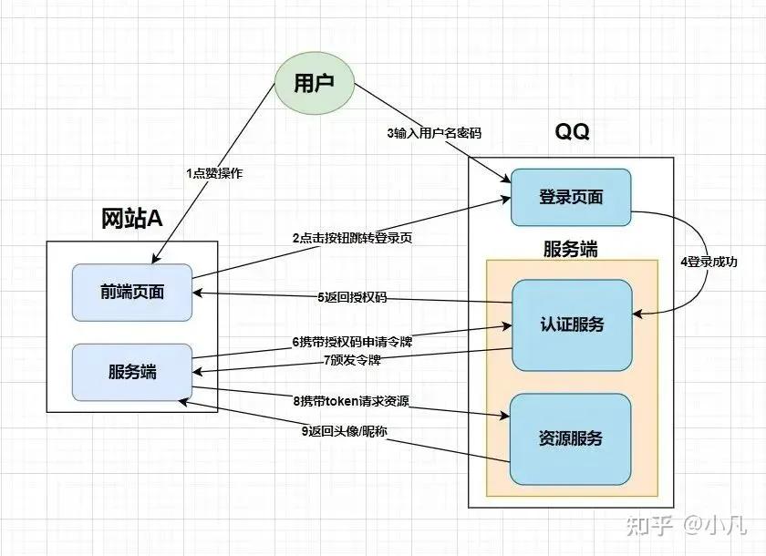

# OAuth2.0

## 介绍

OAuth（开放授权）是一个开放标准，**允许用户授权**第三方应用**访问**他们存储在另外的服务提供者上的**信息**，而**不需要将用户名和密码提供给第三方应用**或分享他们数据的所有内容。

## 用处

使用微信登录

权限的授予需要用户的确认, 用户的信息

微信给予JWT令牌, 包含用户信息,反馈给我们的系统

我们拿到令牌, 认为用户身份信息被认证成功, 就进入系统

### OAauth2.0原理流程

1.  客户端(我的系统)向资源拥有者(用户)提出授权申请

    -   微信弹出**"是否授权XXXX?"**的信息

2.  资源拥有者确认授权

    -   用户在微信上点击**确认**
    -   将**授权码**给予客户端(我的系统)

3.  客户端带着**授权码**向授权服务器（也称认证服务器）申请令牌

    -   请求中包括客户端ID(我的系统)、客户端密钥等信息

    -   认证服务器校验客户端ID、客户端密钥是否合法

    -   校验用户授权码是否合法

4.  认证服务器(微信)将令牌给了客户端(我的系统)

5.  客户端(我的系统)拿着令牌来访问资源服务器(有用户名头像)

    -   资源服务器校验令牌是否合法

6.  资源服务器(有用户名头像)把资源返回给**我的系统**

### OAauth2.0包括的角色

1.  客户端

    **本身不存储资源**，需要通过资源拥有者的授权去请求资源服务器的资源

    比如：Android客户端、Web客户端（浏览器端）、微信客户端等。

2.  资源拥有者

    通常为**用户**，也可以是应用程序

3.  授权服务器（也称认证服务器）

    用于服务提供商对资源拥有的身份进行认证、对访问资源进行授权，认证成功后会给客户端发放令牌（access_token），作为客户端访问资源服务器的凭据。

    本例为微信的认证服务器。

4.  资源服务器

    存储资源的服务器，

    本例子为微信存储的用户信息。

服务提供商不能允许随便一个客户端就接入到它的授权服务器啊

服务提供商会给准入的接入方一个身份，用于接入时的凭据:

-   client_id：客户端标识 
-   client_secret：客户端秘钥

因此，准确来说，授权服务器对两种OAuth2.0中的**两个角色进行认证授权**，分别是**资源拥有者、客户端**。

