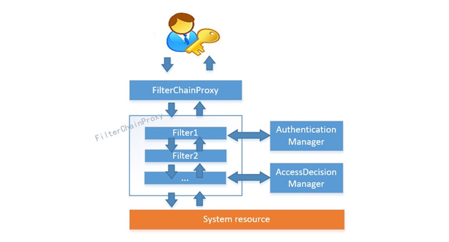
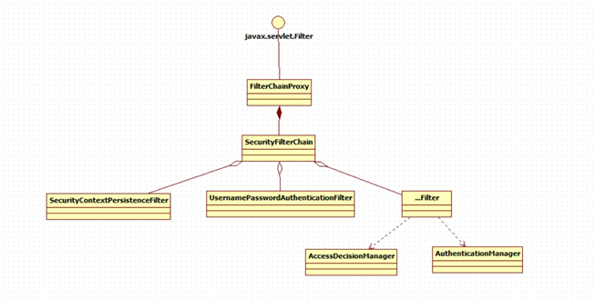
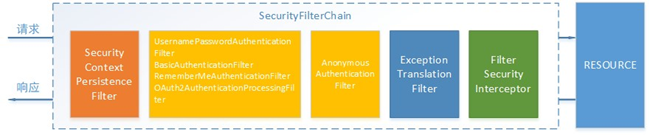
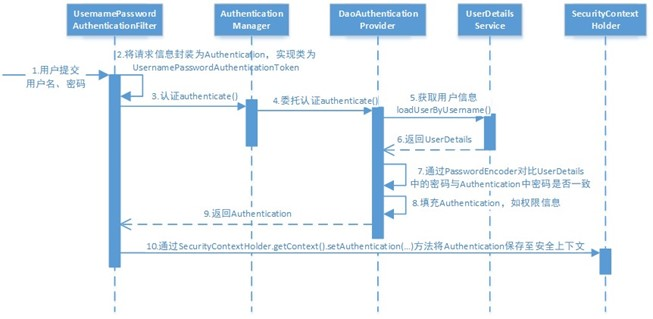
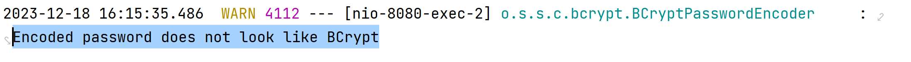
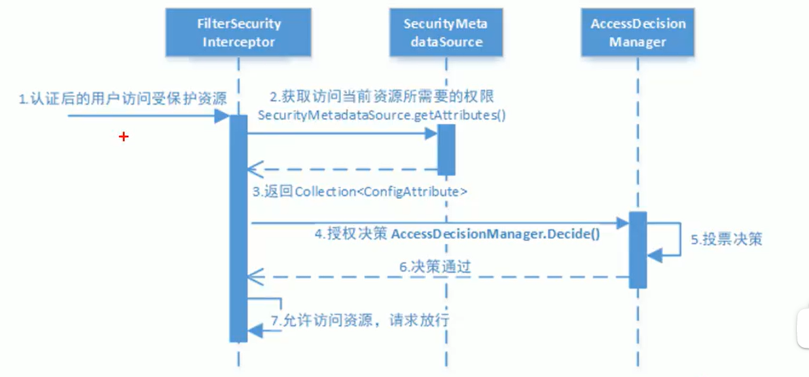
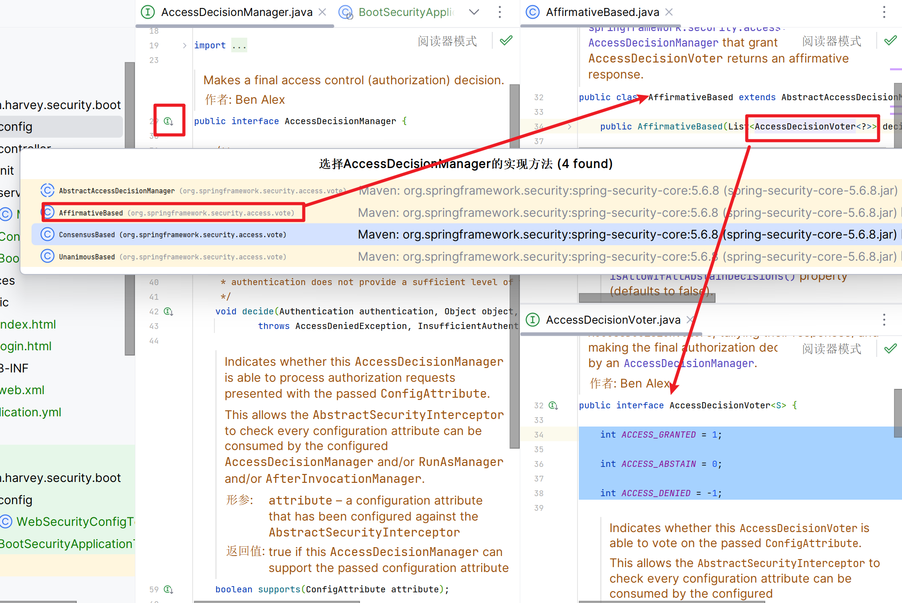

# 工作原理

 对所有进入系统的请求进行**拦截**( 对方法拦截 ), **校验**每个请求是否能够访问它所期望的资源

从Filter入手

对方法拦截-> AOP

初始化SpringSecurity时创建FilterChain 的Servlet过滤器



SpringSecurity有FilterChainProxy的代理类,产生很多Filter

FilterChain里, 有一些Filter用来校验身份,有一些Filter用来校验权限

Filter

-   会委托AuthenticationManager去校验用户的身份
-   会委托AccessDecisionManager去校验用户的权限




## 几个重要的Filter



### SecurityContextPersistenceFilter

整个拦截过程的入口和出口(第一个和最后一个拦截器)


### UsernamePasswirdAuthenticationFilter

**处理来自表单提交的认证**, 表单必须提供对应的用户名密码,

其内部还有**登录成功或失败后进行处理**的AuthenticationSuccessHandler和AuthenticationFailureHandler

### FilterSecurityInterceptor

进行授权使用AccessDecisionManager对当前用户进行授权访问

### ExceptionTranslationFilter

FilterChain的所有Filter的异常, 并进行处理

只会处理两类异常:**AuthenticationException**和**AccessDeniedException**

其他异常继续抛出

## 认证流程



1.  用户提交用户名密码

2.  经过**UsernamePasswirdAuthenticationFilter**过滤器

    -   交由认证器进行认证

3.   将用户名密码数据传递给**AuthicationManager**认证器

    -   交给提供者(Provider)将用户名密码进行比对

4.  数据来到**DaoAuthenticationProvider**

    1.  从**UserDetailsServices**依据用户名查询用户信息

        -   loadUserByUsername()

            查到了返回UserDetails

            没查到返回null

    2.  没查到, 说明身份不合法, 返回错误信息

    3.  查到了, 用**用户输入的密码**和**查询到的密码**进行比对

        -   Provider调用PasswordEncoder的密码编码器

            进行对比

        -   不一致, 密码错误, 返回错误信息

        -   一致,则认证成功

5.  认证成功之后, 将Authentication保存至**安全上下文(SecurityContextHolder)**

    -   通过**SecurityContextHolder.getContext().setAuthentication()**


-   两个重点: 
    -   **UsernamePasswirdAuthenticationFilter**
    -   **DaoAuthenticationProvider**

### AuthenticationProvider

-   接口
-   SpringSecurity使用的是DaoAuthenticationProvider的基类AbstractUserDetailsAuthenticationProvider
-   可以自定义但一般不会自定义

### UserDetailService

 自定义,实现数据库查询用户信息

```java
@Service
public class MyUserDetailsService implements UserDetailsService {
    @Override
    public UserDetails loadUserByUsername(String username) throws UsernameNotFoundException {
        // 获取username
        System.out.println("Username= "+username);
        // 连接数据库根据账号查询用户信息
        // 伪造以下数据库
        Set<UserDetails> users = new HashSet<>();
        users.add(User.withUsername("root").password("root").authorities("all").build());
        users.add(User.withUsername("zhangsan").password("zhangsan").authorities("r0").build());
        users.add(User.withUsername("wangwu").password("wangwu").authorities("r1").build());
        // 模拟数据库中依据用户名查找用户信息
        for (UserDetails user : users) {
            if(user.getUsername().equals(username)){
                return user;
            }
        }
        return null;
    }
}
```

替代原先的Bean

```java
/**
 * 定义用户信息服务(查询用户信息)<br>
 * 从内存中查询已有的用户信息
 * @return 用户信息服务的Bean对象
 */
@Bean
public UserDetailsService userDetailsService(){
    // 从内存中查询已有的用户信息
    InMemoryUserDetailsManager userManager = new InMemoryUserDetailsManager();
    // org.springframework.security.core.userdetails.User
    userManager.createUser(
        User.withUsername("root").password("root").authorities("all").build());
    userManager.createUser(
        User.withUsername("zhangsan").password("zhangsan").authorities("r0").build());
    userManager.createUser(
        User.withUsername("wangwu").password("wangwu").authorities("r1").build());
    return userManager;
}
```


### PasswordEnconder

```java
/**
 * 密码编码器, 比对密码的方法<br>
 * PasswordEncoder的各种实现类, 都是一种密码的编码方式<br>
 * NoOpPasswordEncoder就是依据字符串比较密码;
 * @return 密码编码器的Bean对象
 */
@Bean
public PasswordEncoder passwordEncoder(){
    return NoOpPasswordEncoder.getInstance();
}
```

字符串?这不对吧?这安全吗?不安全!

#### 推荐使用的编码器

-   BCryptPasswordEncoder
-   Pbkdf2PasswordEncoder
-   SCryptPasswordEncoder

#### 配置编码器

```java
/**
 * 密码编码器, 比对密码的方法<br>
 * PasswordEncoder的各种实现类, 都是一种密码的编码方式<br>
 * @return 密码编码器的Bean对象
 */
@Bean
public PasswordEncoder passwordEncoder(){
    return new BCryptPasswordEncoder;
}
```

这时, 由于经过了密码编码, **数据库**里的密码变成了**密文**

密码编码器是把**输进来的明文转变成密文,再与数据库的密文进行比较**

不会把数据库里的密文转化成明文

那么,这时候就有聪明的小朋友要问了:

```java
Set<UserDetails> users = new HashSet<>();
users.add(User.withUsername("root").password("root").authorities("all").build());
users.add(User.withUsername("zhangsan").password("zhangsan").authorities("r0").build());
users.add(User.withUsername("wangwu").password("wangwu").authorities("r1").build());
```
我这数据库里不是明文吗?

可是, **DaoAuthenticationProvider**可不认为你这字符串是明文

你看,它给你的警告也很有意思



它只知道这是字符串, 咱知道这是明文还是密文嘞

所以:

-   **注意数据库中存储的密码字段应该是密码编码器转换成密文之后的密文结果**

### 测试编码器(BCrypt为例)

我们再来测试一下BCryptPasswordEncoder的编码过程

-   BCrpt工具类

    ```java
    /**
     * 依据 OpenBSD bcrypt scheme 加密一段密文
     * @param password 待被加密成密文的口令
     * @param salt 盐, 干扰项
     * @return 加密之后的密文
     */
    public static String hashpw(String password, String salt) {
        byte passwordb[];
        passwordb = password.getBytes(StandardCharsets.UTF_8);
        return hashpw(passwordb, salt);
    }
    ```

-   测试方法

    ```java
    @Test
    void testPasswordEncoder() {
        String password = "H1a0r2v3e0y0B3l2o3c2k4s";
        // BCrypt.gensalt()自动生成盐,每次生成的盐还不一样;
        String salt = BCrypt.gensalt();
        String ans = BCrypt.hashpw(password, salt);
        System.out.println("password= "+password);
        System.out.println("   ans  = "+ans);
    }
    ```

-   测试结果:

    -   第一次

        ```txt
        password= H1a0r2v3e0y0B3l2o3c2k4s
           ans  = $2a$10$TMyxtzYCIeKRjJk.UxNhJuBnOyCGwbPGsHY4CteXN7vZNKS.k/pvu
        ```

    -   第二次

        ```txt
        password= H1a0r2v3e0y0B3l2o3c2k4s
           ans  = $2a$10$CX9N3fT8QgCdnG1qzNTBYePhjiAAJ5nEcADEvA0vn5fnOA1w.p2yC
        ```

    -   第三次

        ```txt
        password= H1a0r2v3e0y0B3l2o3c2k4s
           ans  = $2a$10$ctYxD5VSf0Vmbq9/HH4r3.fow.xyOzpU0YnMRgWjZBQOxCqV3N3u.
        ```

    还都不一样

每次编码结果都不一样, 校验能一样吗

## 授权流程




**FilterSecurityInterceptor**

-   拿到资源当前所需要的权限,

-   拿到用户拥有的权限
-   对比交给AcessDecisionManager

**AccessDecisionManager**

-   授权管理器
-   授权管理器完成对比

### 授权管理器

接口AccessDecisionManager

```java
public interface AccessDecisionManager {
    /**
	 * 决策方法
	 * @param authentication 用户的身份信息(用户所拥有的权限) (not null)
	 * @param object the secured object being called
	 * @param configAttributes 资源所要求的权限
	 * @throws AccessDeniedException if access is denied as the authentication does not
	 * hold a required authority or ACL privilege
	 * @throws InsufficientAuthenticationException if access is denied as the
	 * authentication does not provide a sufficient level of trust
	 */
    void decide(Authentication authentication,
                Object object, 
                Collection<ConfigAttribute> configAttributes)
        throws AccessDeniedException, InsufficientAuthenticationException;

    boolean supports(ConfigAttribute attribute);
    boolean supports(Class<?> clazz);
}
```

#### 投票决策



随便一个实现类都可以看看

投票接口: 

```java
public interface AccessDecisionVoter<S> {
	// 赞成
    int ACCESS_GRANTED = 1;
	// 弃权
    int ACCESS_ABSTAIN = 0;
	// 反对
    int ACCESS_DENIED = -1;

    boolean supports(ConfigAttribute attribute);
    boolean supports(Class<?> clazz);
    int vote(Authentication authentication, S object, Collection<ConfigAttribute> attributes);

}
```

-   用户权限和资源权限**一致**, 投**赞成票ACCESS_GRANTED**
-   用户权限和资源权限**不一致**, 投**反对票ACCESS_DENIED**
-   若用户具有部分角色，但不足以满足访问要求，则弃权，让下一个权限决策器继续判断(GPT说的, 不知真假)


-   **AffirmativeBased(SpringSecurity的默认)**实现类的逻辑:

    -   只要有一个赞成, 就通过
    -   全部弃权, 也通过
    -   没有赞成, 但有反对: 不通过,抛出**AccessDeniedException**

-   **ConsensusBased**实现类的逻辑:

    少数服从多数

    -   赞成表多于反对票, 通过
    -   反对票多于赞成票. 不通过,抛出**AccessDeniedException**
    -   赞成票和反对票持平(包括全是弃权票)
        -   属性**allowlfEqualGrantedDecision**为true(**默认**), 通过
        -   属性**allowlfEqualGrantedDecision**为false, 不通过

-   **UnanimousBased**实现类的逻辑:

    -   只要有一个反对, 就不通过,抛出**AccessDeniedException**
    -   全部弃权
        -   属性**allowlfEqualGrantedDecision**为true(**默认**), 通过
        -   属性**allowlfEqualGrantedDecision**为false, 不通过
    -   没有反对, 但有赞成: 通过

