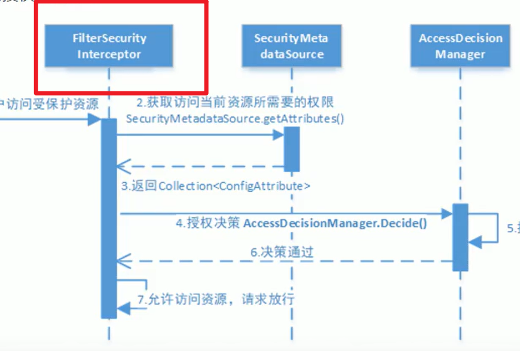

# 自定义授权

授权的方式

-   web 授权

    -   通过url拦截

    -   拦截器为**FilterSecurityInterceptor**

        

    -   在

        ```java
        protected void configure(HttpSecurity http) throws Exception {
            http.csrf().disable()// 取消对CSRF的保护
            ....
        }
        ```

        中配置

        ```java
        .and()
            .authorizeRequests()
            .antMatchers("/resource/r0").hasAnyAuthority("r0")
        ```

        

-   方法授权

    -   通过方法拦截
        AOP
    -   拦截器为**MethodSecurityInterceptor**
    -   在方法上**注解**什么方法需要什么权限

-   都会调用**accessDecisionManager**进行授权决策

##从数据库查询权限

### 数据库权限准备


```mysql
use security;
CREATE TABLE  t_role(
    id varchar(32) not null,
    role_name varchar(255) default null,
    description varchar(255) default null,
    create_time datetime default null,
    update_time datetime default null,
    status char(1) not Null ,
    Primary Key (id),
    unique key unique_role_name (role_name)
);
CREATE TABLE `t_user_role` (
    `user_id` varchar(32) NOT NULL,
    `role_id` varchar(32) NOT NULL,
    `create_time` datetime DEFAULT NULL,
    `creator` varchar(255) DEFAULT NULL,
    PRIMARY KEY (`user_id`,`role_id`)
) ENGINE=InnoDB DEFAULT CHARSET=utf8;
insert into `t_user_role`(`user_id`,`role_id`,`create_time`,`creator`) values
    ('1','1',NULL,NULL);

CREATE TABLE `t_permission` (
    `id` varchar(32) NOT NULL,
    `code` varchar(32) NOT NULL COMMENT '权限标识符',
    `description` varchar(64) DEFAULT NULL COMMENT '描述',
    `url` varchar(128) DEFAULT NULL COMMENT '请求地址',
    PRIMARY KEY (`id`)
) ENGINE=InnoDB DEFAULT CHARSET=utf8 comment '权限表';
insert into `t_permission`(`id`,`code`,`description`,`url`) values ('1','p1','测试资源
1','/r/r1'),('2','p3','测试资源2','/r/r2');

CREATE TABLE `t_role_permission` (
    `role_id` varchar(32) NOT NULL,
    `permission_id` varchar(32) NOT NULL,
    PRIMARY KEY (`role_id`,`permission_id`)
) ENGINE=InnoDB DEFAULT CHARSET=utf8 comment '角色权限关系表';
insert into `t_role_permission`(`role_id`,`permission_id`) values ('1','1'),('1','2');
```

###定义权限Entity

```java
public class PermissionDto {
    private String id;
    private String code;
    private String description;
    private String url;
    ...Getter And Setter...
}
```

###依据用户ID查询权限

-   准备查询命令

    ```mysql
    select * from t_permission
    where id in (select permission_id
    	from t_role_permission
    	where role_id in (select role_id
    		from t_user_role 
    		where user_id = ?));
    ```

    


-   在UserDao中查询

    ```java
    /**根据用户的id查找用户的权限
     *
     * @param userId 用户的ID
     * @return 权限列表
     */
    public List<String> findPermissionsByUserId(String userId){
        String sql =
                "select *\n" +
                "from t_permission\n" +
                "where id in (select permission_id\n" +
                "from t_role_permission\n" +
                "where role_id in (select role_id\n" +
                "from t_user_role\n" +
                "where user_id = ?));";
    
        List<PermissionDto> query = jdbcTemplate
                .query(sql, new Object[]{userId},
                        new BeanPropertyRowMapper<>(PermissionDto.class));
    
        if(query==null||query.size()!=1){
            return null;
        }
        return query.stream()
                .map(PermissionDto::getCode).collect(Collectors.toList());
    }
    ```

-   完善Service方法

    ```java
    public UserDetails loadUserByUsername(String username) throws UsernameNotFoundException {
        UserDTO userDTO;
        // 数据库中依据用户名查找用户信息
        if((userDTO = userDao.getUserByUsername(username))==null){
            return null;// 由认证流程, 返回null将有provider抛出异常
        }
        List<String> permissions = userDao.findPermissionsByUserId(userDTO.getId());
        return org.springframework.security.core.userdetails.User
                .withUsername(username).password(userDTO.getPassword())
                .authorities(permissions.toArray(new String[]{})).build();
    }
    ```

    

## 基于Web授权

```java
.and()
    .authorizeRequests()
    .antMatchers("/resource/r0").hasAnyAuthority("r0")
    .antMatchers("/resource/r1").hasAnyAuthority("r1")
    .antMatchers("/resource/**")
    .authenticated()// 这个目录下的需要验证
    .anyRequest().permitAll()// 其余的可以通过
    // 配置权限
```

### 相关Api

```java
.and()
    .authorizeRequests()
    .antMatchers("/resource/r0").hasAuthority("r0")//基于权限
    .antMatchers("/resource/r1").hasAnyAuthority("r1","r1")//多权限授权,或的关系
    .antMatchers("/resource/r2").hasRole("root")//基于角色
    .antMatchers("/index").permitAll()//指定的URL,无需保护,都可以访问
    .anyRequest().permitAll()// 剩余的全部放行
```

-   只要前面的通过了, 后面的不再校验

    ```java
    .and()
        .authorizeRequests()
        .anyRequest().permitAll()
        .antMatchers("/resource/r0").hasAuthority("r0")
        .antMatchers("/resource/r1").hasAnyAuthority("r1","r1")
        .antMatchers("/resource/r2").hasRole("root")
        .antMatchers("/index").permitAll()
    ```

-   支持SPEL表达式

    ```java
    	.antMatchers("/r/r3")
            .access("hasAuthority('p1') and hasAuthority('p2')") //该方法使用 SpEL表达式, 所以可以创建复杂的限制.
    ```

    复杂, 不建议

-   其他:

    `authenticated()` **保护URL，需要用户登录**

	`permitAll()` 指定URL无需保护，**一般应用于静态资源文件**
	
	`hasRole(String role)` 限制单个角色访问，**角色将被增加 “ROLE_” .所以”ADMIN” 将和 “ROLE_ADMIN”进行比较.**
	
	`hasAnyRole(String… roles)`允许多个角色访问.
	
	`hasAuthority(String authority)` 限制单个权限访问
	
	`hasAnyAuthority(String… authorities) `允许多个权限访问.
	
	`access(String attribute)` 该方法使用 SpEL表达式, 所以可以创建复杂的限制.
	
	`hasIpAddress(String ipaddressExpression)` 限制IP地址或子网

##基于方法授权

-   可以在Controller,Service,Dao层的方法,但是**建议拦截Controller方法**

    因为Controller方法是面对用户的

### 注解

| 注解           | 描述                    |
| -------------- | ----------------------- |
| @PreAuthorize  | 类似于在AOP的前面做增强 |
| @PostAuthorize | 类似于在AOP的后面做增强 |
| @Secured       |                         |

### @Secured

#### 开启@Secured

```java
@EnableGlobalMethodSecurity(securedEnabled = true)//注解在任何配置类上边,开启@Seurity
```

#### 用法

```java
public interface BankService {
	@Secured("IS_AUTHENTICATED_ANONYMOUSLY")// 本方法可匿名访问
	public Account readAccount(Long id);
    
    @Secured("IS_AUTHENTICATED_ANONYMOUSLY")// 缺点:难记
	public Account[] findAccounts();
	
    @Secured("ROLE_TELLER")// 有TELLER的角色的用户可以访问,底层使用RoleVoter投票器。
	public Account post(Account account, double amount);
}
```

###@PreAuthorize

####开启@PreAuthorize

```java
@EnableGlobalMethodSecurity(prePostEnabled = true)//注解在任何配置类上边,开启@PreAuthorize
```

## 用法

```java
@RestController
@RequestMapping("/resource")
public class ResourceController {
    
    @GetMapping(value = "/r0",produces = Constant.TEXT_PRODUCES)
    @PreAuthorize("hasAuthority('r0')")
    public String resource0(){
        return "好康的\n";
    }

    @GetMapping(value = "/r1",produces = Constant.TEXT_PRODUCES)
    @PreAuthorize("hasAuthority('r1')")
    public String resource1(){
        return "学习资料\n";
    }

    @GetMapping(value = "/r2",produces = Constant.TEXT_PRODUCES)
    @PreAuthorize("hasAuthority('r0') and hasAuthority('r1')")// idea会有提示
    public ModelAndView resource2(){
        ModelAndView modelAndView = new ModelAndView();
        modelAndView.setViewName("/index.html");
        return modelAndView;
    }
}
```


#### configure的配置更改

```java
http.csrf().disable()// 取消对CSRF的保护
        .sessionManagement().sessionCreationPolicy(
                SessionCreationPolicy.IF_REQUIRED
        )//配置会话机制
    .and()
        .authorizeRequests()
        .antMatchers("/resource/**").authenticated()//目录/resource下的所有资源都必须认证通过
        .anyRequest().permitAll()
    .and()
        // 配置资源页面和URL
        .formLogin()//允许表单登录
        .loginPage("/login-view")//自定义登录页面
        .loginProcessingUrl("/login")//指定登录处理的URL
        .successForwardUrl("/login-success")// 自定义登录成功的页面地址
    .and()
        .logout().logoutUrl("/logout")//自定义登出处理的URL, 默认使Session无效,清理上下文
        .logoutSuccessUrl("/logout-view?logout")//自定义登出成功的端点
;
```