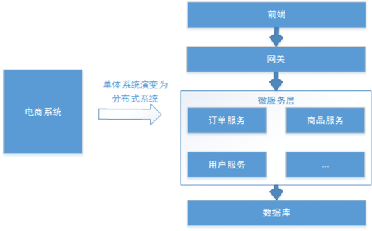

# 分布式系统

-   分布式系统
-   单体系统  

分布式, 分布在微服务层, 有了许多微服务

## 基本特点

分布式系统具体如下基本特点：

1. 分布性：

    每个部分都可以独立部署，**服务之间交互通过网络进行通信**，比如：订单服务、商品服务。

2.  伸缩性：

    每个部分都可以集群方式部署，并可**针对部分结点进行硬件及软件扩容**(独立)，具有一定的伸缩能力。

3.  共享性：

    每个部分都可以作为**共享资源对外提供服务**(共享网关)，多个部分可能有操作共享资源的情况。

4.  开放性：

    每个部分根据需求都可以对外发布共享资源的访问接口，并可允许**第三方系统**访问(淘宝可以访问微信支付)。

## 分布式认证需求

每个服务都要有认证授权, 但是每个服务都写一套认证授权的系统, 将会增加很多累赘

-   由共享性, 可以给各个微服务提供**统一认证授权**

-   这个**统一认证授权**面向的对象不止是**用户**, 由分布性, 还有**其他服务**,由开放性,还有**第三方应用**

    -   应用接入机制:

        对第三方应用开放

        使用**接口规范**

-   统一认证授权要有**可拓展**型. 支持各种认证需求,如: 用户名密码认证, 短信验证码认证, 二维码, 生物特征识别认证, 并可以灵活切换

